# 练习：基本的FME技能复习

|  练习1 |  基本的FME技能复习 |
| :--- | :--- |
| 数据 | 公共艺术品（Microsoft Excel） 公交站点（文件地理数据库） |
| 总体目标 | 复习基本的FME技能 |
| 演示 | 使用基本转换器读取和写入数据 |
| 启动工作空间 | 无 |
| 结束工作空间 | C:\FMEData2018\Workspaces\DesktopAdvanced\FMEReview-Ex1-Complete.fmw  C:\FMEData2018\Workspaces\DesktopAdvanced\FMEReview-Ex1-Complete-Advanced.fmw |

您刚刚被该市的GIS部门聘用。对于您的第一个项目，您被要求创建一个地图，在每个火车站的5分钟步行半径（2-3个街区）内显示公共艺术品。该项目还用于评估您的技能，并了解您可以立即开展哪些其他项目。

**项目要求：**

使用FME Workbench执行以下操作：

* 从Excel电子表格（PublicArt.xlsx）中读取所有工作表，将数据转换为空间要素 
* 从文件地理数据库（CommunityMapping.gdb）读取公交站点表
* 根据需要将数据重新投影到UTM83-10
* 在设置为大约3个街区（250米）的公交站点周围创建一个缓冲区
* 在工作站缓冲区中查找艺术品要素
* 将数据样式设置为KML格式
* 将数据写入Google KML格式

|  技巧 |
| :--- |
|  如果您愿意，可以使用您之前学到的FME技能创建满足上述要求的工作空间，而无需查看下面的步骤！  如果你还没有完成它也没关系。完整的指导如下。只要尽你所能！  如果您在练习中遇到困难，最好在参加此高级课程之前返回并查看 [FME Desktop基础手册](https://safe-software.gitbooks.io/fme-desktop-basic-training-2018/content/)。 |

  
**1\) 创建一个新的工作空间**   
O打开FME Workbench并从空白工作空间开始。 使用以下参数添加新工作空间:

| **读模块格式:** | Microsoft Excel |
| :--- | :--- |
| **读模块数据集:** | C:\FMEData2018\Data\Culture\PublicArt.xlsx |
| **坐标. 系统:** | LL84 |
| **工作流选项:** | 单一合并要素类 |

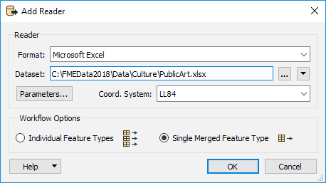

添加Microsoft Excel读模块后，添加Inspector转换器（或启用“功能缓存”）并运行工作空间。检查结果。

_**注意:**_ \*请勿使用读模块要素类上的“检查”弹出按钮。您将看不到任何几何对象。

\*

  
**2\) 添加地理数据库数据**   
接下来，添加另一个读模块，这次是地理数据库中的公交站表:

| **读模块类型:** | Esri地理数据库 \(File Geodb Open API\) |
| :--- | :--- |
| **读模块数据集:** | C:\FMEData2018\Data\CommunityMapping\CommunityMap.gdb |
| **参数 &gt; 表列表:** | TransitStations |
| **工作流选项:** | 独立要素类 |

检查这个新的数据集，注意坐标系：

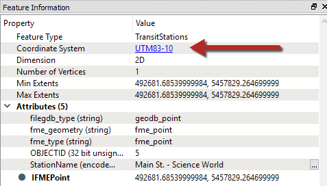

该数据集的坐标系为UTM83-10，另一个数据集是LL84; 因此，如果我们希望测试它们的空间关系，则必须重新投影其中一个数据集以匹配另一个。

  
**3\) 重新投影公共艺术**   
由于UTM83-10是一个更加本地化的坐标系，让我们重新投影公共艺术。将Reprojector转换器添加到画布并将其连接到Public Art要素类型\(&lt;All&gt;\). 在参数中将目标坐标系设置为UTM83-10：

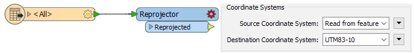

  
**4\)缓存公交站点**   
要为每个站点创建一个5分钟的步行半径，大约2-3个城市街区，我们需要创建一个缓冲区。为此，我们将使用Bufferer转换器。将Bufferer转换器添加到画布并将其连接到公交车站要素类。在参数中将缓冲量设置为100：

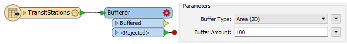

  
**5\) 检查要素**   
接下来，我们将运行转换以检查缓冲区数量是否足够。如果尚未设置，请首先从菜单栏中选择“运行”&gt;“使用要素缓存运行”：  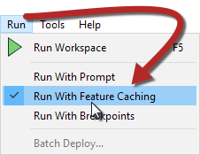

现在运行转换。

转换完成后，在画布上选择Reprojector和Bufferer转换器。然后使用右键单击&gt;检查缓存要素：

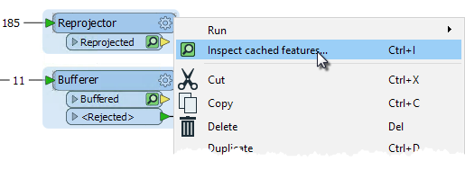

这将打开Data Inspector中的两个要素。

要检查缓冲区覆盖的块数，我们需要启用背景图。在Data Inspector中，选择Tools&gt; FME Options&gt; Background Map。将Stamen Maps设置为背景格式，单击“参数”按钮，然后选择任何可用的地图类型。

结果将如下所示：

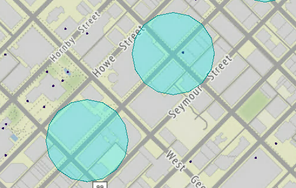   
地图瓦片提供由 [Stamen Design](http://stamen.com), 许可提供由 [CC-BY-3.0](http://creativecommons.org/licenses/by/3.0). 数据提供由 [OpenStreetMap](http://openstreetmap.org), 许可提供由 [CC-BY-SA](http://creativecommons.org/licenses/by-sa/3.0).

|  技巧 |
| :--- |
|  如果没有互联网连接，或者您无法使用Web服务获取背景地图，则可以使用任何FME支持的数据格式。例如，将背景设置为其他FME格式，并使用Autodesk AutoCAD DWG / DXF读模块显示CompleteRoads.dwg数据集：  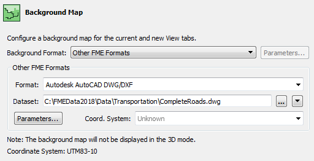  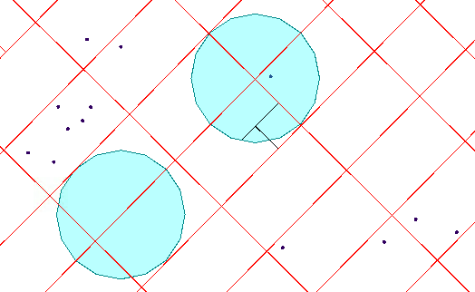 |

看起来这些缓冲区只覆盖了大约一个块，所以我们应该增加它们的大小。返回FME Workbench，将Bufferer中的Buffer Amount参数更改为250.可选地，减小Interpolation Angle参数以提供更平滑的结果。

要重新运行工作空间，请使用“部分运行”（即单击“Bufferer”并选择“从此运行”弹出按钮）。然后再次检查Reprojector和Bufferer缓存：

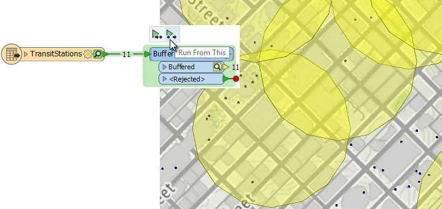   
地图瓦片提供由 [Stamen Design](http://stamen.com), 许可提供由[CC-BY-3.0](http://creativecommons.org/licenses/by/3.0). 数据提供由 [OpenStreetMap](http://openstreetmap.org), 许可通过由 [CC-BY-SA](http://creativecommons.org/licenses/by-sa/3.0).

这看起来不错; 现在我们可以继续前进了。

  
**6\) 过滤公共艺术品**   
既然缓冲区尺寸合适，我们可以找出哪些公共艺术作品属于缓冲区域。

将SpatialFilter转换器添加到画布。将Reprojector：Reprojected输出端口连接到SpatialFilter：Candidate输入端口，将Bufferer：Buffered输出端口连接到SpatialFilter：Filter输入端口：

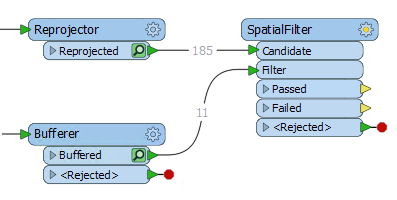

根据需要调整工作空间以确保没有交叉连接。

将SpatialFilter Spatial Predicates设置为Test参数以应用两者 _Filter Contains Candidate_ and _Filter Touches Candidate_.

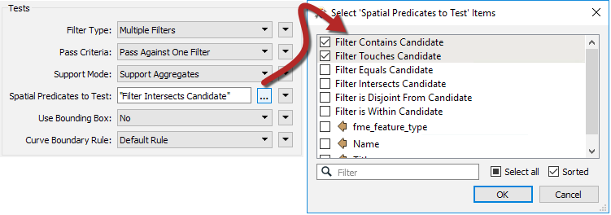

如果您愿意，请重新运行转换，并检查SpatialFilter：Passed输出端口（与Bufferer输出一起）以确保结果正确。应该有52个Passed要素。

  
**7\) 添加Google KML写模块**   
最后，我们可以写出到Google KML。使用以下参数添加Google KML写模块

| **写模块格式:** | Google KML |
| :--- | :--- |
| **写模块数据集:** | C:\FMEData2018\Output\Walkability.kml |
| **要素类定义** | Automatic |

将新创建的要素类型的名称更改为ArtNearTransit。将其连接到SpatialFilter：传递输出端口。还将Bufferer：缓冲输出端口连接到ArtNearTransit：输入端口：

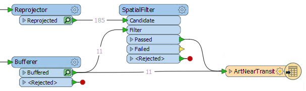

打开ArtNearTransit要素类参数，然后选择“用户属性”选项卡。将属性定义更改为手动并删除属性OBJECTID和\_predicate：

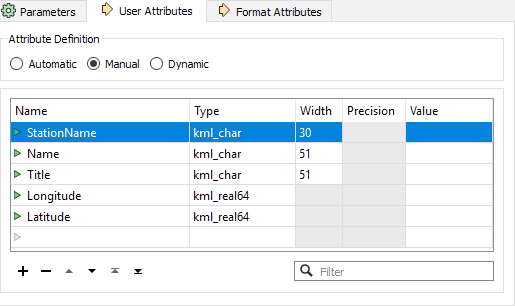

  
**8\) 保存并运行转换**   
现在可以保存工作空间，然后运行转换。在Google地球或FME Data Inspector中打开Google KML文件：

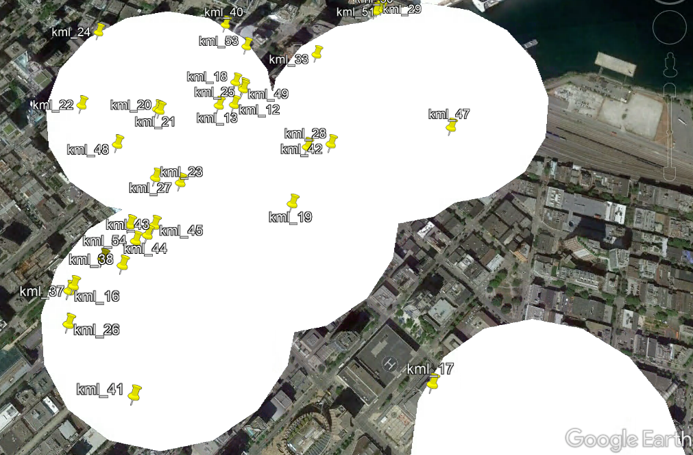

_**注意:**_ _即使我们将数据重新投影到UTM83-10，Google KML格式也只支持纬度和经度坐标系。请注意，写模块会自动为我们重新投影数据。那么为什么你认为我们在Reprojector中将我们的数据重新投影到UTM83-10？提示：它与Bufferer转换器有关。_

|  高级练习 |
| :--- |
|  Google KML的输出并不是最漂亮的; 它只使用默认图标。可以使用KMLStyler转换器更改这些输出样式。 |

  
**9\) 连接公交车站**   
我们还想为TransitStation添加一个图标，以便用户知道该站的位置。将TransitStation要素类型连接到ArtNearTransit写模块：

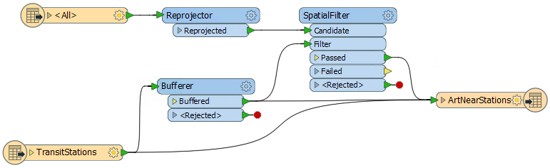

  
**10\) 样式输出KML**    
在SpatialFilter：Passed输出端口和ArtNearTransit写模块之间添加KMLStyler转换器。在图标&gt;名称下的参数中，单击省略号，然后选择一个图标，如J1。然后对于标签样式，将“缩放”设置为0，将“不透明度”设置为0.这将允许显示图标，但隐藏其标签。

在Bufferer和ArtNearTransit Writer之间添加另一个KMLStyler。在参数中将颜色设置为黑色，将填充颜色设置为黄色。将“不透明度”和“填充不透明度”均设置为0.5。然后对于标签样式，将“缩放”设置为0，将“不透明度”设置为0。

最后，在画布上添加第三个KMLStyler。这次将它连接在TransitStation：输出端口和ArtNearTransit：输入端口之间。在参数图标&gt;名称中，单击省略号，然后双击第一个文件夹图标以浏览更多图标。然后选择gx\_rail图标并单击“确定”。另外，将标签样式的“缩放”和“不透明度”设置为0。

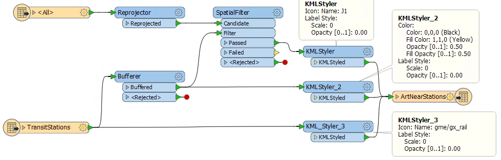

  
**11\) 保存并运行转换**   
最后，保存并重新运行转换以查看Google地球中的更新图标：

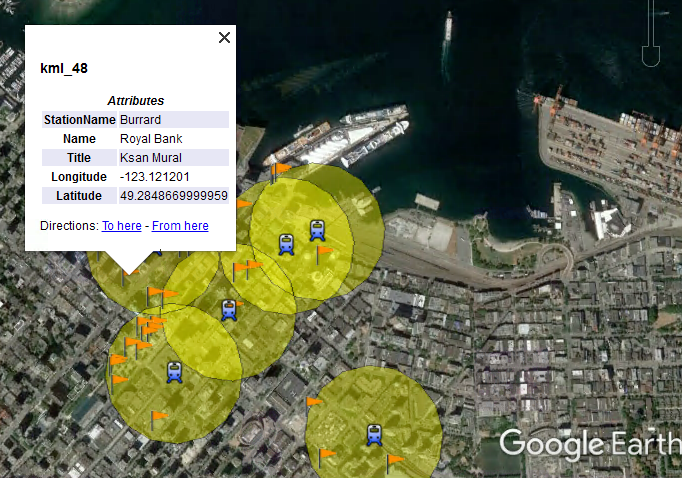

<table>
  <thead>
    <tr>
      <th style="text-align:left">恭喜</th>
    </tr>
  </thead>
  <tbody>
    <tr>
      <td style="text-align:left">
        
完成本练习后，您已经了解了以下技能：
           
        

        <ul>
          <li>添加一个读模块和写模块</li>
          <li>修改读模块参数</li>
          <li>应用各种转换器参数（Bufferer和SpatialFilter）</li>
          <li>使用Data Inspector检查数据</li>
          <li>将背景地图添加到Data Inspector</li>
          <li>修改写模块输出模式</li>
          <li>设置一个KML数据集的样式</li>
        </ul>
      </td>
    </tr>
  </tbody>
</table>
