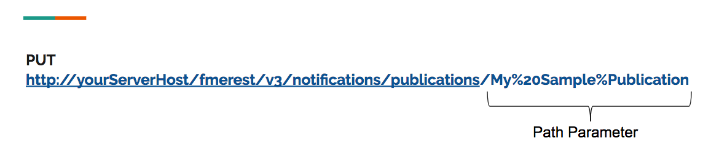
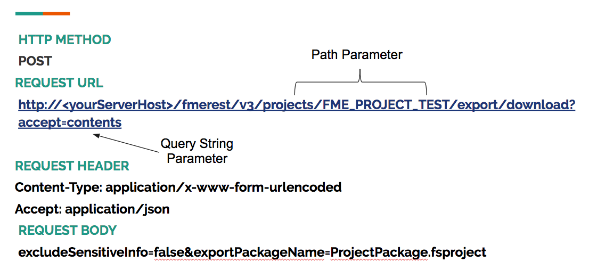

# 1.2请求中包含哪些组件？

[](https://github.com/xuhengxx/FMETraining-1/tree/b47e2c2ddcf98cce07f6af233242f0087d2d374d/FMESERVER_RESTAPI1Overview/Images/image1.2.1.request.png)

_请求中的组件图_

在开始之前，了解对服务器的示例请求是什么样子很重要。有关示例调用的完整列表，请访问 [REST API文档](https://docs.safe.com/fme/html/FME_REST/apidoc/v3/#)。

## HTTP方法：

HTTP方法对于每次调用REST API都是必不可少的。**HTTP方法表示您要完成的FME Server的操作。**

| HTTP方法 | 操作 | 在FME Server中的用途 |
| :--- | :--- | :--- |
| POST | 创建\(Create\) | 创建发布，项目，通知。 |
| GET | 读取\(Read\) | 执行运行状况检查，获取服务器上的信息，获取有关发布的通知。 |
| PUT | 更新和替换\(Update and Replace\) | 替换发布，更新项目，更新用户信息 |
| DELETE | 删除\(Delete\) | 删除主题，用户，角色。 |

|  Ricky RESTless说...... |
| :--- |
| 我经常使用GET和POST请求。GET请求获取FME Server上已有的信息。POST请求将新信息发布到FME Server。例如，我可以在FME Server上获取项目列表。然后，我可以使用POST请求来创建一个新项目。 |

## 请求URL

**请求URL是您能够完成调用的方式。它由关键字组成，向服务器指示您要执行的操作。**在本教程中，我们将讨论您可以提出的不同请求。每个请求都具有相同的基本URL：

```text
http://<yourServerHost>/fmerest/v3/
```

参数通过在调用上指定约束来影响REST API的响应。请求URL中有两个主要参数。

**路径参数 -**路径参数是调用所必需的，并充当端点的一部分。下面的调用需要发布的名称才能工作。发布名称是“我的示例发布”。因为我们无法在URL中输入空格，％20就表示空格。

[](https://github.com/xuhengxx/FMETraining-1/tree/b47e2c2ddcf98cce07f6af233242f0087d2d374d/FMESERVER_RESTAPI1Overview/Images/image1.2.2a.path.png)

_表示路径参数的图表_

**查询字符串参数** - 在请求URL中的端点中的问号之后指定查询字符串参数。

[](https://github.com/xuhengxx/FMETraining-1/tree/b47e2c2ddcf98cce07f6af233242f0087d2d374d/FMESERVER_RESTAPI1Overview/Images/image1.2.3a.query.png)

_表示查询字符串参数的图表_

在上面的请求URL中，有两个参数，限制和偏移量。参数由和号（＆）分隔。顺序对查询字符串参数无关紧要，因此您可以将偏移量放在限制之前，并且请求将产生相同的结果。

请求URL可以包含路径参数和查询字符串参数。

## 请求标头

**REST标头为要放置的调用类型设置上下文。它们提供了进行调用所需的信息。**首先，我们将使用三个主要标头。

1. **Authorization**：几乎每次调用FME Server都需要授权。授权可确保向FME Server发出的呼叫是经过许可进行的。授权由令牌提供。要获得令牌访问，http：/// fmetoken /要了解有关授权访问的更多信息，请参阅 [配置安全资源的身份验证](http://docs.safe.com/fme/2017.1/html/FME_Server_Documentation/Content/AdminGuide/Configuring-Authentication-for-Security-Resources.htm)。
2. **Accept：** Accept指示返回的响应的语言。这可确保客户端为响应做好准备。在本教程中，accept将是application / json。
3. **Content-Type：**内容类型告诉服务器请求体所使用的语言。在本教程中，我们将使用JSON，x-www-form-urlencoded和二进制代码。

## 请求主体

请求主体定义正在完成的内容的参数。它指定要修改，创建或删除的信息。我们将在本教程后面提供示例。

## 示例请求

下面的示例将项目导出为下载，并且总共有四个参数。在请求URL中，项目之后有一个路径参数。FME\_PROJECT\_TEST是将下载的项目的名称。查询字符串参数（accept = contents）指定内容类型。在调用主体中有两个表单参数。excludeSensitiveInfo确定是否在下载的包中返回任何敏感信息。还有导出ProjectName，您可以在其中指定导出时项目的名称。

[](https://github.com/xuhengxx/FMETraining-1/tree/b47e2c2ddcf98cce07f6af233242f0087d2d374d/FMESERVER_RESTAPI1Overview/Images/image1.2.4a.call.png)

_表示调用内容的图表_

这是HTTPCaller中的相同请求，这是在FME中用于访问REST API的转换器。我们将在课程后期使用HTTPCaller进行练习，但是现在，知道调用的结构非常重要。

[](https://github.com/xuhengxx/FMETraining-1/tree/b47e2c2ddcf98cce07f6af233242f0087d2d374d/FMESERVER_RESTAPI1Overview/Images/image1.2.5a.HTTPCaller.png)

_HTTPCaller中的相同调用_

