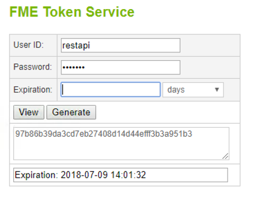
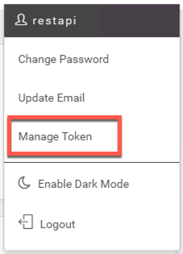
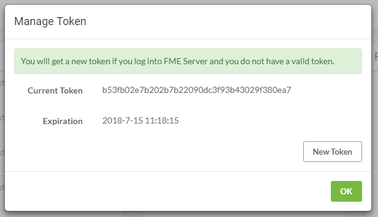

# 1.4令牌和REST API

有许多方法可以使用令牌进行身份验证。

## 获得令牌的方法

**1）通过FME令牌页面**

要生成令牌访问：

```text
      http://<yourServerHost>/fmetoken/
```

或[http://localhost/fmetoken/](http://localhost/fmetoken/) 如果您使用的是培训计算机。

访问服务器后，系统会要求您验证用户名和密码，并要求您指定令牌何时到期。您可以发出令牌的最长时间是两年。



**2）通过您的FME Server**

```text
http://<yourServerHost>/fmeserver/#/home
```

在FME Server上，单击用户图标。然后单击“管理令牌”。





**3）通过REST API主页**

```text
http://<yourServerHost>/fmerest/apidoc/v3/
```

在页面的右上角，您会看到一个绿色按钮，上面写着“获取令牌”。单击此处获取令牌或查找现有令牌。


## 令牌和用户

您还可以通过Web应用程序请求和管理令牌。用户通常会将Guest用户硬编码到应用程序中。这可以防止用户必须登录才能访问数据。稍后将在构建Web应用程序的教程中讨论此方法。

## 在调用中使用令牌

有两种方法可以将令牌包含在FME Server中。您可以在查询参数和授权标头中包含令牌。使用这些不同实践的实际方法将在本教程后面讨论。但是，目前，了解每种方法的优缺点非常重要。

**查询参数-** 您还可以在请求标头中包含令牌。这是首选方法，因为令牌将更多地隐藏在调用中。

```text
http://<yourServerHost>/fmerest/v3/info?fmetoken=<yourToken>
```

但是，建议不要这样做，因为令牌在URL中可见。

**授权标头-** 您还可以在请求标头中包含令牌。这是首选方法，因为令牌将更多地隐藏在调用中。

### 授权错误故障排除

如果未经授权调用，您将从系统收到错误代码。您可能会收到禁止或未经授权的消息。禁止（代码403）表示请求被理解但被拒绝。这表示您没有完成请求的正确权限。未授权（代码401）表示凭据丢失或不正确。如果请求需要令牌并且该令牌不存在或令牌已过期，则可能会发生这种情况。

