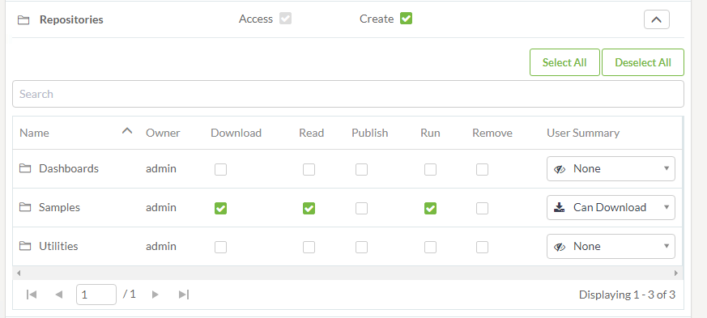
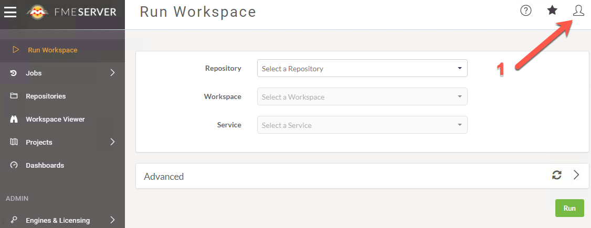

|  练习1 |  创建新用户和令牌 |
| :--- | :--- |
| 数据 | 没有 |
| 总体目标 | 教授用户如何创建具有有限权限的用户并获取令牌。 |
| 演示 | 如何创建用户和新令牌 |

此练习旨在教会用户如何创建具有有限权限的新用户。使用REST API进行开发时，建议不要使用管理员令牌。Admin令牌具有很多权力，如果暴露可能会很危险。通过创建具有有限权限的帐户，如果令牌被公开，我们将限制风险。

  
**1）打开FME Server**

我们的第一步是访问FME Server。我们可以通过以下方式做到这一点：

```text
<yourServerHost>/fmeserver
```

如果您使用的是训练计算机，请访问：localhost / fmeserver

如果您使用的是训练计算机，使用以下凭据以管理员身份登录:

**用户名：** admin  
 **密码：** admin

  
**2）转到“用户”页面**

现在，我们将导航到“用户”页面。我们将在左侧面板中找到**Security**，然后单击**Users**。

[](https://github.com/xuhengxx/FMETraining-1/tree/b47e2c2ddcf98cce07f6af233242f0087d2d374d/FMESERVER_RESTAPI1Overview/Images/image1.3.1.Users.png)

  
**3）创建一个新用户**

单击页面右上角的“新建”按钮。

[](https://github.com/xuhengxx/FMETraining-1/tree/b47e2c2ddcf98cce07f6af233242f0087d2d374d/FMESERVER_RESTAPI1Overview/Images/image1.3.2.NewUser.png)

出现提示时，使用以下参数创建新用户：

* **用户名：** restapi
* **全名：** Forest Apier
* **密码：** restapi

  
**4）向下滚动并分配权限**

为将来的用户分配权限时，请访问“ [用户权限”](http://docs.safe.com/fme/2018.1/html/FME_Server_Documentation/Content/WebUI/Roles.htm)以查看完整文档。

现在分配以下权限：

<table>
  <thead>
    <tr>
      <th style="text-align:left">权限</th>
      <th style="text-align:left">权限级别</th>
      <th style="text-align:left">权限说明</th>
    </tr>
  </thead>
  <tbody>
    <tr>
      <td style="text-align:left">运行工作空间</td>
      <td style="text-align:left">高级</td>
      <td style="text-align:left">在运行工作空间时，可以访问“运行工作空间”页面并访问“作业指令”。</td>
    </tr>
    <tr>
      <td style="text-align:left">作业</td>
      <td style="text-align:left">管理</td>
      <td style="text-align:left">访问和管理所有用户的工作作业。您可以，取消当前正在运行的任何作业，删除以前运行的作业的历史记录，以及管理作业队列。（还需要引擎和许可中的管理权限。）</td>
    </tr>
    <tr>
      <td style="text-align:left">仓库</td>
      <td style="text-align:left">创建</td>
      <td style="text-align:left">访问“仓库”页面并创建存储库。</td>
    </tr>
    <tr>
      <td style="text-align:left">单个仓库
        <br /> <b>单击“仓库”权限右侧的向下箭头以显示“单个存储库”权限。</b>
      </td>
      <td style="text-align:left">样本=下载，读取，运行</td>
      <td style="text-align:left">可以将工作空间和其他存储库项目从FME Server下载到Workbench。可以查看仓库信息。可以从FME Server运行仓库工作空间。</td>
    </tr>
    <tr>
      <td style="text-align:left">工作空间查看器</td>
      <td style="text-align:left">访问</td>
      <td style="text-align:left">可以访问工作空间查看器。</td>
    </tr>
    <tr>
      <td style="text-align:left">资源</td>
      <td style="text-align:left">创建</td>
      <td style="text-align:left">访问“资源”页面并创建新资源。</td>
    </tr>
    <tr>
      <td style="text-align:left">单个资源
        <br /> <b>单击“资源”权限右侧的向下箭头以显示“个人资源”权限。</b>
      </td>
      <td style="text-align:left">
        <p>数据=完全访问权限</p>
        <p>Temp =完全访问权限</p>
      </td>
      <td style="text-align:left">可以访问，读取和下载文件。可以列出资源的文件夹和文件。可以写入文件，上传文件和删除文件。</td>
    </tr>
    <tr>
      <td style="text-align:left">项目</td>
      <td style="text-align:left">创建</td>
      <td style="text-align:left">访问“项目”页面并创建项目。</td>
    </tr>
    <tr>
      <td style="text-align:left">仪表板</td>
      <td style="text-align:left">访问</td>
      <td style="text-align:left">访问“仪表板”页面。</td>
    </tr>
    <tr>
      <td style="text-align:left">引擎和许可</td>
      <td style="text-align:left">管理</td>
      <td style="text-align:left">配置引擎和许可，但作业队列除外（还需要在作业中具有“管理”权限）。</td>
    </tr>
  </tbody>
</table>**如果要创建Web应用程序，则令牌的权限应限制在特定的仓库中。**

设置应如下所示： [](https://github.com/xuhengxx/FMETraining-1/tree/b47e2c2ddcf98cce07f6af233242f0087d2d374d/FMESERVER_RESTAPI1Overview/Images/image1.3.3.Permissions.png)

单个仓库应如下所示： [](https://github.com/xuhengxx/FMETraining-1/tree/b47e2c2ddcf98cce07f6af233242f0087d2d374d/FMESERVER_RESTAPI1Overview/Images/image1.3.4.Individual.png)

单个资源应如下所示： [](https://github.com/xuhengxx/FMETraining-1/tree/b47e2c2ddcf98cce07f6af233242f0087d2d374d/FMESERVER_RESTAPI1Overview/Images/image1.3.4a.Resources.png)

  
**5）单击“确定”以创建restapi用户**

[](https://github.com/xuhengxx/FMETraining-1/tree/b47e2c2ddcf98cce07f6af233242f0087d2d374d/FMESERVER_RESTAPI1Overview/Images/image1.3.5.CreateUser.png)

  
**6）以restapi用户身份登录FME Server并找到您的令牌**

以restapi用户身份登录FME Server。  


* **用户名：** restapi
* **密码：** restapi

一旦我们登录到我们的FME Server，检查所有正确的组件是否存在是很重要的。 在左侧面板中，我们应该看到，运行工作空间，作业，仓库，工作空间查看器，资源，项目，仪表板以及引擎和许可。  
 [](https://github.com/xuhengxx/FMETraining-1/tree/b47e2c2ddcf98cce07f6af233242f0087d2d374d/FMESERVER_RESTAPI1Overview/Images/image1.3.5a.Permissions.png)  
  
  
  


[](https://github.com/xuhengxx/FMETraining-1/tree/b47e2c2ddcf98cce07f6af233242f0087d2d374d/FMESERVER_RESTAPI1Overview/Images/image1.3.6.NewUser.png)

接下来，我们可以找到用户图标。如果我们希望找到有关用户的更多信息，这是我们访问的区域。

[](https://github.com/xuhengxx/FMETraining-1/tree/b47e2c2ddcf98cce07f6af233242f0087d2d374d/FMESERVER_RESTAPI1Overview/Images/image1.3.7.ManageToken.png)

选择用户图标后，可以单击“管理令牌”。要找到令牌。

[](https://github.com/xuhengxx/FMETraining-1/tree/b47e2c2ddcf98cce07f6af233242f0087d2d374d/FMESERVER_RESTAPI1Overview/Images/image1.3.8.ViewToken.png)

然后，我们可以看到当前令牌。或者，我们可以在此区域获得新令牌。

  
**7）保存此令牌**

打开Notepad ++文档并将令牌粘贴到文档中以便于访问。

<table>
  <thead>
    <tr>
      <th style="text-align:left">恭喜</th>
    </tr>
  </thead>
  <tbody>
    <tr>
      <td style="text-align:left">
        <p>通过完成本练习，您已学会如何：
          <br />
        </p>
        <ul>
          <li>在FME Server中创建新用户</li>
          <li>为用户分配特定权限</li>
          <li>获取新用户令牌</li>
        </ul>
      </td>
    </tr>
  </tbody>
</table>
