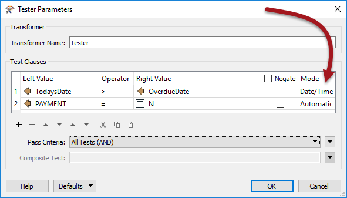
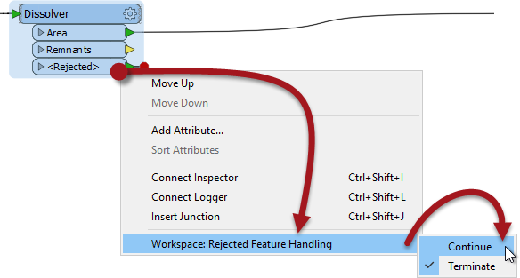
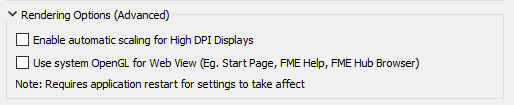

# 2018的新特性

FME Desktop 2018为FME Workbench和FME Data Inspector引入了许多新工具和功能。这些工具对工作空间作者在设计和创建工作空间时使用的方法进行了广泛的更改。

## 热门工具

本课程将介绍最重要的新工具。它们是：

* **缓存和部分运行**
  * FME在转换的每个点缓存数据并重新使用该缓存数据的能力。
* **可折叠书签**
  * 将书签折叠到简单的输入/输出端口以隐藏内容的能力。
* **精度和容差参数**
  * 能够在多个空间操作上设置容差，以解决坐标精度差异。
* **Microsoft格式**
  * 能够将数据写入Microsoft PowerPoint和Microsoft Word，以及为所有Microsoft格式添加样式转换器
* **FeatureJoiner**
  * 一个基于SQL的转换器，用于在功能更强大的FeatureMerger版本中执行连接

## 其他更新

除了这些顶级工具之外，还值得一提的是FME2018版本的其他亮点：

### 新格式

FME2018支持多种新格式，超过50种基于GDAL技术的新栅格格式。一些关键格式是：

* Apple Venue Format（AVF）读写模块
* Bentley i-Model 读模块
* Esri索引3D场景图层（I3S）
* LDAP（活动目录）读模块
* PCD（点云数据）读模块
* PDF读模块（2D /栅格/文本）
* Qlik数据交换写模块
* Well Log ASCII标准（WLAS）读模块

iTunes商店还有一个FME AR格式和相关应用程序。

### 新转换器

除了与微软相关的功能之外，2018年的新转换器主要围绕连接到Web服务：

* HDFSConnector（Hadoop）
* ProjectWiseConnector
* S3Connector
* SalesforceConnector

### Workbench更新

FME Workbench包括许多升级 - 一些小型升级，一些大型升级 - 与本课程涵盖的内容分开。这些包括：

* 复制/粘贴转换器参数
* 动态日志窗口过滤
* FeatureWriter输出端口
* 新几何类型支持（回旋曲线和3D弧）
* 支持新的德国和澳大利亚坐标系基准
* Tester日期时间支持

* 通过右键单击更改拒绝要素处理

* 默认的注释字包装。书签默认填写
* 新的Windows渲染选项，用于高DPI显示和web视图

* 使用Ctrl + K将新注释直接放置到画布上

## 进一步阅读

有关FME 2018中其他新功能和更多功能的更多信息，请参阅[**FME2018揭幕网络研讨会**](https://www.safe.com/webinars/unveiling-fme-2018/)，[**FME Desktop深度潜水网络研讨会**](https://www.safe.com/webinars/deep-dive-fme-desktop-2018/)和[**FME Server深度潜网络研讨会**](https://www.safe.com/webinars/deep-dive-fme-server-2018/)

