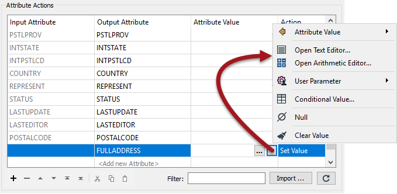

# 构造属性

除了常量属性值，FME还允许您使用字符串操作和算术计算来构建值。使用通过单击“属性值”字段中的箭头打开的菜单可以实现此目的：

此功能非常有用，因为属性不再是固定值：它可以由现有属性和参数的混合构成。这两种方法就是文本编辑器和算术编辑器。

字符串函数主要基于Tcl，C周围的算术函数。

|  Lynn Guistic教授说… |
| :--- |
|  请记住，除了现有构造属性之外，文本和算术编辑器可以应用于大多数FME参数。例如，您不必使用AttributeManager算术编辑器来创建属性，然后在3DForcer转换器中使用; 您可以直接在3DForcer中使用算术编辑器。 |

|  Vector小姐说... |
| :--- |
|  你知道哪些转换器可以用来创建属性吗？选择所有适用的选项：  [1. AttributeCopier](http://52.73.3.37/fmedatastreaming/Manual/QAResponse2017.fmw?chapter=15&question=1&answer=1&DestDataset_TEXTLINE=C%3A%5CFMEOutput%5CQAResponse.html) [2. AttributeCreator](http://52.73.3.37/fmedatastreaming/Manual/QAResponse2017.fmw?chapter=15&question=1&answer=2&DestDataset_TEXTLINE=C%3A%5CFMEOutput%5CQAResponse.html) [3. AttributeManager](http://52.73.3.37/fmedatastreaming/Manual/QAResponse2017.fmw?chapter=15&question=1&answer=3&DestDataset_TEXTLINE=C%3A%5CFMEOutput%5CQAResponse.html) [4. AttributeRenamer](http://52.73.3.37/fmedatastreaming/Manual/QAResponse2017.fmw?chapter=15&question=1&answer=4&DestDataset_TEXTLINE=C%3A%5CFMEOutput%5CQAResponse.html) |

