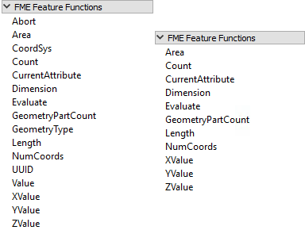

# FME函数

## FME要素函数

文本和算术编辑器菜单中的另一个项目是FME要素函数：

这些功能可以触及FME核心功能的核心。它们是构建转换器的基石; 可以将值返回给编辑器的基本功能。

例如，_@ Area（）_函数返回当前要素的面（假设它是多边形）。_@NumCoords（）_返回当前要素中的顶点数。

一些函数返回字符串，其他函数返回数值; 因此，可用的功能取决于是使用文本编辑器还是算术编辑器。在上面的屏幕截图中，文本编辑器功能位于左侧，算术编辑器功能位于右侧。

FME要素函数很有用，因为它们允许您直接在属性创建中构建处理，而不是使用单独的转换器。

|  Lynn Guistic教授说...... |
| :--- |
|  您可能也想知道为什么文本编辑器中有数学函数以及如何使用它们。  好吧，有时你需要计算一个数值作为字符串的一部分。如果是这样，您可以在文本编辑器中使用FME函数@Evaluate（）来执行数学计算。此函数了解所有数值运算，这就是它们包含在文本编辑器对话框中的原因。 |

## 替换其他转换器

集成的文本和算术编辑器为工作空间创建提供了很大的好处。它们允许属性创建功能直接在单个转换器中执行。

例如，AttributeManager文本编辑器可以用作StringConcatenator和ExpressionEvaluator转换器的直接替代。

AttributeManager还可以替换StringPadder和AttributeTrimmer转换器，尽管用户友好性稍差。如果在编辑器中使用FME要素函数，则此转换器也可以在技术上替换转换器，例如AreaCalculator，LengthCalculator，VertexCounter，DateTimeStamper等等。

更换转换器通常是件好事。当尽可能多的外围操作直接集成到单个转换器中时，工作空间更紧凑，定义更明确。但是，由于AttributeManager可以执行许多活动之一，因此使用最佳实践并确保其具有正确的注释也很重要。

如果没有正确注释AttributeManager，则无法通过查看Workbench画布确定它正在执行的操作！

|  Lynn Guistic教授说...... |
| :--- |
|  请注意，将功能合并到单个转换器中并不是为了提高性能。  例如，在一个AttributeManager转换器内用二十个函数替换二十（20）个转换器 - 所有这些都执行相同的任务 - 不太可能使整个工作空间更快; 加上每个添加到其中的新函数，加上AttributeManager自然会变慢。 |

&lt;/body&gt;&lt;/html&gt;

