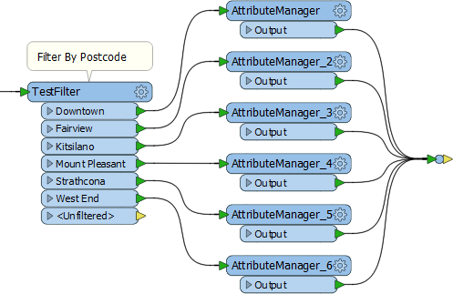
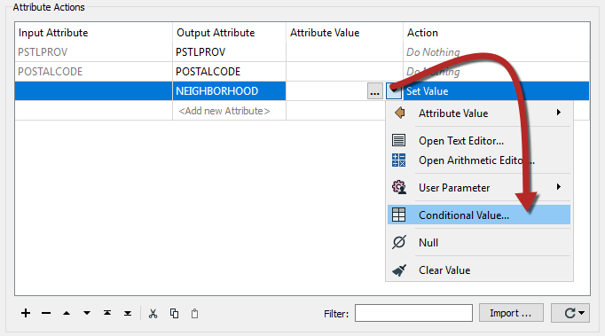
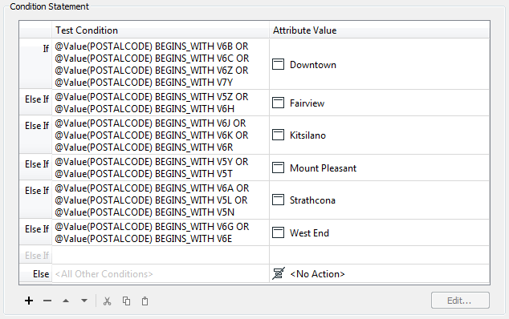
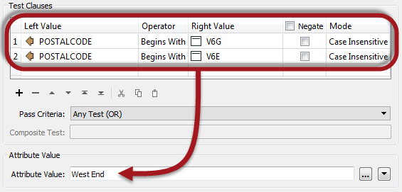
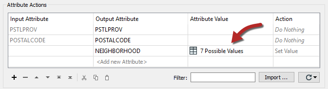
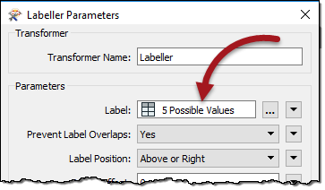

# 条件属性值

条件属性值是一种可用于替换许多相同类型的现有转换器的工具。

## 基于转换器的属性映射

可以在称为条件过滤的过程中使用变换器在工作空间内划分要素，并且可以基于这些划分来设置或创建属性。在这里，写模块使用邮政编码属性将数据划分为邻域：

但是，像这样的大量AttributeManager转换器并不是一个好主意。它导致工作空间膨胀; 难以导航并且难以编辑。此外，由于每个值都需要一个单独的TestFilter端口和AttributeManager组合，因此很容易想象 - 例如 - 超过50个值所涉及的困难！

一种解决方案是使用简单的AttributeValueMapper转换器。但是，该转换器只允许一个简单的条件，例如X = Y. 如果需要更高级的条件集，则首选解决方案是**条件属性值**。

## 什么是条件属性值？

条件属性值是指作者在工作空间中创建一组条件和值作为单独的对象，而不是在单个转换器中设置条件和值。

条件属性的选项可在大多数转换器参数的下拉对话框中找到。在AttributeManager中，它看起来像这样：

在上面的屏幕截图中，工作空间作者正在创建一个名为NEIGHBORHOOD的新属性。NEIGHBORHOOD的值以其他属性值为条件，并且 - 在此示例中 - 设置如下：

|  Lynn Guistic教授说...... |
| :--- |
|  为了节省时间并防止数据输入错误，您可以在类似样式的转换器之间进行复制和粘贴。例如，Tester转换器和TestFilter转换器中的测试条件。 |

与AttributeValueMapper一样，一系列条件（左）映射到不同的值（右）。但是，与AttributeValueMapper相比，此对话框允许比简单的1：1映射更复杂的条件。这是因为此对话框中内置了完整的测试功能。

通过双击“测试条件”字段以打开测试器样式对话框来定义条件。条件和输出值都可以在此对话框中设置：

当条件设置为原始对话框时 - 在这种情况下，AttributeManager - 看起来像这样，具有定义可能值数量的条件数：

|  Lynn Guistic教授说...... |
| :--- |
|  就像属性构造一样，条件值不仅适用于属性，也适用于大多数FME参数; 例如，我可以使用Labeller转换器本身创建标签条件： 所以我不必在AttributeManager中创建标签，然后将它们作为单独的任务应用于Labeller中。     |

## 何时使用条件属性值？

当您需要映射（或设置）与现有属性的值相关的属性时，以及条件比在简单的AttributeValueMapper（或AttributeRangeMapper）转换器中处理的条件更复杂时，条件属性值非常适合。

实质上，条件值就像它们包含的功能范围中的TestFilter和AttributeCreators的组合。

|  Lynn Guistic教授说...... |
| :--- |
|  另外，如果你在算术编辑器中使用？：运算符，那么你可以停止这样的炫耀并使用条件值代替！ |

|  Vector小姐说...... |
| :--- |
|  条件设置中的输出属性“值”可以是以下哪一个（选择所有适用的选项）：     [1.简单的值，如字符串或数字](http://52.73.3.37/fmedatastreaming/Manual/QAResponse2017.fmw?chapter=15&question=2&answer=1&DestDataset_TEXTLINE=C%3A%5CFMEOutput%5CQAResponse.html)   [2.从文本或算术编辑器构造的值](http://52.73.3.37/fmedatastreaming/Manual/QAResponse2017.fmw?chapter=15&question=2&answer=2&DestDataset_TEXTLINE=C%3A%5CFMEOutput%5CQAResponse.html)   [3.无动作（即值将保持原样）](http://52.73.3.37/fmedatastreaming/Manual/QAResponse2017.fmw?chapter=15&question=2&answer=3&DestDataset_TEXTLINE=C%3A%5CFMEOutput%5CQAResponse.html)   [4.FME终止转换的命令](http://52.73.3.37/fmedatastreaming/Manual/QAResponse2017.fmw?chapter=15&question=2&answer=4&DestDataset_TEXTLINE=C%3A%5CFMEOutput%5CQAResponse.html) |

