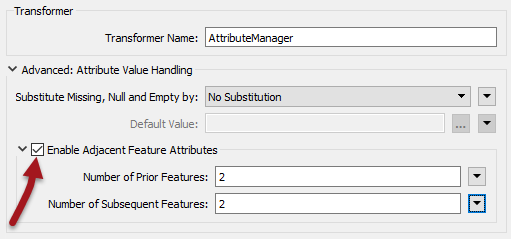
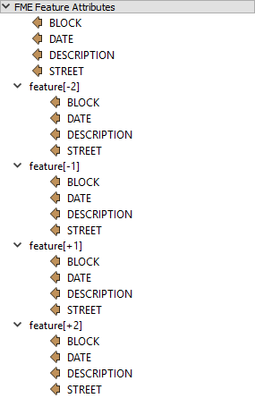
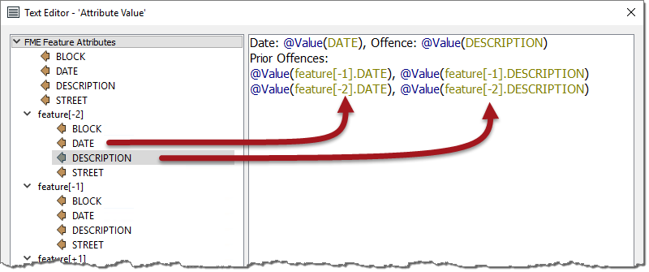
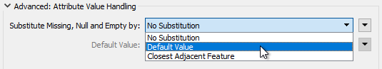

# 多个要素属性

通常，FME中的一个要素是独立的。它可能会在某个时刻作为一个组进行处理，但除此之外它与工作空间中的其他要素没有任何关系。

但是，在某些情况下，要素访问其他要素的属性非常有用。

例如，采用如下记录的坐标表格数据集：

| X | Y |
| :--- | :--- |
| +0.0 | +3.0 |
| +3.2 | +0.0 |
| -3.2 | +0.0 |
| +0.0 | +3.4 |
| +4.2 | +0.0 |

在这种情况下，每一行都不是绝对坐标; 相反，它是与前一个的偏移。因此，要计算真实坐标，每个要素都需要知道前一个要素的坐标，以便它可以应用偏移。

这类场景由FME中的相邻要素属性来满足。

## 相邻要素功能

通过选中AttributeCreator或AttributeManager转换器中标记为启用相邻要素属性的框来激活相邻要素功能：

这将打开一个对话框，其中作者可以指定当前要素之前有多少要素，或者应该有多少要素在它后面。在上面的屏幕截图中，来自前一个和后续两个要素的属性将变得可用。

## 使用多个要素属性

使用从先前/后续要素检索的属性的最简单方法是通过文本或算术编辑器，其中要素属性列表具有以前和后续要素的可扩展部分：

请注意上面的属性不仅可用于当前要素，还可用于上一个/后续两个要素。与当前属性一样，双击相邻属性会将其添加到表达式窗口：

在上面的屏幕截图中，工作空间作者正在使用关于违章停车的数据。他们创建一个由日期和违章组成的字符串，然后添加前两个违章（我们假设数据已按日期顺序排序）。

您可以看到只需使用feature \[x\]即可访问先前和后续属性值。其中x是指向后续或先前特征的正数或负数。

|  Lynn Guistic教授说… |
| :--- |
|  这是一流的功能，最高级别的优秀。  但是......请注意，额外的系统资源用于存储相邻要素。因此，使用这些功能时，转换性能会受到（比较小的）影响，其程度取决于保留的属性数量。 |

### 缺少数值

AttributeCreator和AttributeManager还有一个选项，用于指定在缺少字符串中使用的属性时应该发生的情况：

当转换器尝试使用缺失的值（或null或空）时，此选项允许用户选择替换值，或不执行替换。

请注意，此设置适用于当前要素的属性，与相邻要素的属性一样多。

|  Vector小姐说... |
| :--- |
|  我的AttributeManager设置NewAttribute = OldAttribute + feature\[+1\].OldAttribute  我的数据集中有100个要素。  鉴于要素\[101\] .OldAttribute不存在，NewAttribute的值将为第100个要素提供什么？   [1.根本没有值（空属性）](http://52.73.3.37/fmedatastreaming/Manual/QAResponse2017.fmw?chapter=15&question=3&answer=1&DestDataset_TEXTLINE=C%3A%5CFMEOutput%5CQAResponse.html)  [2. 与要素\[100\].OldAttribute相同](http://52.73.3.37/fmedatastreaming/Manual/QAResponse2017.fmw?chapter=15&question=3&answer=2&DestDataset_TEXTLINE=C%3A%5CFMEOutput%5CQAResponse.html)  [3. 它取决于Substitute Value参数](http://52.73.3.37/fmedatastreaming/Manual/QAResponse2017.fmw?chapter=15&question=3&answer=3&DestDataset_TEXTLINE=C%3A%5CFMEOutput%5CQAResponse.html)  [4. 什么也没有。FME会崩溃并炸掉您的计算机](http://52.73.3.37/fmedatastreaming/Manual/QAResponse2017.fmw?chapter=15&question=3&answer=4&DestDataset_TEXTLINE=C%3A%5CFMEOutput%5CQAResponse.html) |

