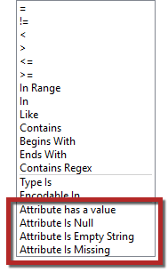
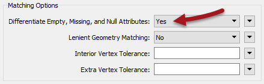
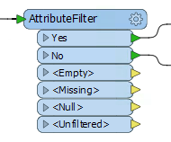

# 处理空属性

除了在其界面中表示“无”的任何形式之外，FME还允许“无”作为各种测试中的条件，允许用户设置“无”值，并允许从一种形式的“无”到另一种形式的批量更新。

## 认识空值

各种格式有各种各样的方式来代表无。但是，如果它们支持null的概念，则FME将使用&lt;null&gt;值读取任何null属性。

对于检查传入空值的工作空间，Tester转换器具有特定的运算符来测试null，空值和缺失值：

由于Tester接口包含在FME的许多方面（例如TestFilter转换器或条件属性/参数），因此您可以在找到该接口的任何位置测试空值。

|  技巧 |
| :--- |
|  当属性不为null，不为空且不为丢失时，“有值属性”测试返回true - 从而节省了必须单独使用这三个测试的不便。 |

## 其他零处理转换器

许多其他转换器也允许测试空值。例如，Matcher转换器具有关于空值是否构成匹配的选项：

此参数允许工作空间作者决定是否应将null，empty和missing值视为不同的值。

如果设置为No，则即使其中一个属性为&lt;null&gt;且另一个属性为&lt;missing&gt;，也可以匹配两个要素。

如果设置为“是”，则只有两个要素的属性相同时才能匹配; 即，当&lt;null&gt;上的一个要素与另一个上的&lt;null&gt;匹配时。

另一个例子是AttributeFilter转换器，它具有&lt;Empty&gt;，&lt;Missing&gt;和&lt;Null&gt;的独立输出端口：

## 写入空值

作为数据验证过程的一部分，或者当空值会导致计算出现问题时，能够测试和过滤空值通常很重要。

但是，能够过滤掉写入数据的空值也很重要。这是因为将设置为null的属性发送到写模块时会发生什么，这在很大程度上取决于数据格式。

如果格式支持&lt;null&gt;，则目标数据集将包含&lt;null&gt;属性。

如果格式不支持&lt;null&gt;，则FME会自动将数据转换为最支持的表示形式。

例如，MapInfo TAB没有&lt;null&gt;的概念; 对应的不写入文本属性（因此FME会将它们读回&lt;missing&gt;），而数字属性则写为-9999（这是一个等效于null的MapInfo）。

|  技巧 |
| :--- |
|  请注意，只有当格式不支持当前表示时FME才转换“null”值，。例如，如果要素具有空属性值，并且格式允许空值，则FME不会将数据转换为true &lt;null&gt;。 |

## 加入Null属性键和值

FME中有各种转换器以某种方式将数据连接在一起; FeatureMerger，FeatureJoiner和DatabaseJoiner都是这些的例子。

连接数据时，必须考虑处理空值，特别是属性连接中的空键值。

当FME比较密钥，并且一个密钥为空时，它必须考虑哪个操作是正确的。该要素是否应该被拒绝，或者该要素是否应该与其他具有空键的要素相结合？

类似地，当FME合并属性并且存在冲突时，大多数转换器都有一个参数来指定哪个优先。但是，当具有优先级的属性具有空值时，该操作是否应该相同？null应该覆盖实际值吗？

这些都是要考虑的数据连接的所有方面。某些转换器（例如，FeatureMerger）具有处理空值的特定参数。通常，如果您怀疑数据包含需要处理的空值，则应始终检查每个转换器的文档。

&lt;/body&gt;&lt;/html&gt;

