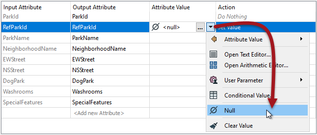
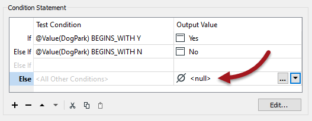
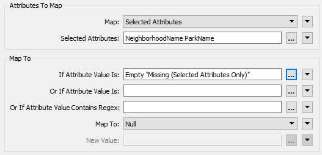
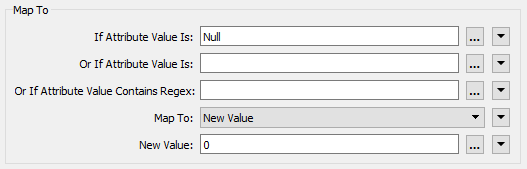

# 设置空属性

## 设置Null值

设置属性值的常用方法是使用AttributeCreator或AttributeManager，它们的下拉菜单中有一个选项可将值设置为null：

条件属性功能还支持设置&lt;null&gt;值：

## 批量Null更新

处理属性批量更新的方法是使用**NullAttributeMapper**转换器。

NullAttributeMapper转换器允许作者检查要素上的任何或所有属性的值，并将它们批量转换为null或从null转换。

例如，这里作者正在检查缺少或空的属性并将它们转换为null值：

其中一个原因可能是工作空间将数据从不支持null值的格式转换为支持null值的格式。这里有必要显式映射值，因为输出中可能允许空值/缺失值，而FME不会自动将数据从空映射到null，只是因为格式支持它。

在第二个示例中，作者正在检查现有null值的属性。如果该值设置为null，则它将替换为零：

据推测，这必须是一个数字字段。如果它是文本字段，则作者可能会将其设置为空字符串。与以前不同，作者在从支持null的格式转换为不支持null的格式时不需要这样做，因为当不支持当前状态时，FME将自动映射值。

这种映射的一个更好的理由是作者想要执行数值计算，其中零是有效数字但&lt;null&gt;不是。

|  Vector小姐说...... |
| :--- |
|  我的读模块格式支持null值，并在数据中包含已知的null值。我的写模块格式是一种不支持null值的简单文本格式。我该怎么做才能让我的工作空间正常工作？    [1.使用AttributeRemover删除属性](http://52.73.3.37/fmedatastreaming/Manual/QAResponse2017.fmw?chapter=15&question=4&answer=1&DestDataset_TEXTLINE=C%3A%5CFMEOutput%5CQAResponse.html)  [2.将高级读模块参数“Read Nulls as Empty”设置为Yes](http://52.73.3.37/fmedatastreaming/Manual/QAResponse2017.fmw?chapter=15&question=4&answer=2&DestDataset_TEXTLINE=C%3A%5CFMEOutput%5CQAResponse.html)  [3.使用NullAttributeMapper将所有&lt;null&gt;值转换为&lt;empty&gt;](http://52.73.3.37/fmedatastreaming/Manual/QAResponse2017.fmw?chapter=15&question=4&answer=3&DestDataset_TEXTLINE=C%3A%5CFMEOutput%5CQAResponse.html)  [4.什么也不用做，写模块会将值在需要时转换](http://52.73.3.37/fmedatastreaming/Manual/QAResponse2017.fmw?chapter=15&question=4&answer=4&DestDataset_TEXTLINE=C%3A%5CFMEOutput%5CQAResponse.html) |

