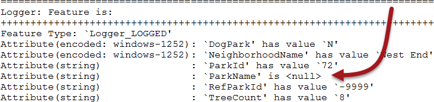
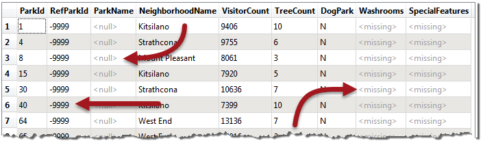

# 空(Null)属性

空属性是FME属性处理的一个非常重要的部分。并非每个数据集都具有空值，并非每种格式都支持它们; 但是当它们确实存在时，FME正确处理它们就非常重要。

## 什么是空值？

在一般情况下，一个空的属性值是相当于**无**。但是，在我们的术语中准确是很重要的，因为有很多方法可以代表无：

* 属性具有表示空无的特定_状态_（null）
* 属性具有表示空无的特定_值_（例如，-999）
* 属性存在但没有值（空）
* 属性不存在（缺失）
* 数字属性是NaN（非数字）
* 数字属性的值为零

事实上，Safe Software的开发人员确定了十五种不同的方式，可以在空间和表格数据中表示“无”。

|  Lynn Guistic教授说...... |
| :--- |
|  万一你想知道，是的，我们的开发人员花了六个月的时间“无所事事”，开玩笑了！ |

所以当我们谈论_null时_，它具有特定的含义。对我们来说，null是一个特定的状态，故意设置为表示该信息不存在。它告诉我们缺少信息并不是一个错误，而丢失或空值可能是。

因为有很多不同的方法，本节将讨论处理“无”属性值的方法，但特别强调Null值。

## FME如何代表“无”？

FME的内部引擎有自己的状态来表示null。但是，当呈现给用户时，空值通常表示为&lt;null&gt;。

例如，Logger中的此要素的ParkName属性具有&lt;null&gt;：

同样，FME Data Inspector会将空值描述为&lt;null&gt;：

请注意我们在这里有多种“无”值。ParkName是一个真正的&lt;null&gt;，RefParkId的值是-9999，而Washrooms是&lt;丢失&gt;（意味着该属性不存在）。

|  Lynn Guistic教授说...... |
| :--- |
|  **&lt;丢失&gt;** 是一个有趣的概念。您可能会问，“我们怎么知道属性何时丢失”？但更好的问题是“我们怎么知道该属性应该存在”？   我们知道它应该存在，因为它出现在读模块中定义的模式中。例如，在上面的屏幕截图中，Washrooms出现在模式中，但由于某些原因，某些要素没有该属性。这使得属性&lt;丢失&gt;。 |

