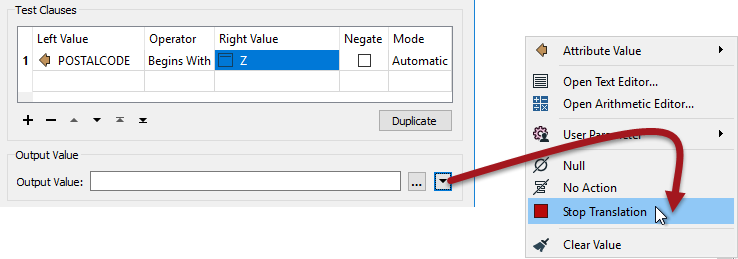

# Q + A答案

以下是本章问题的答案。

|  Vector小姐说...... |
| :--- |
|  你知道哪些转换器可以用来创建属性吗？选择所有适用的选项：  1. AttributeCopier 2. AttributeCreator 3. AttributeManager 4. AttributeRenamer  AttributeCreator是显而易见的 - 希望如此 - AttributeManager也是这样。其他转换器可能在某些时候允许创建属性，但不再需要这些功能。 |

|  Vector小姐说...... |
| :--- |
|  条件设置中的输出属性“值”可以是以下哪一个（选择所有适用的选项）：  1. 简单的值，如字符串或数字 2.从文本或算术编辑器构造的值 3.无操作（即值将保持原样） 4。FME终止转换的命令  是的，**所有**这些都是有效的。您可以键入一个简单值或使用编辑器构造一个值，甚至可以将值设置为用户参数。但输出值字段也不需要是“值”！它可以是通常的下拉菜单上的任何操作，包括Null，无操作或停止转换。   |

|  Vector小姐说...... |
| :--- |
|  我的AttributeManager设置NewAttribute = OldAttribute + feature \[+1\] .OldAttribute  我的数据集中有100个要素。鉴于该要素\[101\] .OldAttribute不存在，NewAttribute的值将为第100个要素提供什么？  1.完全没有值（空属性） 2.与要素\[100\].OldAttribute相同 3.它取决于替换值参数 4.FME 将崩溃并炸掉您的计算机  作为作者，你可以选择当一个值缺失时会发生什么，使用“替换值”参数，其包含由于超出范围而丢失的值。如果未设置替换值，则结果将是要素100的NewAttribute 为&lt;missing&gt;。 |

|  Vector小姐说...... |
| :--- |
|  我的读模块格式支持null值，并在数据中包含已知的null值。我的写模块格式是一种不支持null值的简单文本格式。我该怎么做才能让我的工作空间正常工作？  1.使用AttributeRemover删除属性 2.将高级读模块参数“Read Nulls as Empty”设置为Yes 3.使用NullAttributeMapper将所有&lt;null&gt;值转换为&lt;empty&gt; 4.什么也不做，编写器会在需要时将值转换  如果格式不支持null值，则编写器将以尽可能接近null的格式写入该格式的数据。有时它将是一个空值，其他格式具有null的特定值（如-9999）。 |

&lt;/div&gt;&lt;/body&gt;&lt;/html&gt;

