# 练习：税务报告项目

|  练习1 |  税务报告项目 |
| :--- | :--- |
| 数据 | 建筑物覆盖区（AutoCAD DWG） 分区数据（MapInfo TAB） 税收报告（CSV（逗号分隔值）） |
| 总体的目标 | 为每个建筑创建税收报告 |
| 演示 | 构造属性值 |
| 启动工作空间 | C:\FMEData2018\Workspaces\DesktopAdvanced\Attributes-Ex1-Begin.fmw |
| 结束工作区 | C:\FMEData2018\Workspaces\DesktopAdvanced\Attributes-Ex1-Complete.fmw |

应计算年度财产税报告，并决定使用FME进行处理。您必须设置一个工作空间来计算每个建筑物的税额（基于大小和分区），并创建包含结果的文本文件。

  
**1）打开工作空间**  
打开工作空间C：\ FMEData2018 \ Workspaces \ DesktopAdvanced \ Attributes-Ex1-Begin.fmw。这是你到目前为止为了建立读模块和写模块以及一些预备转换所创造的：

[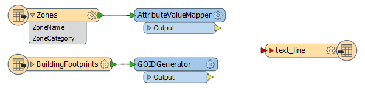](https://github.com/domix2000/FMETraining/blob/Desktop-Advanced-2018/DesktopAdvanced1Attributes/Images/Img1.201.Ex1.InitialWorkspace.png)

依次打开每个转换器的参数。请注意，AttributeValueMapper是从区域类别映射到TaxMultiplier值：

[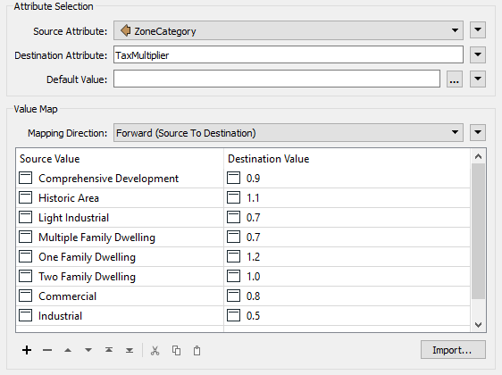](https://github.com/domix2000/FMETraining/blob/Desktop-Advanced-2018/DesktopAdvanced1Attributes/Images/Img1.202.Ex1.AttributeValueMapperParams.png)

GOIDGenerator仅为每个建筑物足迹创建唯一ID。

  
**2）运行工作空间**  
确保已启用“运行”&gt;“使用缓存运行”，然后运行工作空间。检查两个源数据集的缓存。它们看起来像这样：

[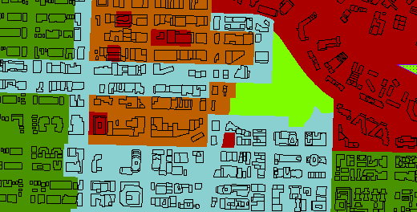](https://github.com/domix2000/FMETraining/blob/Desktop-Advanced-2018/DesktopAdvanced1Attributes/Images/Img1.200.Ex1.InitialData.png)

还要检查转换器高速缓存，以确保它们执行您期望的操作。

  
**3）添加SpatialFilter**  
首先要做的是将分区信息传输到建筑物覆盖区。将SpatialFilter转换器添加到工作空间，将区域作为过滤器要素，将建筑物作为候选项：

[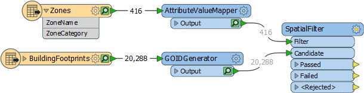](https://github.com/domix2000/FMETraining/blob/Desktop-Advanced-2018/DesktopAdvanced1Attributes/Images/Img1.203.Ex1.SpatialFilterOnCanvas.png)

检查转换器参数。设置（或确保设置）以下内容：

| 过滤器类型 | 多个过滤器 |
| :--- | :--- |
| 通过标准 | 通过一个过滤器 |
| 空间谓词测试 | “Filter Intersects Candidate”和“Filter Contains Candidate” |

您可能需要重新运行工作空间并检查SpatialFilter缓存，以确保构建要素（如预期的那样）从SpatialFilter：Passed输出端口出现，并拥有三个新属性（ZoneName，ZoneCategory和TaxMultiplier）。

  
**4）添加AttributeManager**  
添加连接到SpatialFilter的AttributeManager：通过输出端口并检查其参数。

第一项任务是为税率创建数值。

创建一个名为TaxRate的新属性。将其设置为固定值0.2

接下来，添加一个名为TaxAmount的新属性，单击右侧的下拉箭头，然后选择Open Arithmetic Editor选项：

[](https://github.com/domix2000/FMETraining/blob/Desktop-Advanced-2018/DesktopAdvanced1Attributes/Images/Img1.204.Ex1.OpenArithmeticEditorOption.png)

  
**5）计算税额**  
税额的计算是：

```text
建筑物占地面积x税收乘数x税率=税额
```

...其中建筑物占地面积是以平方米为单位的面积，“税收倍数”是与“区域类型”相关的值，“税率”是每年更改的值，因此应由用户提供。

结果也应四舍五入到小数点后两位。

因此，首先在FME要素函数下定位Area，然后双击它以将建筑物覆盖区域添加到等式中：

[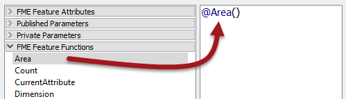](https://github.com/domix2000/FMETraining/blob/Desktop-Advanced-2018/DesktopAdvanced1Attributes/Images/Img1.205.Ex1.EquationAreaValue.png)

接下来，添加乘法符号，找到TaxMultiplier属性并双击它以将其添加到等式中：

[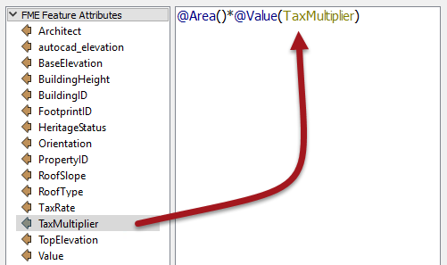](https://github.com/domix2000/FMETraining/blob/Desktop-Advanced-2018/DesktopAdvanced1Attributes/Images/Img1.206.Ex1.EquationTaxMultiplierValue.png)

A添加另一个乘法符号。现在找到TaxRate属性并双击它以将其添加到等式中：

[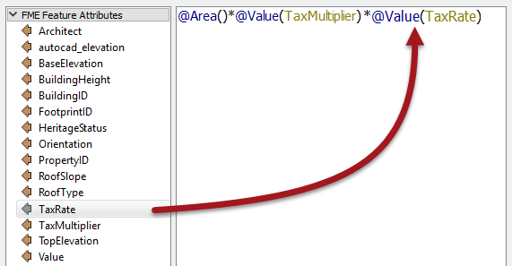](https://github.com/domix2000/FMETraining/blob/Desktop-Advanced-2018/DesktopAdvanced1Attributes/Images/Img1.207.Ex1.EquationTaxRateValue.png)

现在我们需要将结果舍入到两位小数。将方程式括在圆函数中，然后在@Value（TaxRate）之后添加一个逗号并输入2，这样我们就可以舍入到两个小数位。

[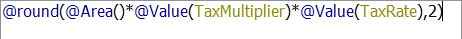](https://github.com/domix2000/FMETraining/blob/Desktop-Advanced-2018/DesktopAdvanced1Attributes/Images/Img1.210.Ex1.EquationRounding.png)

```text
@round(@Area()*@Value(TaxMultiplier)*@Value(TaxRate),2)
```

单击“确定”关闭此对话框，但保持显示的AttributeManager参数...

  
**6\) 创建税务报表字符串**  
最后一项任务是创建一个我们可以写入报表文件的文本字符串。在这种情况下，信息的最终用户希望以下列结构接收纯文本文件：

```text
属性: <PropertyID>
税值: <TaxValue>
<当前日期和时间>
```

因此，在AttributeManager中创建一个名为text\_line\_data的新属性- 这与输出模式匹配。然后单击下拉箭头并打开文本编辑器对话框。

输入固定值并在适当的位置添加属性以获得正确的输出：

[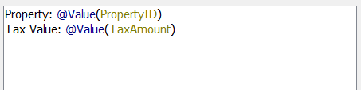](https://github.com/domix2000/FMETraining/blob/Desktop-Advanced-2018/DesktopAdvanced1Attributes/Images/Img1.213.Ex1.StringCreationInitial.png)

然后使用DateTimeNow（）函数创建日期/时间戳：

[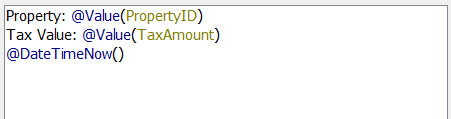](https://github.com/domix2000/FMETraining/blob/Desktop-Advanced-2018/DesktopAdvanced1Attributes/Images/Img1.214.Ex1.StringCreationInitial.png)

要在输出中获得回车，我们需要专门将这些字符添加到编辑器中。要查看此类字符，请选择 Options &gt; Show Spaces/Tabs

然后在特殊字符菜单中找到回车符（\ r），并为每行添加一个：

[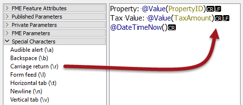](https://github.com/domix2000/FMETraining/blob/Desktop-Advanced-2018/DesktopAdvanced1Attributes/Images/Img1.215.Ex1.StringCreationCarriageReturn.png)

现在单击“确定”关闭对话框，然后接受对AttributeManager的更改。

  
**7\) 连接模式，运行工作空间**  
将AttributeManager：输出端口连接到文本文件写模块要素类型：

[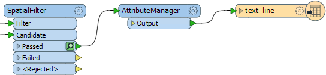](https://github.com/domix2000/FMETraining/blob/Desktop-Advanced-2018/DesktopAdvanced1Attributes/Images/Img1.216.Ex1.MappedSchema.png)

保存然后运行工作空间。结果应该是一个如下所示的文本文件：

[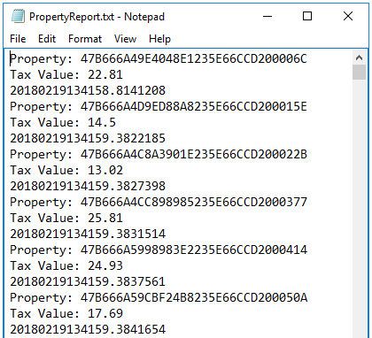](https://github.com/domix2000/FMETraining/blob/Desktop-Advanced-2018/DesktopAdvanced1Attributes/Images/Img1.217.Ex1.FinalOutput.png)

<table>
  <thead>
    <tr>
      <th style="text-align:left">恭喜</th>
    </tr>
  </thead>
  <tbody>
    <tr>
      <td style="text-align:left">
        <p>通过完成本练习，您已学会如何：</p>
        <ul>
          <li>使用算术编辑器构造数值</li>
          <li>使用文本编辑器构造字符串</li>
          <li>将数据写入纯文本文件</li>
        </ul>
      </td>
    </tr>
  </tbody>
</table>&lt;/div&gt;&lt;/body&gt;&lt;/html&gt;

