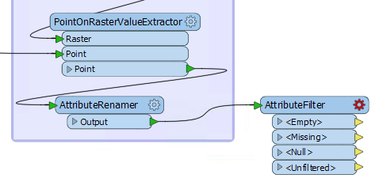
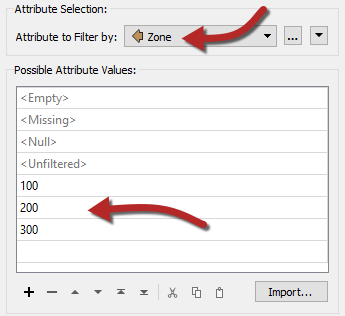
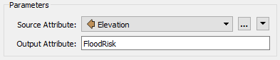
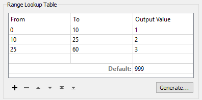
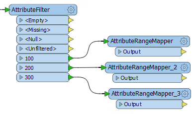

# 练习：洪水风险评估：简单过滤

| 练习2a | 洪水风险项目：简单过滤方法 |
| :---|:--- |
| 启动工作空间 | C:\FMEData2018\Workspaces\DesktopAdvanced\Attributes-Ex2-Begin.fmw |
| 结束工作空间 | C:\FMEData2018\Workspaces\DesktopAdvanced\Attributes-Ex2a-Complete.fmw |

这个简单的过滤方法是一个包含AttributeFilter和几个AttributeRangeMapper转换器的两步过程。您应该已经打开了启动工作空间。

  
**1）放置AttributeFilter**  
放置一个连接到AttributeRenamer的AttributeFilter：

在参数对话框或参数编辑器窗口中检查参数。选择Zone作为要过滤的属性。在“属性值”字段中，输入值100,200和300：

您可以使用导入功能，但对于这么少的值，它几乎不值得。

应用更改，您将看到为您指定的每个值添加的新输出端口。

---
  
**2）添加AttributeRangeMapper**  
添加一个AttributeRangeMapper转换器并将其连接到AttributeFilter的100输出端口：

检查参数。正如您将看到这是一个包含范围的查找表。我们应该能够使用原始表中的信息将海拔范围映射到最终洪水风险。

因此，选择Elevation作为源属性。输入FloodRisk作为输出属性：

在“范围查找表”中，输入“从 - 到”值，如下所示：

| 从 | 到 | 输出值 |
| :--- | :--- | :--- |
| 0 | 10 | 1 |
| 10 | 25 | 2 |
| 25 | 60 | 3 |

如果海拔精确地落在一个值（例如25）上，则计入较低的带（即10-25）。输入999作为默认值，以便任何海拔不匹配的要素，无论出于何种原因，都会被正确标记：

应用更改。您可能希望运行转换并检查AttributeRangeMapper结果，以确保此部件正常工作。

|  Vector小姐说...... |
| :--- |
|  希望您看到来自本练习简介中的洪水风险表的输出值数字！在这里，我们将刚刚过滤的区域（区域100）与每个可能的风险值相结合。 |

 ---
 
**3）复制AttributeRangeMapper**  
现在我们需要为每个其他AttributeFilter输出端口做同样的事情。而不是手动设置它们 - 如上所述 - 最简单的方法是复制我们刚刚设置的AttributeRangeMapper转换器。

因此，单击现有的AttributeRangeMapper并按Ctrl + D复制它。重复并将每个副本连接到不同的AttributeFilter输出端口。

工作空间现在看起来像这样：

现在依次打开每个新AttributeRangeMapper转换器的参数对话框，并根据原始计算表设置正确的输出值。

输出值将是：

| 100米区域 | 1 | 2 | 3 |
| :--- | :--- | :--- | :--- |
| 200米区域 | 2 | 3 | 4 |
| 300米区域 | 3 | 4 | 5 |

---

**4）添加Inspector**  
检查缓存数据不允许您将数据分开以便于检查。因此，放置一个Inspector转换器并将每个AttributeRangeMapper输出连接到它。

打开Inspector参数对话框，在Group-By下选择名为FloodRisk的新创建的属性。

| 技巧 |
|:---|
| 要通过要素缓存实现相同的效果，请添加第二个AttributeFilter并按FloodRisk过滤。将过滤器设置为1,2,3,4,5。然后运行工作空间，选择转换器，然后按Ctrl + I进行检查。|

---
  
**5）保存并运行工作空间**  
将工作空间保存为新文件以保留起始工作空间，然后运行它。您应该看到每个地址都有颜色以匹配其洪水风险。您还可以依次关闭每个区域，以查看哪些地址最危险/最不危险。

 ---
 
| Lynn Guistic教授说...... |
| :--- |
| 如果你今天很敏锐，你会注意到你可以按相反的顺序完成这个过程。您可以按海拔过滤然后映射区域，而不是按区域过滤然后映射海拔。这需要AttributeRangeFilter和AttributeValueMapper转换器的组合。 |

---

| 恭喜 |
| :--- |
| 通过完成本练习，您已学会如何：  <ul><li>使用简单测试过滤数据，以便将其细分为了属性映射</li><li>映射属性值</li></ul>  |

