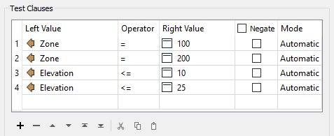
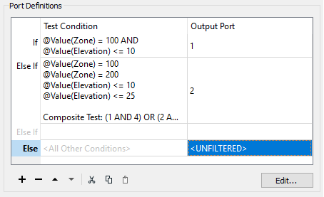
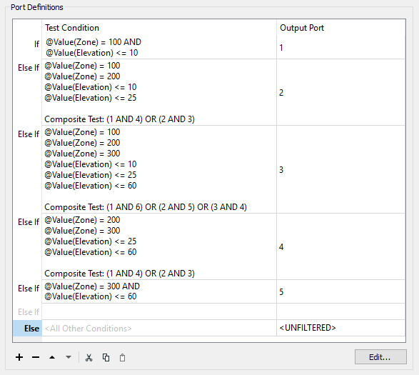
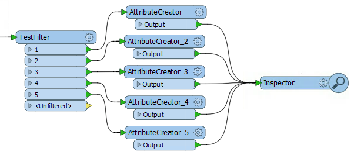

# 练习：洪水风险评估：复杂过滤

 练习2b

 洪水风险项目：复杂过滤方法

启动工作空间

C:\FMEData2018\Workspaces\DesktopAdvanced\Attributes-Ex2-Begin.fmw

结束工作空间

C:\FMEData2018\Workspaces\DesktopAdvanced\Attributes-Ex2b-Complete.fmw

这个稍微复杂一点的方法也是一个过滤过程，但过滤都是在一个步骤中完成的 - 对于区域和海拔 - 都使用TestFilter。

  
**1）放置TestFilter**  
将TestFilter连接到AttributeRenamer：

我们想要得到的是每个洪水风险值的单独输出端口。因此，我们需要将所有测试合并到这个转换器中。

  
**2）设置First TestFilter条件**  
在参数对话框或参数编辑器窗口中检查参数。看到有测试条件和输出端口的字段。双击第一个Test Condition字段，将打开类似Tester的对话框：

这可以是FloodRisk = 1（最高）的测试。根据计算表，只有在Zone = 100和Elevation &lt;= 10时才会出现这种情况。因此，设置测试Zone = 100 AND Elevation &lt;= 10的条件。这里重要的部分是将测试设置为AND（即两个条款必须为真）。

在对话框底部的输出端口参数中输入1：

现在单击“确定”关闭对话框的这一部分。

TestFilter主对话框现在如下所示：

  
**3）设置第二个TestFilter条件**  
现在双击下一个测试条件（Else If）以设置FloodRisk = 2的条件

根据该表，FloodRisk = 2有两个条件。他们是当：

* 区域= 200和海拔&lt;= 10
* 区域= 100和海拔&lt;= 25

所以，输入四个条款; 区域= 100，区域= 200，海拔&lt;= 10，海拔&lt;= 25。您可以使用此对话框中的“复制”和“粘贴”按钮或键盘快捷键来帮助加快此过程。

然后将测试类型更改为复合。在“复合表达式”字段中，输入：

* （1和4）或（2和3）

当然，复合表达式字段取决于您输入条款的顺序。如果您以不同的顺序输入它们，则需要调整此字段。

在Output Port参数中输入2，然后单击OK关闭此对话框。TestFilter主对话框现在如下所示：

  
**4）设置剩余的TestFilter条件**  
现在对每个其他洪水风险值重复上述步骤。总共有五个条件（每个洪水风险一个）。

它可能看起来很复杂，但要养成习惯应该很容易。此外，使用这些对话框中的“复制”和“粘贴”按钮可加快此过程。

最终的对话框如下所示：

最后的测试将与第一个测试类似，只有两个条件，因此它将是AND而不是Composite测试。

必须以正确的顺序保持这些; 否则，某个功能可能会以错误的顺序通过测试并获得比预期更低的风险。您可以通过突出显示一行来更改顺序，然后单击箭头按钮以向上或向下移动条件。

将更改应用于参数。

  
**5）添加AttributeCreator**  
到目前为止，我们已经过滤了数据，但没有使用结果设置属性。

为此，添加连接到每个TestFilter输出端口的AttributeCreator（或AttributeManager）。使用AttributeCreator为每个输出端口创建正确的FloodRisk属性（和值）（即端口1：FloodRisk = 1）：

最简单的方法是放置一个AttributeCreator并为每个端口复制它，每次都编辑FloodRisk值。

  
**6）检查结果**  
使用您首选的数据检查方法运行工作空间。要检查缓存数据，您只需选择所有AttributeCreator转换器并检查它们。

对于Inspector转换器，放置一个Inspector转换器并将每个AttributeCreator / Manager输出连接到它。打开Inspector参数对话框，在Group-By下选择名为FloodRisk的新创建的属性。

|  技巧 |
| :--- |
|  在此场景中放置新Inspector转换器的最快方法是选择所有AttributeCreator / Manager转换器，然后使用“快速添加”添加Inspector。这将自动连接所有三个转换器。您仍需要在Inspector上手动设定group-by设置。 |

工作空间现在看起来像这样：

  
**7）保存并运行工作空间**  
将工作空间保存为新文件以保留起始工作空间，然后运行它。您应该看到每个地址都有颜色以匹配其洪水风险。您还可以依次关闭每个区域，以查看哪些地址最危险/最不危险。

<table>
  <thead>
    <tr>
      <th style="text-align:left">恭喜</th>
    </tr>
  </thead>
  <tbody>
    <tr>
      <td style="text-align:left">
        
通过完成本练习，您已学会如何：

        <ul>
          <li>使用复杂测试过滤数据，以便将其细分为属性映射</li>
        </ul>
      </td>
    </tr>
  </tbody>
</table>&lt;/td&gt; &lt;/tr&gt; &lt;/tbody&gt;&lt;/table&gt; &lt;/article&gt; &lt;/div&gt; &lt;/div&gt;&lt;/body&gt;&lt;/html&gt;

