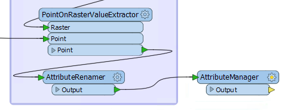
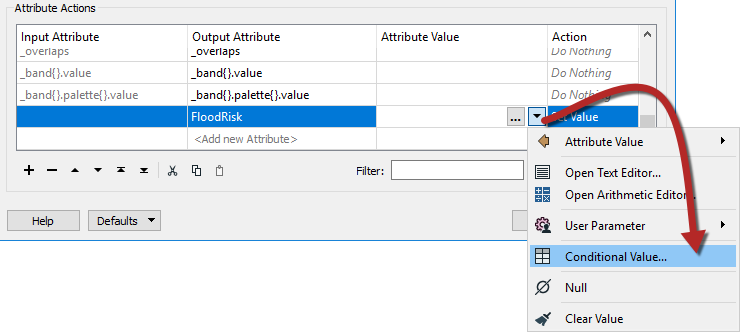
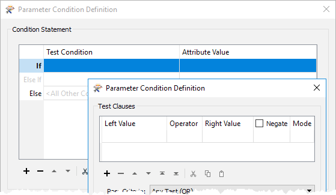
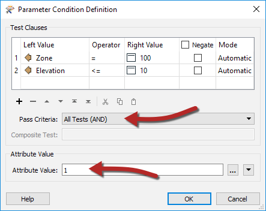
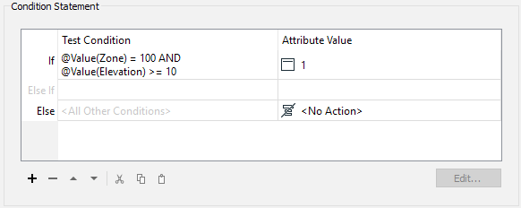
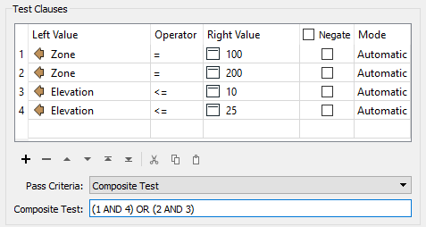
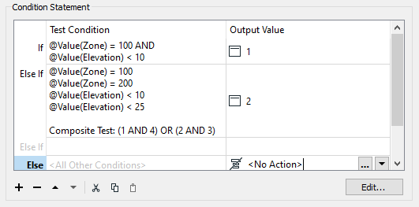
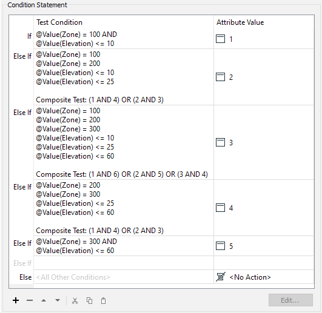
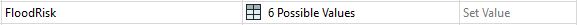

# 练习：洪水风险评估：条件值

|  练习2c |  洪水风险项目：条件值法 |
| :--- | :--- |
| 启动工作空间 | C:\FMEData2018\Workspaces\DesktopAdvanced\Attributes-Ex2-Begin.fmw |
| 结束工作空间 | C:\FMEData2018\Workspaces\DesktopAdvanced\Attributes-Ex2c-Complete.fmw |

这是涉及AttributeManager转换器的一步过程。

  
**1）放置AttributeManager**  
放置一个AttributeManager转换器并将其连接到AttributeRenamer：

  
**2）设置第一个AttributeManager条件**  
在参数对话框或参数编辑器窗口中检查参数。忽略所有现有属性，滚动到对话框的底部，然后在&lt;Add New Attribute&gt;字段中输入FloodRisk。

在“属性值”字段中，单击下拉箭头并选择“条件值”：

这将打开一个与Tester / TestFilter变换器非常相似的新对话框。有测试条件和输出值的字段。双击第一个Test Condition字段，将打开类似Tester的对话框：

这可以是FloodRisk = 1（最高）的测试。根据计算表，只有在Zone = 100和Elevation &lt;= 10时才会出现这种情况。因此，设置测试Zone = 100 AND Elevation &lt;= 10的条件。这里重要的部分是将测试设置为AND（即两个条款）必须为真。

在对话框底部的“属性值”参数中输入1：

现在单击“确定”关闭对话框的这一部分。

主要的条件定义对话框现在如下所示：

  
**3）设置第二个AttributeManager条件**  
现在双击下一个测试条件（Else If）以设置FloodRisk = 2的条件

根据该表，FloodRisk = 2有两个条件。他们是当：

* 区域= 200和海拔&lt;= 10
* 区域= 100和海拔&lt;= 25

所以，输入四个条款; 区域= 100，区域= 200，海拔&lt;= 10，海拔&lt;= 25。

另外，将测试类型更改为复合。在“复合表达式”字段中，输入：

* （1和4）或（2和3）

当然，复合表达式字段取决于您输入子句的顺序。如果您以不同的顺序输入它们，则需要调整此字段。

在“属性值”参数中输入2，然后单击“确定”关闭此对话框。主要的条件定义对话框现在如下所示：

  
**4）设置剩余的TestFilter条件**  
现在对每个其他洪水风险值重复上述步骤。总共有五个条件（每个洪水风险一个）。

它可能看起来很复杂，但应该很容易熟悉起来。此外，在这些对话框中使用“复制”和“粘贴”按钮或键盘快捷键可加快此过程。

最终的对话框如下所示：

必须以正确的顺序保持这些; 否则，某个要素可能会以错误的顺序通过测试并获得比预期更低的风险。

接受更改，主AttributeManager对话框现在如下所示：

  
**5）添加Inspector**  
检查缓存的数据不允许您将数据分离出来以便更容易地检查。因此，放置一个Inspector转换器并将每个AttributeRangeMapper输出连接到它。

打开Inspector参数对话框，在Group-By下选择名为FloodRisk的新创建的属性。

|  技巧 |
| :--- |
|  要通过要素缓存实现相同的效果，请添加第二个AttributeFilter并按FloodRisk过滤。将过滤器设置为1,2,3,4,5。然后运行工作空间，选择转换器，然后按Ctrl + I进行检查。 |

  
**6）保存并运行工作空间**  
保存并运行工作空间。您应该看到每个地址都有颜色以匹配其洪水风险。您还可以依次关闭每个区域，以查看哪些地址最危险/最不危险。

<table>
  <thead>
    <tr>
      <th style="text-align:left">恭喜</th>
    </tr>
  </thead>
  <tbody>
    <tr>
      <td style="text-align:left">
        
通过完成本练习，您已学会如何：

        <ul>
          <li>使用条件属性根据一组复杂条件映射数据</li>
        </ul>
      </td>
    </tr>
  </tbody>
</table>