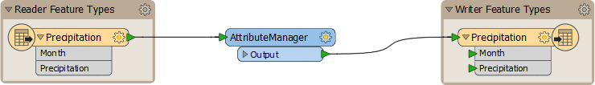
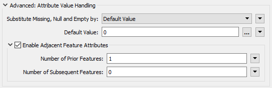
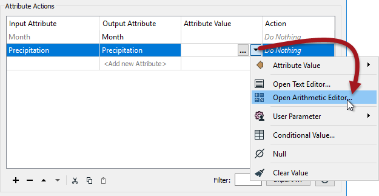
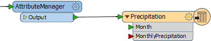
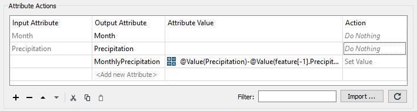
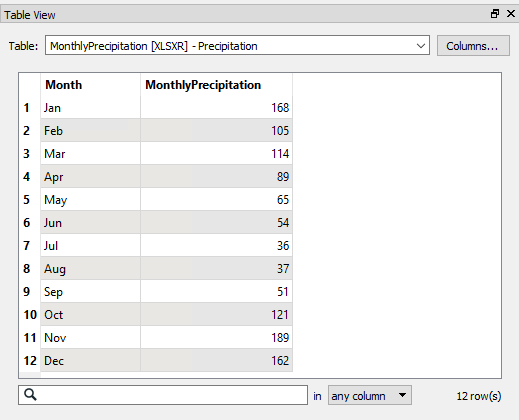

# 练习：降水计算

|  练习3 |  降水计算 |
| :--- | :--- |
| 数据 | 降水数据（Microsoft Excel） |
| 总体的目标 | 计算月降水量 |
| 演示 | 相邻的要素属性 |
| 启动工作空间 | 无 |
| 结束工作空间 | C:\FMEData2018\Workspaces\DesktopAdvanced\Attributes-Ex3-Complete.fmw |

您正在制定一个绘制城市月降雨量（降雨量）的项目。您已经获得了如下数据集：

| 月份 | 降水 |
| :--- | :--- |
| 一月 | 168 |
| 二月 | 273 |
| 三月 | 387 |
| 四月 | 476 |
| 五月 | 541 |
| 六月 | 595 |
| 七月 | 631 |
| 八月 | 668 |
| 九月 | 719 |
| 十月 | 840 |
| 十一月 | 1029 |
| 十二月 | 1191 |

不幸的是，这些数字是累计值，您想要绘制每个月的单独数字。

您决定使用FME进行计算，而不是伸入放着计算器的办公桌抽屉！

  
**1）创建工作空间**  
创建工作空间以转换数据，如下所示：

| 读模块格式 | Microsoft Excel |
| :--- | :--- |
| 读模块数据集 | C：\ FMEData2018 \ DATA \ ElevationModel \ Precipitation.xlsx |
| 写模块格式 | Microsoft Excel |
| 写模块数据集 | C:\FMEData2018\Output\Training\MonthlyPrecipitation.xlsx |

创建工作空间时，请检查读模块的参数，以确保FME识别每列顶部的标题。

  
**2）添加AttributeManager**  
要计算任何给定月份的降水量，您需要从当前月份的累计总量中减去上个月的累计总量。

使用FME，您可以使用相邻要素属性功能来获取上个月的数字。

因此，在读模块要素类之间放置一个AttributeManager转换器：

[](https://github.com/safesoftware/FMETraining/blob/Desktop-Advanced-2018/DesktopAdvanced1Attributes/Images/Img1.243.Ex3.InitialWorkspace.png)

  
**3）设置AttributeManager参数1**  
在参数对话框或参数编辑器窗口中检查AttributeManager的参数。

展开高级属性集，然后选中标记为启用相邻要素属性的复选框。在提供的字段中，输入1表示要保留的先前要素数。

接下来将参数_Substitute Missing，Null和Empty by设置为：_ Default Value并在Default Value字段中输入0：

[](https://github.com/safesoftware/FMETraining/blob/Desktop-Advanced-2018/DesktopAdvanced1Attributes/Images/Img1.244.Ex3.AttributeManagerParameters1.png)

|  Lynn Guistic教授说...... |
| :--- |
|  替换参数比大多数人认识的更重要。 想一想：要处理的第一个要素不能具有先前要素，并且要处理的最后一个要素将不会具有后续要素。因此，您必须要小心这里设置的内容。 在本练习中，我们计算一个数值; 因此，使用0（零）作为默认替换是有意义的。 |

  
**4）设置AttributeManager参数2**  
现在让我们计算新的降水值。

在“降水”属性的“属性值”字段中，单击下拉箭头并打开“算术编辑器”：

[](https://github.com/safesoftware/FMETraining/blob/Desktop-Advanced-2018/DesktopAdvanced1Attributes/Images/Img1.245.Ex3.AttributeManagerParameters2.png)

在算术编辑器对话框中，使用左侧的菜单选择：

* FME要素属性降水
* 数学运算符 - （减号）
* 要素\[-1\]的FME要素属性降水

所有这些应该留给你一个表达式如下：

```text
@Value(Precipitation)-@Value(feature[-1].Precipitation)
```

现在你可以看到为什么设置替换字段如此重要，因为它不确定当要素\[-1\]丢失时，上面会发生什么结果。

单击“确定”关闭“算术编辑器”对话框，然后接受参数更改。

  
**5）保存并运行工作空间**  
保存工作空间，然后运行它。检查输出。

数字开始看起来正确但很快就会出错。即使在温哥华（我的意思是，Interopolis）也不会在一个月内下雨623毫米！

问题是：与FME中的其他场合不同，这里我们不能简单地覆盖我们正在使用的属性。那是因为它扭曲了下一个计算。即3月的计算需要按照2月份的原始数量运行，相反，它会收到我们刚刚用它覆盖的值！

解决此问题的唯一方法是创建一个新属性。

  
**6）调整工作空间**  
返回工作空间。通过将目标属性Precipitation重命名为MonthlyPrecipitation来编辑写模块模式：

[](https://github.com/safesoftware/FMETraining/blob/Desktop-Advanced-2018/DesktopAdvanced1Attributes/Images/Img1.247.Ex3.UpdatedWriterSchema.png)

现在返回AttributeManager并更改它以创建一个名为MonthlyPrecipitation的全新属性。您可以复制并粘贴该行以节省时间; 只需更改输出属性名称：

[](https://github.com/safesoftware/FMETraining/blob/Desktop-Advanced-2018/DesktopAdvanced1Attributes/Images/Img1.248.Ex3.UpdatedAttributeManager.png)

这是一件很痛苦的事情，但是赖我一开始就把你引向错误的方向！您甚至无法将Precipitation重命名为MonthlyPrecipitation，因为无论您怎么称呼它，它仍然会获取不正确的值。您必须将其Action字段重置为“Do Nothing”，然后创建一个新属性。

  
**7）重新运行工作空间。**  
保存工作空间。

在重新运行工作空间之前，请在“导航”窗口中检查名为“覆盖现有文件”的写模块参数。

将其设置为是 - 如果尚未设置 - 那么输出将覆盖目标数据集，而不只是将此数据附加到同一电子表格中。

此外，请确保您要写入的文件尚未在Excel（或任何其他编辑器）中打开。

重新运行工作空间。

检查输出。这次数字应该是正确的：

[](https://github.com/safesoftware/FMETraining/blob/Desktop-Advanced-2018/DesktopAdvanced1Attributes/Images/Img1.249.Ex3.OutputData.png)

|  Lynn Guistic教授说...... |
| :--- |
|  如果输出中的值字面上是“273-168”，“387-273”等，那么你已经使用了字符串编辑器而不是算术编辑器！如果值均为零，则需要确保将“AttributeManager ”操作设置为在“降水”字段“无任何操作”，而不是“设置值”。 |

<table>
  <thead>
    <tr>
      <th style="text-align:left">恭喜</th>
    </tr>
  </thead>
  <tbody>
    <tr>
      <td style="text-align:left">
        <p>通过完成本练习，您已学会如何：</p>
        <ul>
          <li>暴露相邻的要素属性</li>
          <li>使用相邻的要素属性</li>
          <li>处理属性操作中的缺失值</li>
        </ul>
      </td>
    </tr>
  </tbody>
</table>
