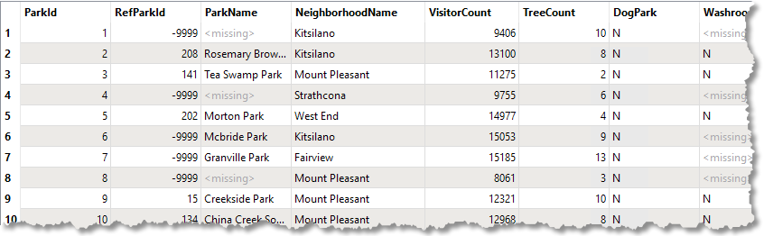
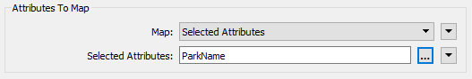
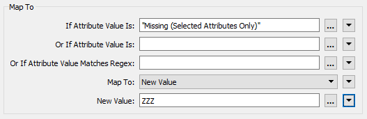
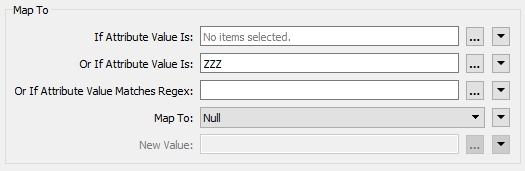
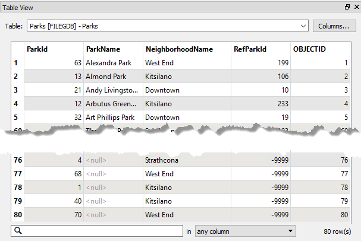
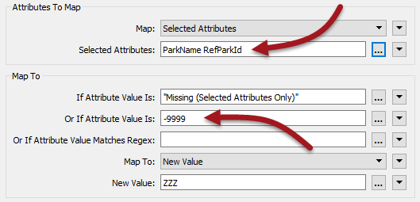

# 练习：停放数据集排序

|  练习4 |  公园数据集排序 |
| :--- | :--- |
| 数据 | 公园（MapInfo TAB） |
| 总体的目标 | 将公园按字母顺序排序 |
| 演示 | Null属性处理 |
| 启动工作空间 | C:\FMEData2018\Workspaces\DesktopAdvanced\Attributes-Ex4-Begin.fmw |
| 结束工作空间 | C:\FMEData2018\Workspaces\DesktopAdvanced\Attributes-Ex4-Complete.fmw |

在此工作空间中，同事正在尝试将公园列表写入地理数据库数据集。重要的是，公园按字母顺序排列 - 根据他们的名字 - 并且没有公园名称的要素被写为null并显示在数据集的最后。

但是，他们拥有的工作空间似乎没有做他们需要的工作。公园按字母顺序排序，但未命名的公园总是首先出现。

  
**1）启动Workbench**  
打开工作空间C：\ FMEData2018 \ Workspaces \ DesktopAdvanced \ Attributes-Ex4-Begin.fmw

通过单击源要素类并选择弹出式检查按钮来检查源数据集。

在Data Inspector中，检查Table View窗口中的数据。您将看到数据按ID的顺序排列，而不是名称，并且有&lt;missing&gt;值散落各处：

要对&lt;missing&gt;数据进行排序，我们需要将其ParkName属性设置为出现在排序列表底部的内容，然后将它们设置为null。

  
**2）添加NullAttributeMapper**  
在Sorter转换器之前添加NullAttributeMapper转换器。检查参数。

确保将“Map”设置为Selected Attributes，然后选择属性ParkName：

下面是要映射到的内容的一部分。

我们知道这里的值当前列为&lt;missing&gt;，因此将“If Attribute Value Is”参数设置为Missing（仅限Selected Attributes）

我们希望将这些值映射到出现在按字母顺序排序的列表底部的值，因此将“Map To”更改为New Value并输入ZZZ作为新值。

接受参数更改。

  
**3）添加NullAttributeMapper**  
现在添加第二个NullAttributeMapper; 这次它应该在Sorter_之后_连接。

打开参数，再次确保“Map”设置为Selected Attributes并选择ParkName属性。这次将ZZZ值转回空值：

从技术上讲，我们可以把它们转回&lt;missing&gt;; 地理数据库写模块将它们写为空值。但是，假设我们不知道，null是更安全的选择，并且必然会给我们想要的东西。

  
**4）保存并运行工作空间**  
保存工作空间，然后运行它。检查输出。这次数据应按ParkName排序，但所有空值都在数据集的末尾：

  
**5）修复RefParkId**  
您的同事现在要求您修复RefParkId字段。您会注意到很多值都是-9999。这在MapInfo相当于“无”，但对于地理数据库，最好将它们设置为正确的空值。

|  Vector小姐说...... |
| :--- |
|  这很简单。在看指导之前花点时间考虑一下要如何做！ |

为此，请打开第一个NullAttributeMapper的参数对话框。将RefParkId添加到要处理的属性列表中。然后将-9999添加到_Or If Attribute Value Is_字段：

现在打开第二个NullAttributeMapper并将RefParkId添加到属性列表以进行处理。

现在，这些值将映射到ZZZ，缺少ParkName值。然后它们将被第二个NullAttributeMapper变为真空。

|  高级练习 |
| :--- |
|  如果还有时间，则应过滤掉空的ParkNames和RefParkID，并将它们写入地理数据库中的单独要素类型（表）。 |

<table>
  <thead>
    <tr>
      <th style="text-align:left">恭喜</th>
    </tr>
  </thead>
  <tbody>
    <tr>
      <td style="text-align:left">
        
通过完成本练习，您已学会如何：

        <ul>
          <li>识别null和缺少的属性值</li>
          <li>设置null和缺少的属性值</li>
        </ul>
      </td>
    </tr>
  </tbody>
</table>
