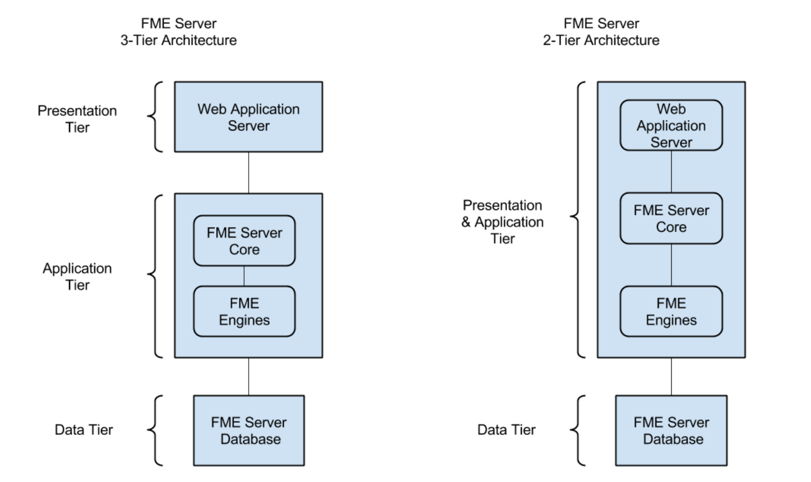

# 部署FME Server

FME Server可以部署在多种配置中。

|  分析师女士说...... |
| :--- |
|  本节旨在提供FME Server部署选项的基本概述。如果您有兴趣了解有关如何部署FME Server的更多信息，请查看[FME Server管理员培训课程，](https://safe-software.gitbooks.io/fme-server-administration-training-2018/content/)因为这里有更详细的介绍。 |

## 平台

可以通过多种方式部署FME Server：

* **本地基础架构（物理硬件）** - 这是您购买FME Server并将其安装在您自己的硬件系统上的传统配置。
* **基础架构即服务（虚拟硬件）** - 您可以在此处购买FME Server并将其安装在由Amazon等公司作为服务提供的虚拟硬件上。
* **平台即服务（FME云）** - 这是预装在亚马逊虚拟计算机上的FME Server，其中整个平台由Safe Software提供，按现收现付原则。

|  新内容 |
| :--- |
|  Docker上的FME Server现已退出FME服务器2018的技术预览版。这提供了一种在支持Docker的任何平台上快速部署FME Server的方法。有关更多信息，请参阅 [Docker和FME](https://blog.safe.com/2017/02/docker-fme-driver-worker-workflows/)博客文章或 [安装FME Server for Docker](https://knowledge.safe.com/articles/24815/deployment-of-fme-server-using-docker-toolbox.html)文章。 |

## 分布式系统

分布式系统是系统的不同组件位于不同的联网计算机上的系统。这对于减少内存存储或移动引擎更接近数据非常有用。

例如，在分布式环境中，FME Engines可以在与FME Server主机分开的计算机或多台计算机上运行。FME Server数据库和Web应用程序服务器也可以单独安装。

