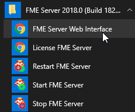
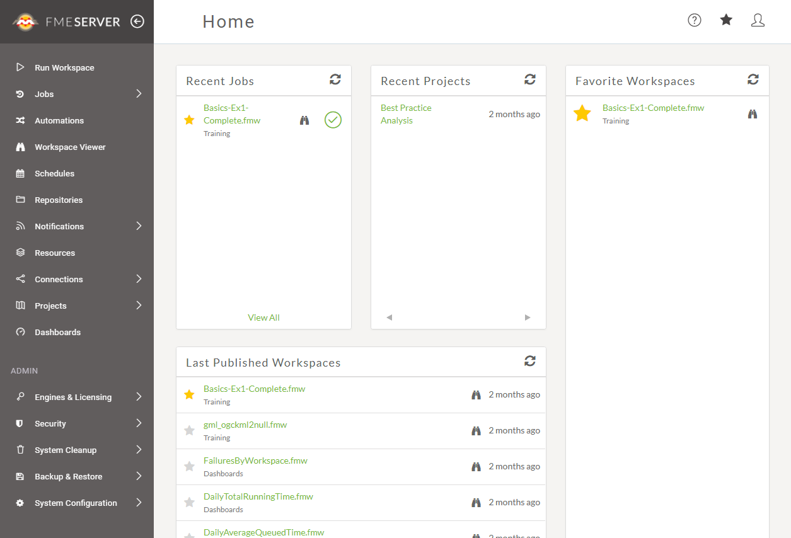
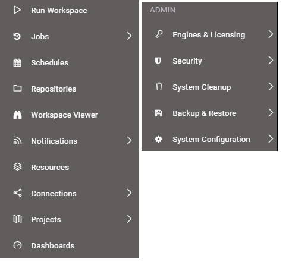
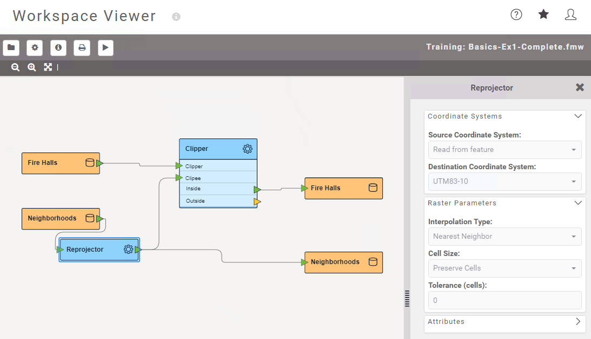
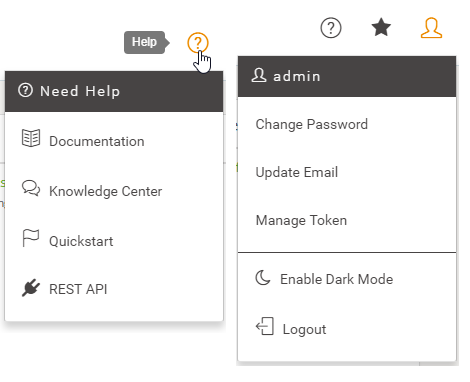

# Web界面基础知识

虽然转换是在FME Workbench中编写的，但FME Server的核心工具是通过基于Web的界面访问的。

可以通过URL **&lt;servername&gt;:&lt;port&gt;/fmeserver**（端口可以是可选的）或通过开始菜单访问Web界面：

FME Server的Web界面如下所示：

界面的主要部分显示包含信息，报告，参数和其他组件的内容页面。例如，登录页面包含最近作业，最近项目和收藏工作空间列表的快捷方式。

界面的左侧包含一组菜单。选择菜单项会更改页面内容以匹配所选的菜单项。

## Web界面菜单

通常，可通过Web界面菜单访问FME Server功能。此菜单中有两个主要部分：

第一部分涉及FME Server 的**使用**。除此之外，它还具有运行工作空间，访问存储库，设置计划以及查看作业历史记录的选项。

菜单的下一部分与FME Server 的**管理**有关。除其他外，它还具有管理引擎，设置安全性和创建系统备份的选项。

|  新内容 |
| :--- |
|  请注意下面菜单中的Workspace Viewer。这是FME Server 2018中的一项全新功能，允许您获取发布到FME Server的任何工作空间的只读视图。它允许您查看工作空间中设置的所有读模块，写模块，转换器和参数：  |

界面的右上角有一个额外的菜单：

它为作者，用户，管理员和开发人员提供了访问帮助工具的权限。它也是查看您收藏的任何工作空间的快捷方式，并允许访问您的用户帐户选项。

|  新内容 |
| :--- |
|  2018的web界面有了一次样式更新。一个重大变化是为界面引入了Dark Mode。您可以在“用户选项”菜单中找到启用或禁用它的选项。 |

## 开始使用

开始使用FME Server Web界面需要熟悉三个关键页面：

* 引擎和许可
* 运行工作空间
* 作业  

