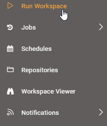
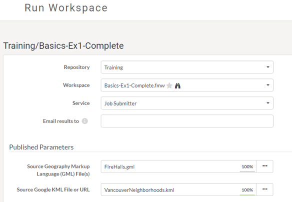
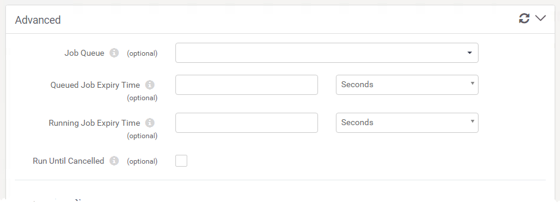
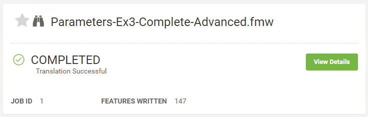

# 运行工作空间

开始使用FME Server的第二步是选择Run Workspace的菜单选项：

这将打开“运行工作空间”页面，您可以在其中选择存储库，工作空间和服务来运行转换：

选中工作空间后，将显示所有已发布的参数，以便在运行转换之前设置它们。

单击“高级”旁边的箭头将展开“高级参数”菜单。这些是FME Server特定的参数，可以精确调整工作空间的运行方式。“高级”部分还包含用于运行工作空间的URL以及设置参数的概述：

如果对参数感到满意，请单击底部的绿色“运行”按钮以运行转换。将出现一个进度对话框，指示您的工作空间是运行还是已排队。在此对话框中，您可以取消作业或查看详细信息：

工作空间（作业）运行完毕后，将显示完成消息，通知您转换是成功还是失败。根据您运行工作空间的服务，您还会看到其他详细信息，如下载链接：

---

|  警察局长Webb-Mapp说... |
| :--- |
|  请注意，还有其他方法可以查找和运行工作空间。最近发布的工作空间和工作空间“加星标”作为收藏夹可以在界面登录页面上轻松找到。    此外，可以通过浏览“存储库”页面（单击菜单上的“存储库”）来浏览要运行的工作空间，这更像是文件浏览器而不是简单的选择工具。 |

