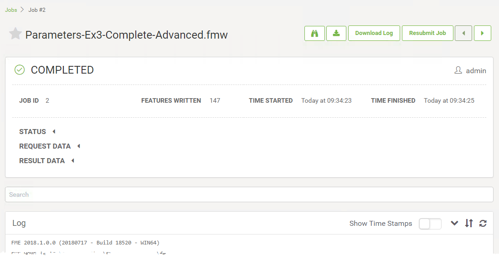

# 作业

开始使用FME Server的最后一步是选择Jobs的菜单选项，然后选择Completed，Queued或Running jobs来查看：

这将打开“作业”页面，您可以在其中查看作业的状态，无论是已完成，已排队还是正在运行：

这允许您检查刚刚运行的转换是否已成功完成。您还可以查找当前正在运行的作业，排队等待运行的作业或已完成运行的任何作业。当作业历史记录从多个用户运行到数千个工作空间时，允许您选择要显示的作业的下拉菜单特别有用。还有一个按作业状态过滤的选项，例如，您可以快速找到导致失败消息的所有作业。

|  2018.1的新功能 |
| :--- |
|  对于2018.1，添加了更多已完成的作业过滤选项。过滤器现在包含在名为Filters的可扩展菜单中。您现在可以按用户，状态，引擎，存储库和工作空间进行筛选。要删除过滤器，请单击“重置过滤器”按钮或离开“作业”页面。对于排队和正在运行的作业，您仍然只能按用户过滤：  |

## 完成的作业

单击已完成的作业将打开一个显示该作业信息的页面; 例如作业ID，作业优先级，启动时间，写入的要素以及用户运行作业。您还可以查看和搜索作业日志。

一系列按钮允许您下载转换的FME日志，只需单击即可重新提交作业，查看工作空间并下载工作空间：

这使您可以确认工作空间是否正常运行，具有与FME Desktop中相同的详细程度。

## 排队和正在运行的作业

可以列出已排队和正在运行的作业，以便您可以查看服务器当前正在处理的作业。您可以再次按特定用户名筛选作业。

一个特别有用的功能是，如果不再需要某些作业，这些页面可以用来取消它们。

|  技巧 |
| :--- |
|  如果您的作业经常排队，请与您的FME Server管理员联系，了解不同的选项，如作业队列、专用引擎或安排更大的任务在正常办公时间以外运行。 |

