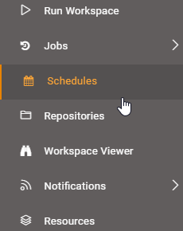
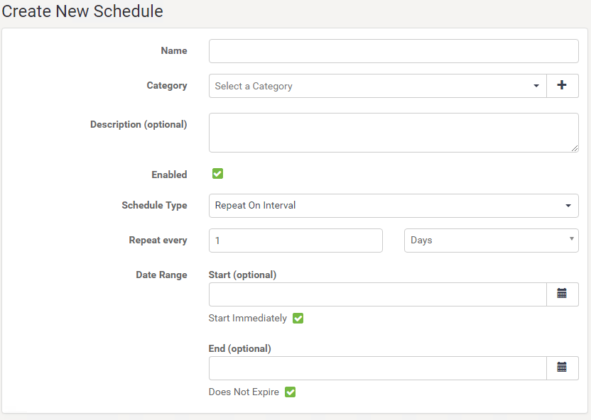
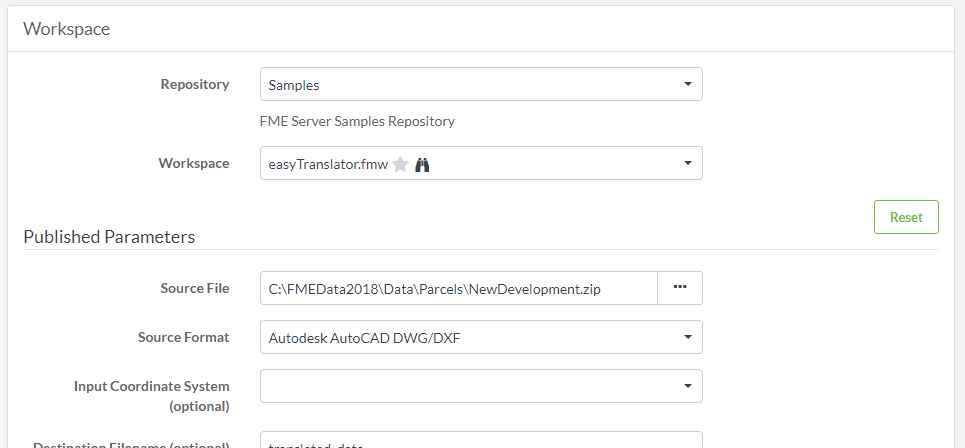

# FME Server定时

定时转换是在特定时间或日期启动工作空间的最佳方式。同样重要的是，使用定时来自动化在一个定义的时间间隔内多次运行工作空间的任务。

## 什么是定时?

定时是指将FME Server配置为在将来的特定时间在仓库中运行工作空间的功能。定时可以使工作空间运行一次或重复运行。

## 管理定时任务

定时任务在Web界面中设置。可以通过主菜单上的按钮访问它们：

该界面支持您期望的所有功能，包括创建，删除，复制以及启用和禁用任务的能力：

## 创建定时任务

创建定时任务时可以设置许多参数。

第一组参数包括用于命名和描述定时以及设置实际定时的选项。在这里工作空间将设置为从4月28日凌晨2:00开始每天运行一次。

|  2018.1的新变化 |
| :--- |
|  请注意，在FME Server 2018.1中，“创建新定时”界面略有改变。主要变化是，如果结束（可选）字段留空，则定时不会过期。这将取代以前的FME Server版本中的Schedule Does Not Expire复选框：   |

请注意，每个定时都可以分配给特定类别。

接下来的几个参数集中在要运行的工作空间上。

选择工作空间后，FME将检索有关工作空间的信息，此时会有短暂的暂停。然后它将暴露工作空间中存在的任何已发布参数：

通知主题还有可选参数，可在完成定时任务时触发。这些可用于通知管理员转换成功或失败。

最后，还有一些高级选项可用于控制作业队列和作业到期（对于时间敏感的作业，如果通过更高优先级的任务在特定时间内保留，则不再有用）。

为定时任务设置参数后，它将添加到主定时界面中，可以轻松启用或禁用。
