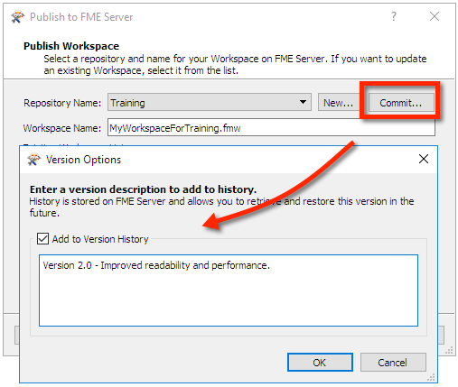
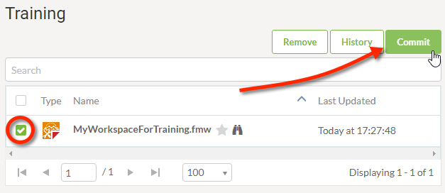
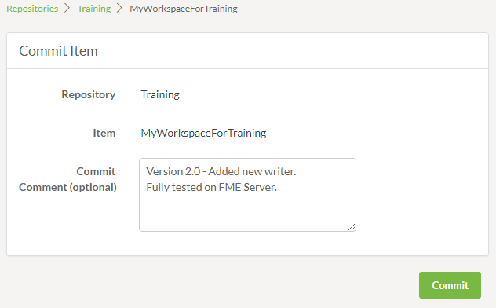

# 版本控制

|  新内容 |
| :--- |
|  版本控制在FME Server 2018.0中是全新的。好吧，从技术上讲，它是作为一个技术预览版发布的，但现在它是一个正式的新功能! |

在进行更改并将其发布到FME Server时，版本控制可以更轻松地跟踪对工作空间所做的更新。

您可以在将工作空间发布到FME Server时或在通过Web界面发布和测试工作空间之后提交新版本的工作空间。然后直接通过存储库页面访问任何存储库或工作空间的完整版本历史记录。

## 配置版本控制

默认情况下，在新的FME Server安装中，版本控制将关闭，但可以由FME Server 管理员轻松打开和配置。可以在“系统配置”&gt;“功能”菜单下找到此选项。

|  技巧 |
| :--- |
|  从管理员的角度设置版本控制在[FME Server 2018管理员培训](https://safe-software.gitbooks.io/fme-server-administration-training-2018/content/ServerAdmin5Customization/5.09.WorkspaceVersioning.html)课程中有详细介绍。因此，如果您有兴趣了解有关如何配置它的更多信息，请务必查看。 |

## 编写和版本控制

FME Server 管理员启用版本控制后，任何工作空间作者都可以使用版本控制工具。

并非每次对FME Server工作空间所做的更改都会自动添加到版本历史记录中。工作空间作者可以选择“提交”一个他们认为重要或值得检查的版本。将新版本的工作空间提交到版本历史记录有两种方法。

### 发布时提交

“提交”按钮将显示在FME Desktop内“发布到FME服务器向导”的“发布工作空间”对话框中。它将打开“版本选项”窗口，其中包含将当前工作空间添加到“版本历史记录”的选项，以及添加提交消息以及所做更改的摘要。

### 发布后提交

“提交”按钮也可在FME Server Web界面的“存储库”页面中使用。如果要在提交新版本之前在FME Server上发布和测试工作空间，这将非常有用。只需打开存储库，选择工作空间，然后单击“提交”。

这将打开一个页面，可选择包含一个提交注释，以包含新版本中已更改内容的摘要。

## 查看版本历史记录

要查看任何存储库的已提交更改的完整版本历史记录，请转到“存储库”页面，然后单击顶部的“历史记录”按钮。

这将打开一个对话框，按时间顺序列出所有提交，最新的提交在顶部。它还将显示与其相关的工作空间，提交消息，用户提交更改的时间以及添加时间。

## 恢复以前的版本

要还原工作空间的预览版本，请打开该工作空间的“版本历史记录”，然后单击所需版本旁边的“下载”按钮。

这将下载该工作空间的副本到您的计算机。然后，您可以使用Workbench将其打开，并将该版本发布回FME Server。

|  技巧 |
| :--- |
|  默认情况下，您将看到存储库中所有工作空间的所有版本。如果首先选择一个工作空间，则历史记录将仅显示所选工作空间的提交。 |

