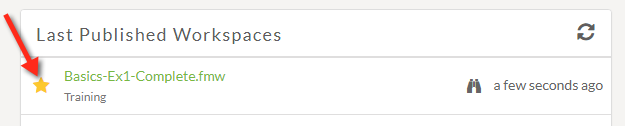
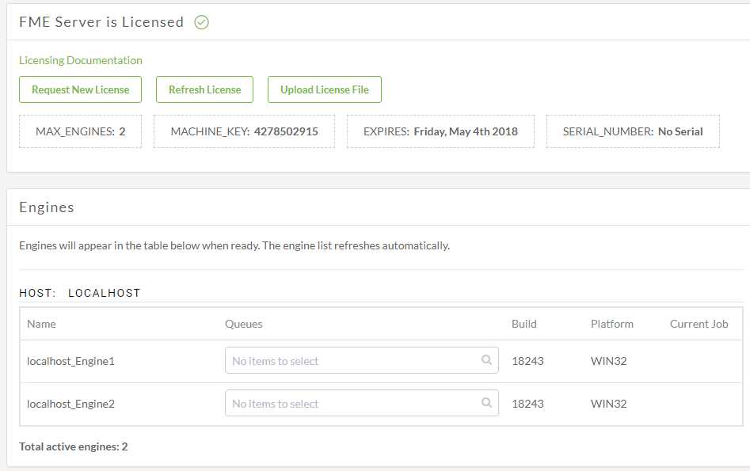
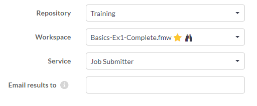

# 练习1.2：每日数据库更新：运行工作空间

|  练习1.2 |  每日数据库更新：运行工作空间 |
| :--- | :--- |
| 数据 | 消防站\(Firehalls\)（GML） 街区\(Neighborhoods\)（KML） |
| 总体目标 | 创建工作空间以读取和处理部门数据并将其发布到FME Server |
| 演示 | 检查FME Server界面并运行工作空间 |
| 启动工作空间 | 无 |
| 结束工作空间 | 无 |

---

对于本章的练习，您是当地城市GIS部门的技术分析师。您拥有使用FME Desktop的丰富经验，您的部门正在调查FME Server以评估其功能。

市内有许多部门，您的任务之一是从每个部门获取数据并将它们合并到一个公司数据库中。

由于每个部门都以不同的格式和样式生成数据集，因此您可以使用FME执行此任务，并每周执行一次。

在创建工作空间以执行此转换并将其发布到FME Server之后，您现在希望登录到服务器以运行该工作空间。

---

|  注意 |
| :--- |
| 在开始本练习之前， 您需要完成[练习1.1](https://safe-software.gitbooks.io/fme-server-authoring-training-2018/content/ServerAuthoring1Basics/Exercise1.html)。我们将运行已发布的Basics-Ex1-Complete.fmw工作空间（或任何您命名的工作空间）。 |

---
  
**1）连接到服务器**  
要登录FME Server Web界面，请从开始菜单中选择Web界面选项，或者 - 在Web浏览器中 - 输入FME Server的地址。

---

|  技巧 |
| :--- |
|  当FME Server安装在物理或虚拟硬件上时，地址为http：// &lt;servername&gt; / fmeserver   如果您使用的是FME云，则地址为：http：// &lt;servername&gt; .fmecloud.com / fmeserver |

---

这将打开正在使用的FME服务器的Web界面登录屏幕。

  
**2）登录服务器**  
在“用户登录”对话框中，输入FME Server帐户的用户名和密码。用于培训安装的常用用户名/密码组合是admin / admin：

单击“登录”按钮。

  
**3）检查用户界面**  
欢迎使用FME Server Web界面。花一点时间熟悉这个界面。在右上角，您可以访问“帮助”菜单，您喜欢的工作空间列表和用户设置：

侧边菜单是可以访问所有FME Server功能的地方。如果您需要更多空间，可以折叠此菜单。请注意，根据您登录的帐户，旁边的菜单会有所不同。在下图中，用户以admin身份登录：

最后，在FME Server主页上，您可以访问“最近的作业”，“最近的项目”，“上次发布的工作空间”和“收藏的工作空间”。如果您点击此页面，只需点击顶角的FME徽标即可返回主页。

在“上次发布的工作空间”下，您应该能够找到练习1中发布的工作空间。单击此工作空间旁边的“星形”图标将其设置为收藏夹：

单击“星形”后，工作空间将显示在“收藏夹工作空间”面板中。这允许从FME Server Web界面中的任何位置快速访问此工作空间：

我们很快就会运行工作空间，但也许首先我们应该确保FME Server正常运行（我们可以登录的事实是一个好兆头）并且我们获得了许可且引擎也正在运行。

  
**4）确认许可**  
单击界面菜单的ADMIN部分上的Engines＆Licensing。这将打开许可部分。您应该看到一条消息，通知您FME Server已获得许可并且可用的引擎列表：

---

|  技巧 |
| :--- |
|  如果您的机器未经许可或缺少引擎，请与您的教师联系以获取故障排除提示。 |

---
  
**5）运行工作空间**  
单击界面左上角的FME Server徽标，返回Web界面主页。

单击“收藏夹工作空间”面板中的已发布工作空间以打开此工作空间的网页。如果在“收藏的工作空间”面板下未看到工作空间，则表示未在步骤3中单击该星形。

工作空间页面显示了一些选项，第一个选项用于存储库，工作空间和服务。这些应该已经填入了值，因为我们直接打开了工作空间。如果我们通过Run Workspace页面打开工作空间，我们必须填写以下值：

由于此工作空间具有一些已发布的参数，因此它们也会列出; 但是我们现在可以忽略这些（我们将在课程后期处理源数据集）。

单击“运行”按钮以运行工作空间。工作空间将运行完成，并将显示该效果的消息：

  
**6）检查作业页面**  
单击侧面菜单上的“作业”将其展开，然后单击“已完成”以查看已完成作业的列表。将打开以前运行的作业列表，包括我们刚刚运行的作业。请注意，您的“作业”页面看起来与下面的屏幕截图不同，一个DataTest.fmw工作空间运行显示为失败的作业：

请注意界面的一些有趣部分：

1. 有标签显示已完成作业（默认），排队作业和正在运行的作业。
2. 有两个下拉列表：一种允许您过滤显示谁的作业，另一个允许您根据作业状态进行筛选。在2018.1中，过滤器包含在一个下拉列表中。
3. 不同的图标用于指示作业是成​​功还是失败。
4. 作业按其完成的时间顺序显示（无论是否成功）。

单击您的作业以更详细地检查结果。您将在顶部看到摘要，显示已写入的要素数以及开始和结束的时间。_STATUS_下有更多的时间详细信息，包括作业提交，排队等的时间。有关向FME服务器发出的特定请求的信息可以在_REQUEST DATA_下找到。转换的完整结果在_RESULT DATA下_。

您还可以在此页面上检查FME转换日志文件。

---

|  警察局长Webb-Mapp说...... |
| :--- |
|  请记住，此工作空间不会写入任何数据，只会将其发送给Null写模块。因此，现在，要查看任何结果，请在日志文件中搜索摘要。 |

---

|  高级练习 |
| :--- |
|  如果你想看到一个处于不同状态的作业，那么我们将不得不放慢一些工作空间。    在FME Workbench中打开工作空间并添加Decelerator转换器（例如，在Reprojector之前）。将其设置为每个要素延迟工作空间5秒。将工作空间发布回FME Server并重新运行它。    现在工作空间将需要30多秒才能运行，您应该能够在Running状态下找到它。此外，如果您快速连续运行三到四次，那么您将拥有比引擎更多的作业，并能够在排队状态下找到一些作业。 |

---

<table>
  <thead>
    <tr>
      <th style="text-align:left">恭喜</th>
    </tr>
  </thead>
  <tbody>
    <tr>
      <td style="text-align:left">
        
通过完成本练习，您已学会如何：
           
        

        <ul>
          <li>登录FME Server并检查它是否正在运行并获得许可</li>
          <li>使用“上次发布”列表找到工作空间</li>
          <li>运行工作空间并检查作业历史记录以确认其正确运行</li>
        </ul>
      </td>
    </tr>
  </tbody>
</table>
