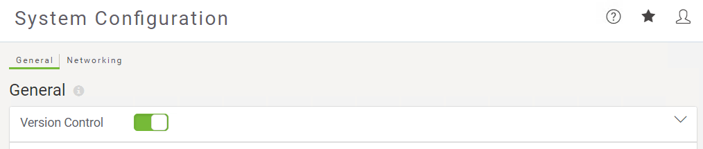

# 练习1.4：每日数据库更新：添加到版本历史记录

|  练习1.4 |  每日数据库更新：添加到版本历史记录 |
| :--- | :--- |
| 数据 | 消防站Firehalls（GML） 街区Neighborhoods（KML） |
| 总体目标 | 将先前练习中构建的工作空间的副本提交到FME Server上的版本历史记录。 |
| 演示 | 与版本历史工具交互 |
| 启动工作空间 | 无 |
| 结束工作空间 | 无 |

您已经（在练习1,2和3中）创建了一个工作空间来执行此转换，将其发布到FME Server，运行它以确认它是否正常工作并安排它每天运行。

您现在想要“检查点”工作空间的这个工作版本，以确保如果将来对其进行任何编辑，您始终可以返回到此状态。

|  警告 |
| :--- |
|  在工作场所中，您必须先让FME Server管理员启用版本控制，然后才能开始使用它。 |

  
**1）连接到服务器**  
浏览到FME Server界面的登录页面，然后使用管理员帐户（admin / admin）登录。

  
**2）打开版本控制**  
版本控制将默认关闭，因此您需要先打开它才能使用它。单击侧面菜单上的“系统配置”以展开菜单，然后在界面菜单的“管理”部分中单击“常规”。在“系统配置常规”页面上，找到“版本控制”设置以切换开关以打开“版本控制”，启用该功能时，开关将为绿色。

|  2018.1新的变化 |
| :--- |
|  在FME Server 2018.1中，系统配置已压缩，并且可以在“系统配置”菜单的“常规”页面中找到“版本控制”。 |

不要担心该页面上的其他设置，现在，只需将它们保留为默认值即可。

  
**3）将工作空间添加到版本历史记录**  
由于Basics-Ex1-Complete.fmw工作空间已发布到FME Server，您可以从Web界面将其添加到版本历史记录中。转到“仓库”页面并打开“培训仓库”。选中工作空间旁边的复选框，然后单击Commit提交。

为此版本的工作空间添加有意义的提交注释，然后单击“提交”将其添加到历史记录中。

  
**4）检查版本历史记录**  
确认已将此新版本添加到版本历史记录中。转到“存储库”页面并打开“培训仓库”。选中工作空间旁边的复选框，然后单击“历史记录”按钮以查看有关您刚刚提交的工作空间版本的信息。

<table>
  <thead>
    <tr>
      <th style="text-align:left">恭喜</th>
    </tr>
  </thead>
  <tbody>
    <tr>
      <td style="text-align:left">
        
通过完成本练习，您已学会如何：
           
        

        <ul>
          <li>将新版本的工作空间提交到版本历史记录</li>
          <li>查看仓库的版本历史记录</li>
        </ul>
      </td>
    </tr>
  </tbody>
</table>
