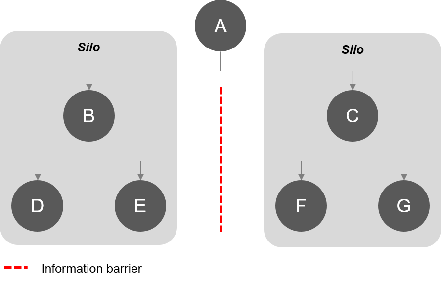

# 数据集成

> “从互联网上获取信息就像从消防水管里喝水一样”

> - [Mitchell Kapor](https://www.kaporcenter.org/co-chairs-and-staff/)，[Lotus的](https://en.wikipedia.org/wiki/Lotus_Software)联合创始人和[Electronic Frontier Foundation的](https://www.eff.org/)联合创始人。

> “你可以拥有没有信息的数据，但是没有数据你就无法获得信息。”

> - [Daniel Keys Moran](https://en.wikipedia.org/wiki/Daniel_Keys_Moran)，美国计算机程序员和科幻作家。

> “信息是21世纪的石油，分析是内燃机。”

> - Gartner公司执行副总裁[Peter Sondergaard](https://www.gartner.com/analyst/12/Peter-Sondergaard)

正如上面的引文所示，数据的创建，操作和分析是当代组织面临的重大挑战。从未有过如此多的机器可读取数据，但各组织仍在努力寻找利用这些大量信息来帮助决策的方法。

## 什么是数据集成？

数据集成意味着将来自各种来源的信息组合成有用的东 它是关于有效管理数据并将其提供给需要它的人。无论是技术流程还是业务流程，[IBM都将其定义](http://www-01.ibm.com/software/data/integration/)为“从各种来源发现，清理，监控，转换和交付数据。” 数据集成允许跨越孤立“筒仓”进行数据组合和分析，在这些筒仓中，通常很难进行协作。它允许具有多个部门，设施，软件和工作流程的组织将所有数据整合在一起。

### 组织为什么需要整合数据？

以下是集成数据对技术和业务实践至关重要的9个原因。

#### 1.每种数据类型都有其优势

每种数据格式都是出于某种原因设计的。每个都以其他格式不同的方式表示信息，具有唯一属性，元数据，结构和模式。集成来自不同格式的数据可为数据集添加不同级别的专业知识。

例如，[可以集成CAD和GIS数据，](http://blog.safe.com/2014/02/integrate-cad-gis/)以增强具有专门GIS信息和属性的CAD绘图。[库尔佩珀在线GIS测绘系统](http://townofculpeperva.gisbrowser.com/)是CAD，GIS数据集成项目的一个例子。

_此数据集是集成栅格和点云信息的结果，可提供两全其美的效果。_

#### 2.利用专业应用程序

同样，每个应用程序的设计都是出于某种原因 每个使用数据的软件都以专门的方式表示、分析和转换信息。通过将数据集成到该应用程序接受的格式中，您将拥有在该软件中打开和使用数据的能力。

例如，Cambian Business Services维护来自60个不同来源和至少10个应用程序的数据模型。他们需要将所有数据集成到PostgreSQL数据库中，然后将其重新部署到原始系统。数据集成使他们能够在格式之间自由转换，并在其原始遗留应用程序中打开其数据。（了解有关[Cambian Business Services数据集成项目的](http://blog.safe.com/2012/10/navigating-non-spatial-data-migration/)更多信息。）

_这些只是少数几种以高度专业化的方式处理数据的流行应用程序。_

#### 3.降低数据复杂性

[April Reeve描述得很好](https://infocus.emc.com/april_reeve/drivers-for-managing-data-integration-from-data-conversion-to-big-data/)：

> 组织中应用程序之间的潜在接口数量是应用程序数量的指数函数。因此，拥有一千个应用程序的组织可能拥有多达五十万个接口......

数据集成是可以管理复杂性，简化连接以及使数据轻松交付到任何系统。这可能涉及创建易于发布和订阅的数据中心。

例如，Shell Canada将复杂的2D，3D，栅格和矢量信息统一到易于阅读的3D PDF数据集中。他们的数据集成计划为可能无法访问专用GIS软件的用户提供信息。（了解有关[壳牌加拿大公司3D PDF数据集成的](http://cdn.safe.com/resources/case-studies/CaseStudy_Shell-Canada.pdf)更多信息。）

_数据集成解决方案简化了各种系统之间的交互，就像在这个3D PDF中一样。_

#### 4.通过统一系统增加数据价值

将不同的数据集放在一起会增加信息的价值。例子包括：

* 合并并利用外部数据（例如来自供应商）;
* 结合不同性质的数据（结构化，非结构化，空间，表格，网络，栅格，大数据等）;
* 将空间信息应用于非空间数据;
* 合并来自不同存储库的数据库;
* 为没有元数据标准的一组数据集创建统一模式;
* 将来自不同来源的数据集合纳入通用GML结构，以[符合INSPIRE](http://safe.com/webinars/how-to-create-and-share-inspire-compliant-data-with-fme/)（[参见示例](http://safe.com/webinars/inspire-success-stories-with-fme/)）。

例如，Talisman Energy将不同的数据集集成到一个中央GIS库中。数据集通常不与GIS几何图形连接，具有严格的更新计划，可能来自内部或外部来源。对他们而言，数据集成对于高效可视化和统一数据访问至关重要。（阅读[Talisman Energy的集成GIS数据库](http://cdn.safe.com/resources/case-studies/CaseStudy_Talisman.pdf)。）

_项目的这种全面表示是集成各种空间、非空间和基于web的源的结果。_

#### 5.使数据更加可用

集中数据可以使组织中的任何人（或在组织之外，取决于您的目标）轻松检索，检查和分析数据。

易于访问的数据意味着轻松转换数据。人们更有可能将数据集成到他们的项目中，共享结果并使数据保持最新。这种可用数据循环是创新和知识共享的关键。

例如，Alpine Shire Council整合了一系列来自不同格式的复杂源数据，包括数字高程模型，Esri Shapefiles等。将计算应用于集成数据，以产生空间和非空间结果，可通过iPad应用程序实时访问。（了解[the BAL Plan app](http://blog.safe.com/2013/10/fighting-australian-bushfires-fme-cloud/)。）

_BAL Plan是一款iPad应用程序，可实时通知用户特定区域的森林大火风险。它使关键数据公开，并且是数据集成项目的结果。_

#### 6.轻松的数据协作

可访问性使协作更容易。任何使用你的数据的人都会发现，现在他们可以更容易地使用大脑的力量，因为他们可以用他们需要的格式来使用数据。无论协作涉及内部团队和应用程序之间的共享，还是跨组织共享，集成数据都更加完整，因为它有更多的贡献者。

例如，印第安纳州需要将来自92个县的专业数据以点，地块，具有地址范围的街道和边界的形式组合到现有的在线GIS门户中。尽管每个县都有一个单独的数据管理系统，但他们的数据集成计划为所有县提供了一种非侵入性的简便方法，可以在数据门户上进行协作。（了解[印第安纳如何协调中央数据库中的数据](http://blog.safe.com/2012/10/data-sharing-success-in-indiana/)。）

_数据集成使得在潜在的压倒性信息上进行协作更加容易。_

#### 7.了解数据意味着更明智的业务决策

将位置智能应用于非空间数据集（如此CSV文件）可为决策制定新的机会。

集成数据意味着组织内的透明流程。通过为人们提供在任何系统中使用数据的灵活性，您可以让他们有机会更好地理解信息。在包含各种集成数据集的有组织的存储库中导航更容易 - 也更有用。

例如，[将位置智能](http://www.safe.com/webinars/data-integration-location-intelligence-better-decsisions/)应用于数据集使其在空间上更加全面，并提供围绕该数据集的新级别的洞察力，从而更好地制定决策。

例如，[Skogskyrkogården数据集成项目](http://blog.safe.com/2013/10/fme-and-multi-criteria-analysis-at-skogskyrkogarden/)将数据库，Esri Shapefiles和JSON源数据组合到一个AutoCAD输出中，使他们能够在未来100年内进行规划。

与其他数据类型集成也意味着[符合互操作性标准以节省业务成本](http://geospatial.blogs.com/geospatial/2013/11/estimating-the-benefits-of-interoperability.html)。此外，[开源数据格式提供了许多优势](http://www.pcworld.com/article/209891/10_reasons_open_source_is_good_for_business.html)为企业。

_将位置智能应用于非空间数据集（如此CSV文件）可为决策制定新的机会。_

#### 8.数据完整性

数据集成技术应该清理和验证通过的信息。显然，我们都希望我们的数据是健壮的和高质量的。集成策略可确保数据没有错误、不一致和重复。

例如，BC 公交系统由公共汽车站，车辆，时刻表，路线和乘客以及街道的不连接信息组成。这些奇特的系统使得中央交通信息容易受到不准确的影响。数据集成策略确保BC公交的关键数据准确且高质量。（了解[BC公交的数据集成和验证过程](http://cdn.safe.com/resources/case-studies/CaseStudy_BC-Transit.pdf)。）

_作为CAD-GIS数据集成策略的一部分，这些线段已经平滑成弧形。_

#### 9.使您的数据实时

集成的数据解决方案可以轻松保持信息的最新状态。一个输入可以在所有集成系统中传播，使您的数据保持最新。事实上，如果服务器或云解决方案是集成策略的一部分，您的数据甚至可以是[实时的](http://www.safe.com/realtime)。

例如，天气网络将非空间传感器数据和元数据集成在一起，并将其输出到Google Earth或ArcGIS Earth等空间应用程序。从那里，可以利用实时KML更新和电子邮件警报。（了解[Pelmorex Lightning Detection Network的实时数据集成](http://cdn.safe.com/resources/case-studies/CaseStudy_WeatherNetwork.pdf)。）

_与云系统集成是享受实时数据优势的一种方式。_

## 结论：避免数据筒仓

整合数据不仅提供了上面讨论的好处; 它还可以防止[数据筒仓](http://searchcloudapplications.techtarget.com/definition/data-silo/)的问题- 固定信息库。像农场筒仓一样，它们的内容与外界隔绝。您知道农场仓库内的饲料经常[发酵](https://en.wikipedia.org/wiki/Silage#Fermentation)吗？你知道发酵过程中排出的空气和液体有毒吗？数据被困在筒仓'发酵'中并变得无用。

 _Theodoxxi的数据筒仓图（_[_CC BY-SA_](https://creativecommons.org/licenses/by-sa/4.0) _4.0,2016 ）。_

即使不需要定期访问数据，孤立的数据仍然无法使用，无法进行协作，并且存在与外部数据冲突的高风险。通过积极整合您的数据，您可以避免[可怕的筒仓](http://www.simplebi.com/silos-are-great-for-farming-not-so-great-for-data/)并获得上述潜力。任何数据类型都可以存在于各种来源中。制定集成战略 - 技术和业务方面 - 对于确保组织的数据达到最大潜力至关重要。

## 进一步阅读

为了进一步阅读，为什么不在Safe Software的博客（FME的制造商）上浏览[标记有数据集成](https://blog.safe.com/tag/data-integration/)的文章。

