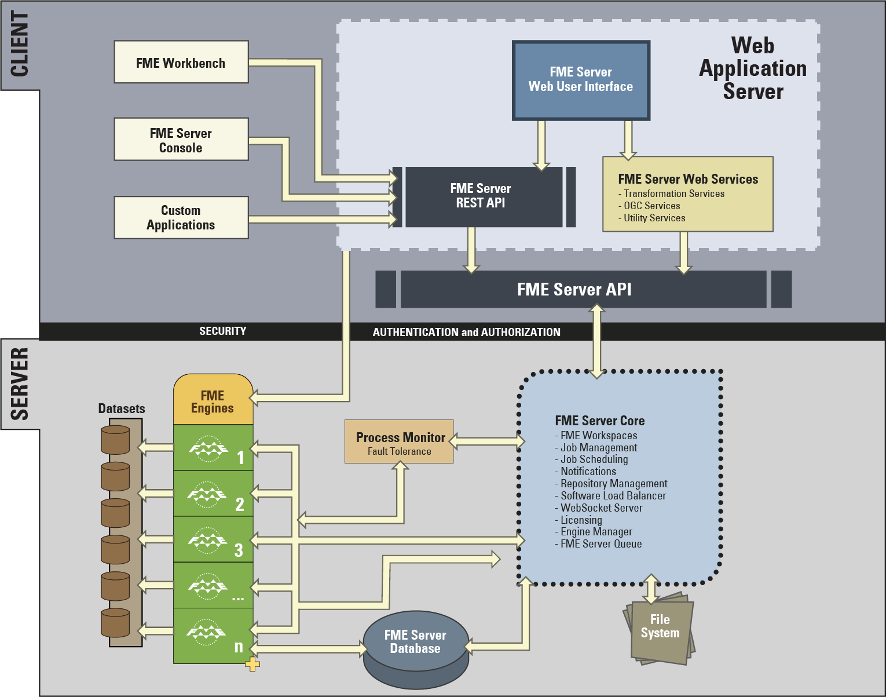

# FME Server架构

FME Server具有许多组件，其中一些组件被视为FME Server 核心的一部分，另一些组件被视为FME Server的客户端。

FME服务器客户端包括：

* Web服务（例如，Job Submitter服务）。
* FME Server的Web客户端，例如Web界面。
* FME Server的非Web客户端，包括FME Server Console，FME Workbench以及使用FME Server REST API的任何自定义应用程序。

属于FME Server核心的组件包括：

* 进程监视器
* 存储库管理
* FME Server数据库
* FME Server队列
* 文件系统
* FME引擎
* 调度管理器
* 中继管理器
* FME Server通知
* WebSocket服务器

## FME Server架构图

## FME Server组件

要了解的FME Server的主要组件是：

* FME引擎：进行数据转换处理
* 服务器核心：处理调度和通知，并管理负载平衡
* 作业队列：排队作业
* 系统数据库：存储与FME Server操作相关的工作空间，作业和配置设置的元数据
* 文件系统：存储工作空间文件，日志文件和数据共享
* Web服务：处理网络功能

### FME引擎

FME引擎通过运行FME工作空间来处理作业请求。这是FME Desktop使用的相同核心引擎，执行相同的处理。FME Server安装可以拥有多个引擎。

每个FME引擎一次处理一个请求，并且可以通过将FME引擎添加到同一台计算机或分布式FME Server环境中的单独计算机来扩展FME Server处理。

### 服务器核心

FME Server 核心管理和分发作业请求（排队，请求路由，调度），存储库内容（工作空间，自定义格式，自定义转换器，数据）和通知请求。

FME Server 核心包含一个软件负载均衡器（SLB），可将作业分配给可用的FME引擎。

### FME Server队列

2018新增 - 队列\(Queue\)是一个新组件，用于为作业提交提供排队机制。当与第二个FME Server系统结合使用时，它将自动变为容错。FME Server Queue与FME Server核心安装在同一系统上。

### FME Server数据库

系统数据库是FME Server 核心的关键组件，必须存在才能使核心正常运行。系统数据库不需要与核心安装在同一系统上，并且可以托管在本地网络上的企业数据库中。如果最初配置了默认系统数据库，则可以在安装后重新配置FME Server以使用其他数据库系统。

### 文件系统

文件系统是FME Server存储已发布工作空间的位置，也是资源文件夹的主页。此处存储FME Server的日志文件以及已完成的作业日志。这通常称为FME Server系统共享。

### Web服务

许多FME Server网络功能都使用我们称之为“服务”的方式处理。服务是软件，其接口提供服务器和客户端之间的通信。

FME Server有许多服务：

* 数据下载
* 数据上传
* 数据流
* 作业提交
* KML网络链接
* 令牌安全
* REST
* 通知

某些服务（例如，数据下载）是执行数据转换的“转换”服务，而其他服务（例如，令牌）是非转换“实用”服务。

需要Web应用程序服务器才能运行FME Server Web界面，FME Server Web 服务和任何其他Web客户端。Web界面包含在FME Server中，可以在浏览器中运行。Web应用程序服务器与FME Server核心安装在同一系统上。可以在FME Server REST API之上开发自定义Web客户端。

