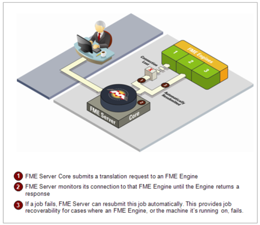
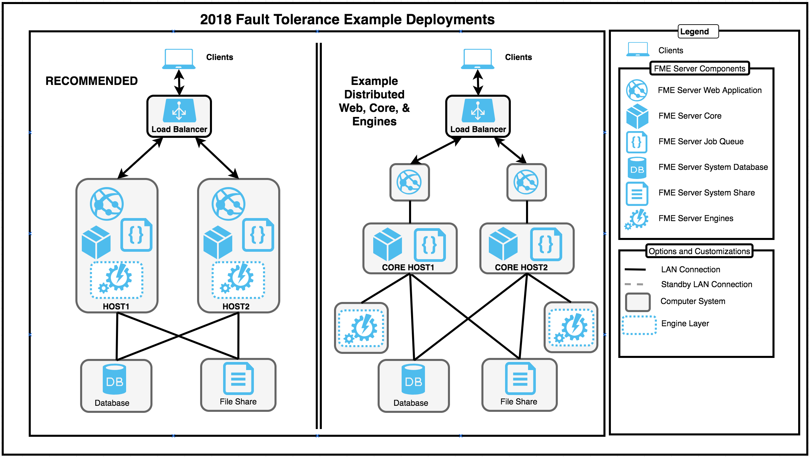

# 规划容错

容错或“高可用性”对任何成功的业务运营都至关重要。为确保在发生故障时处理请求，FME Server支持在集成系统的多个级别中配置容错。FME Server通过以下方式提供容错：

1. **恢复**：发生崩溃时重新启动组件和作业。FME Server自动提供组件和作业恢复 - 无需额外的规划。
2. **冗余**：确保没有单点故障。FME Server 2018中的新功能是容错架构。当两个FME Server系统配置在一起时，会自动实现容错。

## 关于FME Server 2018.0中容错的一个说明

FME Server 2018具有新的和改进的容错能力。在2018.0这个功能只是技术预览。如果您需要容错功能，建议您使用FME Server 2018.1。我们不再支持主动 - 被动FME服务器环境。新的容错需要至少两个系统，两个系统上都安装了FME Server，使用相同的FME Server系统共享和相同的FME Serve系统数据库。还需要一种负载均衡器，用于监视运行状况并在所有FME Server环境之间分发Web请求。所有FME Server主机同时处于活动状态。

## 恢复

### 组件恢复

FME Server具有开箱即用的组件恢复功能。这意味着，即使在单个系统上，FME Server也会监视并重新启动发生故障的组件，包括FME引擎和FME Server核心。这是通过FME Server进程监视实现的。FME Server能够监控其自身组件，确保可靠的正常运行时间和可靠性。

### 作业恢复

FME Server还包括在发生崩溃时重新启动作业的功能。因此，遇到临时问题的作业\(如网络故障\)将重新提交并再次运行。

在FME Server向FME引擎提交转换请求后，它会监视与该引擎的连接，直到返回响应。

如果出现以下情况，FME Server可以重新提交失败的作业：

* 与引擎的连接丢失。
* 引擎崩溃了。

FME Server继续重新提交转换，直到达到指定的尝试次数。要防止FME Server无限期地重试失败的作业，默认设置是重新提交失败的作业最多三次。此设置是可配置的，可以完全关闭。

|  分析师女士说...... |
| :--- |
|  警告！转换请求失败可能导致FME引擎无法正常关闭。如果没有施加最大限制，则无限期地重新发送转换，这可能导致重复的FME引擎故障。    重新提交的事务也可能导致数据重复，例如在写入数据库格式或使用FeatureWriter写入中间转换时。    如果由于失败而重新提交作业，然后成功，则会覆盖第一个作业日志文件，这将永久删除作业在第一次运行时失败的原因。这种情况很少见，但在这些情况下，您可能需要将作业重新提交设置为零。 |

## 冗余

容错环境的目标是删除单点故障，以便组件可以发生故障，但不会使整个系统脱机。这是通过在每个系统上安装FME Server并指向相同的FME服务器系统数据库和FME服务器系统共享的多个系统来实现的。

新的容错架构，最简单的实现是在独立的服务器上复制大多数FME服务器组件。其他系统的配置类似，并提供相同的功能。第三方负载均衡器将传入流量定向到任一可用系统。客户端会话不需要粘性。请求被定向到任何系统。

下图显示了2个部署示例。推荐的方法和完全分布式部署。通过遵循推荐的方法，您将获得容错的好处，并且系统数量最少。  
  

  

 **基本架构要求** - 负载均衡器系统 - FME服务器组件（最少两个系统） - 容错数据库 - 容错文件系统

**优点**

* 易于管理
* 需要的系统更少。
* 可以增加每个系统上可用的引擎数量
* 易于添加额外的系统以增加容量

**分布式架构要求**

* 负载均衡系统
* FME Server Web（最少两个系统）
* FME Server核心（最少两个系统）
* FME Server引擎（最少两个系统）
* 容错数据库
* 容错文件系统

**优点**

* 允许使用自己的Web Servlet，从而在不中断其他系统的情况下进行安全更新
* 允许使用第三方软件轻松部署引擎
* 更精细的控制，用于扩展每个系统的功能（内存，CPU，磁盘空间）

|  技巧 |
| :--- |
|  在容错安装FME Server时，不支持Notification Service UDP Publisher和SMTP Publisher。要接收电子邮件通知，请考虑使用IMAP Publisher。 |

### 负载均衡系统

客户必须提供自己的负载均衡器（LB），并且可以将其配置为指向FME Server并执行定期运行状况检查（如果支持）。LB还可以使用超时请求将请求重定向到另一个FME Server系统。

### FME服务器组件

建议在单个系统上安装FME Server Web应用程序，FME Server核心和FME Server引擎（可选），并对第二个系统重复此操作（请参阅上面的“推荐”图片）。这为您提供了基本的容错环境。然后LB将指向这两个系统。

此外，可以向环境添加类似的附加系统以扩展高可用性。仅具有FME服务器引擎的系统也可以在FME服务器核心中注册，以增加可用引擎并在更多系统中分配处理。

FME Server核心相互了解并将处理请求。将有一个作业管理器，如果失败，另一个系统上的另一个作业管理器将接管并处理作业请求。核心完成后应该有最短的停机时间。请稍等（_1-2分钟_），具体取决于LB配置。

计划表将继续正常运作。

### 容错数据库

客户负责使数据库容错。

### 容错文件系统

客户负责使文件系统容错。

## 跟踪核心故障

然后可以调查故障系统，同时第二个活动系统提供FME服务器的继续操作。一旦新的故障系统恢复并启动，它将无缝地加入环境。

通常导致故障的故障类型是硬件和操作系统崩溃，系统完全崩溃。

必须在受影响的系统上查看日志文件，以了解FME Server核心失败的原因。当核心的可用性受到影响时，结果通常是一个无法使用的系统。

|  Intuitive修女说...... |
| :--- |
|  过去，通知服务发布服务器的客户端没有进行故障转移，但在2018.1中也会发生这种情况。 |

