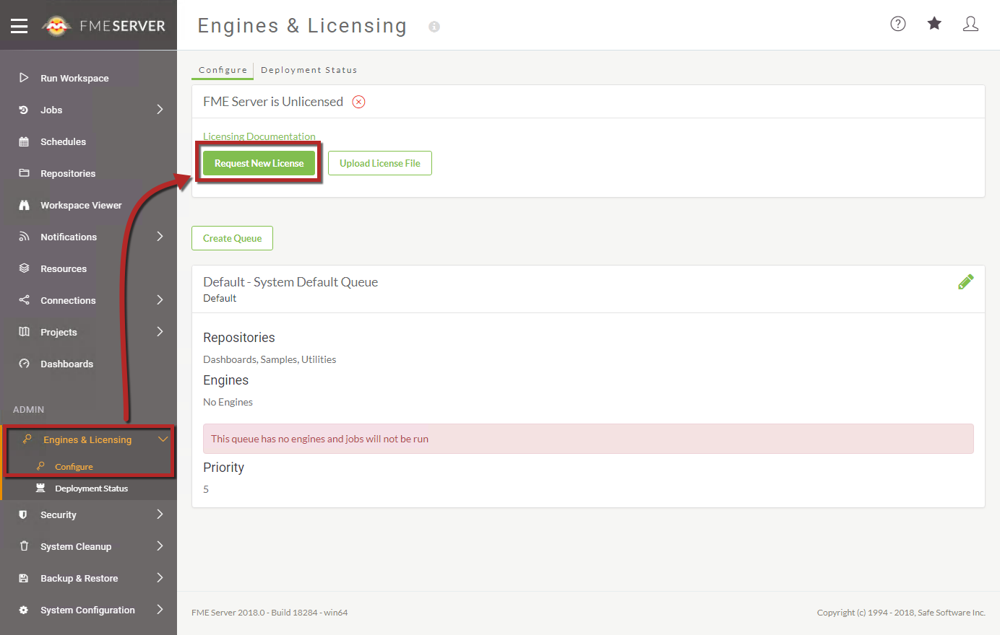
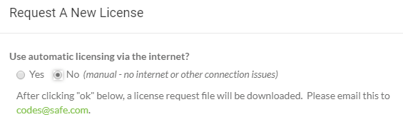

# 许可FME Server

FME Server 2016引入了一种新的许可机制，不再依赖第三方软件来提供许可证。FME引擎许可证现在直接通过FME Server核心提供，并保存到FME Server系统共享 - 这带来了各种好处，包括更轻松的管理，尤其是在配置分布式/自定义FME Server安装时。

## 请求并安装许可证

### 在线模式

授权FME Server的最快和最简单的方法是使用在线方法。FME Server仅需要基本用户信息（姓名，电子邮件）和您的客户经理提供的序列号。通过HTTP / HTTPS发送请求以从我们的后端数据库中检索许可证文件。

您可以在FME Server 的 _引擎和许可_ 选项卡中申请许可证：

默认情况下，许可证文件安装在 _C:\ProgramData\Safe Software\FME Server\licenses_ 上。

|  厨师Bimm说... |
| :--- |
|  如果更改了安装了FME Server的计算机，则无需联系安全支持或您的客户经理 - 只需在将FME Server安装到新计算机后再次请求许可证！ |

### 离线模式

如果托管FME Server安装的计算机与Internet断开连接，或者防火墙规则阻止您的计算机与我们的后端数据库通信，则有一种脱机方法可以检索您的FME Server许可证文件。

在“请求许可证”表单中，选择“否”以将JSON文件下载到本地文件系统。然后可以将此文件转发到codes@safe.com，其中自动进程（在后台运行FME）将在几分钟后返回有效的许可证文件。

然后可以将此文件拖放到“引擎和许可”页面上以许可FME Server。

## 延长试用许可证

如果您申请了7天的试用许可证，您应该收到来自codes@safe.com的电子邮件，该电子邮件允许您将许可证延长至60天。任何用户都可以申请FME Server试用许可证，而无需序列号。

