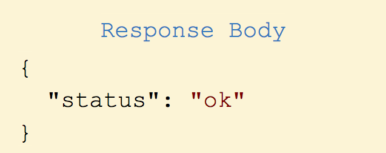
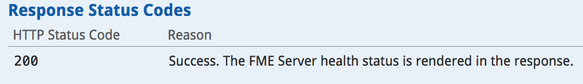

# 2.2 REST API响应

响应结构与请求结构非常相似。它具有响应主体，响应代码和响应头。

## 响应主体

大多数对FME服务器的调用都会产生响应。这使得FME Server REST API成为一个非常强大的工具。通过此响应，您可以自动执行另一个进程。响应主体将始终使用JSON。

## 响应代码

上面的请求应该产生代码200，在示例调用中概述：

### 潜在的响应代码

下面是一个列出常见响应代码的表格。有关完整列表，请访问 [Rest API 文档](https://docs.safe.com/fme/html/FME_REST/apidoc/v3/index.html).

| 响应代码 | 含义 |
| :--- | :--- |
| 200 | 调用已成功完成 |
| 202 | 该请求已被接受处理 |
| 422 | 部分或全部输入参数无效 |
| 401 | 未授权的 |

