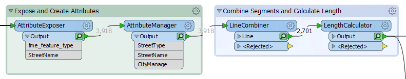
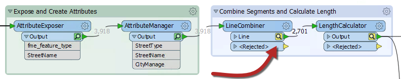
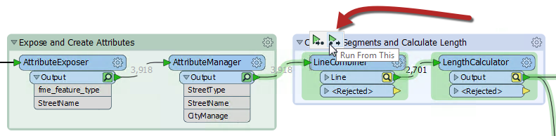
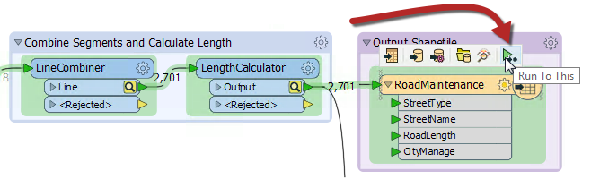

# 部分运行

启用缓存后，运行转换会导致数据缓存在工作空间的每个部分。在后续运行中，可以使用这些缓存，而不必重新运行工作空间的整个部分。

例如，在此处运行工作空间并启用了缓存：

现在作者对LineCombiner参数进行了更改：

请注意，缓存会在LineCombiner和后续转换器上更改颜色（变为黄色）。这表示缓存是陈旧的; 他们的数据内容不再与工作空间产生的内容相匹配。要获得新结果，作者必须重新运行工作空间。但是，他们不必重新运行整个工作空间; 他们可以在变化点简单地启动工作空间 - LineCombiner：

_Run From This_导致工作空间仅从该点运行，使用缓存到此时为止的数据。注意将鼠标悬停在该选项上会导致所有“下游”转换器被突出显示。它们是唯一将要运行。这使转换更快。另一个选项是_Run To This_。作者可以在写模块要素类型上使用该选项，并获得相同的效果：

...但请注意来自LengthCalculator的第二个分支如何不突出显示。它不会运行。这表明如何避免运行特定的工作空间部分，就像禁用该连接一样。

|  .1更新 |
| :--- |
|  F6是“Run From This”的快捷键。 正常运行从这将检查先前的转换器，并提示用户也运行它们，如果先前的缓存是陈旧的。但是，在2018.1中，F6快捷方式绕过用户提示并仅运行任何所需的转换器。 |

&lt;/div&gt;&lt;/body&gt;&lt;/html&gt;

