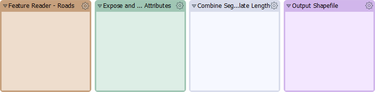
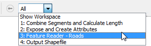
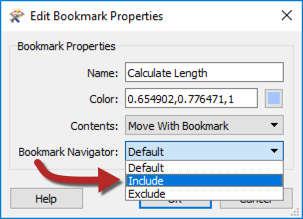
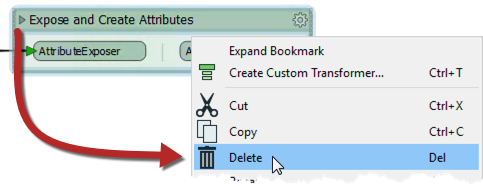
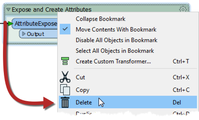
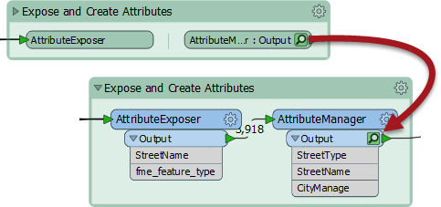

# 书签

由于多种原因，书签在风格良好的工作空间中发挥着重要作用，包括：

* 设计：作为细分工作空间和管理这些部分的一种方式
* 访问：作为快速访问工作空间某个部分的标记
* 编辑：作为一次移动转换器组的手段
* 性能：作为缓存数据时提高工作空间性能的一种方法

## 设计

书签是规划和设计工作空间的好方法。在添加转换器之前使用书签创建线框模型：

## 访问

可以浏览书签，这会创建一个放大您感兴趣的书签的演示文稿类型表单。一旦您的工作空间超出了屏幕视图，这也非常有用：

要设置书签导航，请打开书签的属性，然后选择“ _包括_书签导航器”：

## 编辑

书签可用于一次移动一组转换器。这对于组织和清理工作空间很有用。

### 删除书签

要删除书签的所有内容（包括书签本身），请折叠书签然后将其删除。这对于删除工作空间的整个部分非常有用：

要_仅_删除书签，请将书签展开，然后将其删除：

|  新内容 |
| :--- |
|  可折叠书签是FME2018的全新功能。 |

### 性能和书签

使用要素缓存时，性能会受到不利影响，尤其是在使用大型工作空间时。使用书签可以防止缓存所有数据。折叠书签时，只有在工作空间运行时缓存输出要素：

这意味着数据仅缓存在书签中的最终转换器中，从而节省了大量时间和资源。

