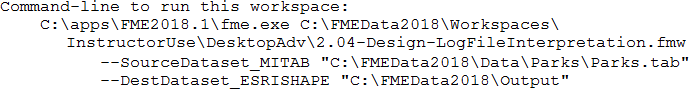

# 日志文件命令部分

本节将详细介绍FME日志的每个部分。

|  Jake Speedie说...... |
| :--- |
|  能够解释日志文件对于性能调整至关重要。如果你无法理解FME正在做什么，那么你就没有太多机会改进它！ |

FME日志的总体结构大约有四个不同的部分。

* 命令行语句
* 配置和设置信息
* 转换和变换本身
* 转换摘要

## 命令行声明

在日志文件的最顶部出现命令行语句。这是FME Workbench用于运行转换的命令：

在性能方面，本节并未告诉我们太多。但是，确认正在运行哪个FME实例很有用，尤其是在安装了多个版本时。请注意，上图中的版本号仅仅是安装FME的版本号; 它不一定是正在运行的版本号。

本节还告诉我们工作空间中已发布的参数以及它们的值。

也许本节最有用的部分是您可以复制并粘贴此语句，以通过命令行或使用批处理文件来运行工作空间。

&lt;/div&gt;&lt;/body&gt;&lt;/html&gt;

