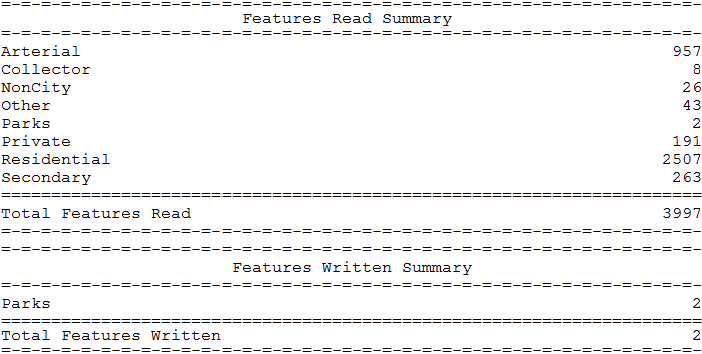
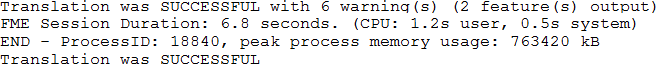

# 日志文件摘要部分

日志文件的最后一部分包括读取和写入的要素数量的报告：

更重要的是，从性能的角度来看，它包括转换所用时间和使用的内存量的简要报告：

峰值内存使用是一个重要的统计数据。它表明FME必须努力工作。如果这个数字可以降低，性能往往会提高。

## 写入要素

FME日志中最误解的统计数据之一是写入的要素数量。

这实际意味着“发送给写模块的要素数量”。它并不总是意味着实际将相同数量的要素写入输出数据集，或者输出数据集将仅包含该数量的要素。

例如，在上面的屏幕截图中，报告了2个要素发送给写模块。但是，例如，如果它是（Esri Shapefile）写模块，则可能会出现日志中较早的警告：

所以实际上，写模块拒绝了这两个要素，在这种情况下，因为它们的几何对象是无效的。写模块被设置为写入点要素，但这些是多边形。

同样，格式可能具有几何限制，导致输出数据集与记录的数字略有不同。

例如，MicroStation DGN格式对每个元素（要素）的顶点数有限制。如果MicroStation写模块接收到具有太多顶点的要素，则会将该要素拆分为多个MicroStation _要素_（MicroStation中的_元素_），以避免超出顶点限制。

因此，实际出现在数据集中的要素数量可能与记录为发送给作者的要素数量不同！

|  警告 |
| :--- |
|  目前，FeatureReader / FeatureWriter转换器读取或写入的要素不包含在日志末尾的摘要中。要查找此信息，您需要检查这些转换器内外连接上显示的要素计数。 |

&lt;/div&gt;&lt;/body&gt;&lt;/html&gt;

