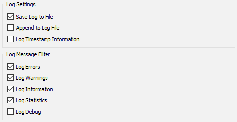
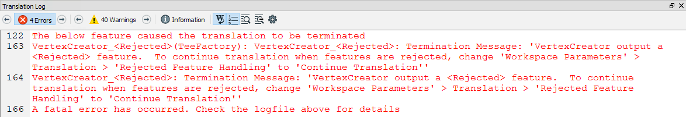
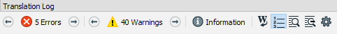

# 日志文件解析

FME日志文件是评估性能的最佳朋友。它告诉您转换需要多长时间，时间，以及FME能够使用可用系统资源的程度。

## 记录消息

首先要注意的是，日志由许多消息组成，每个消息都包含许多字段：

* 绝对日期\[可选\]
* 绝对时间\[可选\]
* 累计时间（转换）
* 运行时间（此消息）
* 消息类型
* 信息

消息类型字段告诉我们信息的性质。它将是以下之一：

* 错误：转换中的错误，通常需要FME终止处理。
* 警告：表示不足以终止处理的问题的警告。
* INFORM：与非错误项相关的信息消息。
* STAT：有关转换统计信息的消息，例如处理的要素数。

## 配置日志窗口

有许多选项可用于调整日志文件和显示的内容。要访问这些，请在FME Workbench中选择工具&gt; FME选项&gt;转换。

这些是选项及其默认设置：

一些最重要的选项如下......

### 记录时间戳

启用此选项后，日志**窗口**中的每条消息都会标记其发生的时间和日期。时间戳是评估性能的宝贵帮助，在大多数情况下应该继续使用。

_**注意：**_ _无论此设置如何，日志**文件**始终包含时间戳。_

### 记录消息过滤器

过滤选项允许在日志窗口中打开或关闭每种类型的消息。关闭INFORM和STAT消息可能特别有用为了更容易发现错误和警告; 但是，一开始运行一个转换并且不会看到通常的信息流似乎很奇怪！

### 记录调试

“日志调试”选项会打开一系列通常对用户隐藏的额外日志消息。不仅会暴露很多底层映射文件，而且还会有许多标记为BADNEWS的错误消息。

## 日志窗口过滤

打开日志消息过滤器后，可以打开和关闭各种消息：

在上图中，作者只查看错误消息，这样可以很容易地看到导致其转换失败的原因。

|  新内容 |
| :--- |
|  切换消息按钮已添加到FME2018的转换日志窗口中。   |

|  警告 |
| :--- |
|  调试消息可以在调试过程中提供帮助，但是在一般的FME使用中你想要保持它们的开启是值得怀疑的。许多BADNEWS消息是FME捕获并保留的“错误”（如文件结束消息）。  另请注意，Log Debug设置在工作空间中持续存在; 换句话说，如果打开该设置并将工作空间传递给另一个用户，它将保留该设置并在其他用户运行工作空间时显示调试消息！ |

|  技巧 |
| :--- |
|  如果日志窗口文本对您来说有点小，或者不够时尚，请使用工具&gt; FME选项&gt;外观&gt;日志字体更改字体大小和样式。 |

&lt;/div&gt;&lt;/body&gt;&lt;/html&gt;

