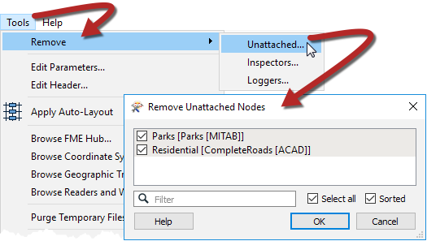

# 常用性能技巧

FME的核心引擎经过精心设计和持续维护，注重性能。虽然性能仍然需要牢记，但不需要作者过多关注。

但是，即使FME是有效率的，也有一些关键领域可能会影响您的性能：

* 未使用的读模块和要素类型
* 未使用的写模块
* 屏蔽转换器
* 过剩的记录器和检查器
* 读取整个数据库
* 在启用要素缓存的情况下运行

## 删除未连接的

在开发工作空间时，很容易丢失未使用的要素类型，尤其是在工作空间大小增加时。要快速删除这些未使用的要素类型，请转到菜单栏中的工具&gt;删除...&gt;删除未附加。

## 删除记录器和检查器

虽然您不会看到巨大的性能差异，但它可以实现更清晰的工作空间。在将工作空间投入生产之前，您可以一次性删除所有记录器和检查器，方法是转到菜单栏中的工具&gt;删除...&gt;检查器或记录器。然后选择要删除的项目。

## 使用要素缓存运行

运行启用了要素缓存的工作空间会因为每个转换器缓存数据而受到巨大的性能影响。最好在不需要时关闭此功能。如果确实需要功能缓存但仅适用于工作空间的某个部分，请使用可折叠书签仅缓存输出功能。

&lt;/div&gt;&lt;/body&gt;&lt;/html&gt;

