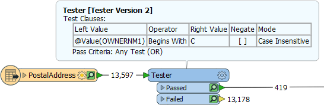
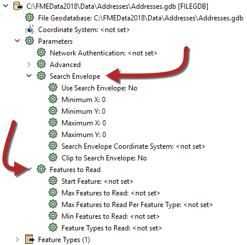
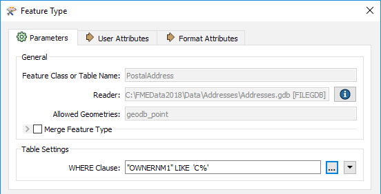
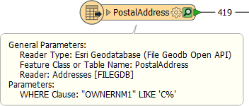
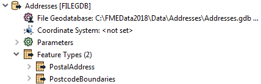
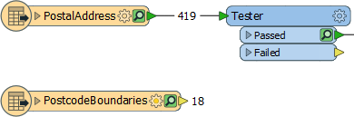

# 优化读模块表现

提高读取性能的最重要方法是最小化正在读取的数据量。如前所述，读取多余的要素视为不必要的工作，因此效率低下。

|  警告 |
| :--- |
|  读取额外要素已经够糟糕了，但是 - 在FME 2018和更新版本中 - 当打开要素缓存时，该效果可以倍增。因此，您需要格外小心来读取不必要的数据。 |

## 过滤输入

例如，此工作空间读取近14,000个要素，但会立即丢弃除419个要素之外的所有要素（所有者名称以“C”开头的所有要素：

在这种情况下，如果可能的话，只需阅读大约400个要素就会更有效率。它不仅可以避免读取不必要的数据，还可以避免两次缓存！

幸运的是，所有格式都有各种参数集，通过过滤读取的数据量来加速要素读取。

第一个 - 搜索矩形框 - 定义要作为地理区域读取的数据。然后只需要读取该数据区域。这些参数在每个空间数据读模块上都可用，但在源数据被空间索引时效果最好。然后以最有效的方式执行查询。

同样，有许多参数旨在让用户定义要读取的要素数量。这些参数包括定义要读取的最大要素数以及要开始的要素的能力。还有一个参数可以定义应该读取哪些要素类型（层或表）。

通过明智地使用这些，可以减少读取的数据量并加快转换速度。例如，如果我们知道数据集中的第一个记录是以“C”开头的记录，我们可以将Max Features设置为Read to 419。

其他格式 - 特别是数据库 - 有附加条款可以帮助减少数据流：

例如，此处，此地理数据库读模块具有“WHERE Clause”参数，该参数以比读取大型表的整个内容和使用Tester转换器更高效的方式应用“所有者名称以'C'测试开头”。

|  Jake Speedie说...... |
| :--- |
|  简而言之，当您想要过滤源数据并且可以使用特定的读模块参数时，它比读取所有源数据然后使用转换器过滤它更有效。 |

## 多余的要素类型

另一个潜在的瓶颈 - 特别是对于带有表列表的格式 - 是您拥有的要素类型多于必要的情况。

在这里，用户已将两个表添加到其地理数据库读模块中：

但是，如果查看工作空间，PostcodeBoundaries表甚至没有连接到任何东西。未连接的表仍在读取 - 并缓存 - 但数据被忽略：

据推测，用户出于某种原因添加了表格，但后来决定他们不需要它们。在这种情况下，他们应该从FME工作空间中删除要素类型。然后不会读取表格，性能会提高。

