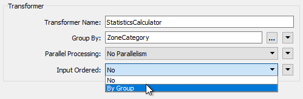
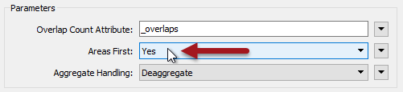
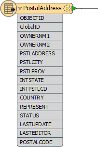
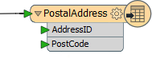
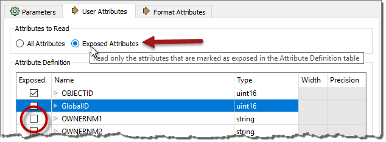
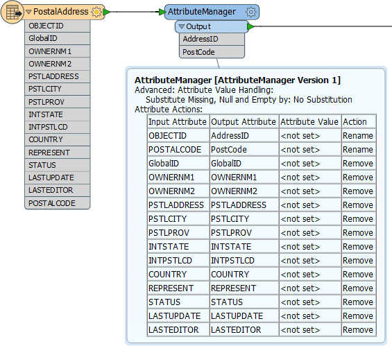

# 优化转换器性能

在大多数情况下，缓慢，耗费内存的转换是由基于组的转换器引起的。

请记住，在基于要素的变换中，转换器在逐个要素的基础上执行操作，其中一次处理单个要素。这种转换只需要存储单个要素所需的内存。

但是，基于组的转换器对一组或一组要素执行操作，并且它需要尽可能多的内存来存储该组的所有要素！

正是这种数据分组导致性能下降。但是，许多基于组的转换器具有的参数实际上使它们更加基于要素。

|  Jake Speedie说...... |
| :--- |
|  当您将尽可能少的数据放入基于组的转换器时，您将获得更好的性能。例如，在基于组的过程之前放置基于要素的过滤转换器，而不是在它之后（参见下面的练习）。另一种技术是使基于组的转换器更加基于要素...... |

## 输入有序参数

基于组的转换器的常见参数称为“输入有序”。并出现在大多数转换器对话框中的Group By参数附近：

应用这些的条件是将要素组预先分类到它们的组中。在这种情况下，参数设置为按组，然后FME更有效地处理数据。

例如，在上面的屏幕截图中，用户使用ZoneCategory属性作为分组参数（即，为_具有相同ZoneCategory值的_每组要素创建一组统计信息）。如果传入的数据已经按ZoneCategory的顺序排序，那么用户可以设置Input Ordered参数并允许FME将其视为基于要素的转换器。

|  警告 |
| :--- |
|  在具有两个（或更多）输入端口的转换器上使用输入有序组时，需要按数据顺序排列数据（端口1，组A，端口2，组A，端口1，组B，端口2， B组等）  即，不仅仅是每个数据流正确排序的情况，您需要为每个组替换流/端口 - 这很难实现。 |

## 要素第一个参数

除了“输入有序”参数外，一些转换器还有自己独特的参数来提高性能。其中许多指定了一种类型的要素“首先”到达。

例如，PointOnAreaOverlayer转换器需要两组数据：点和面。默认情况下，FME需要所有传入的点和面，因为它需要确保它具有所有面才能处理任何点。

但是，如果FME知道面要素将首先到达（即第一个Point要素表示面的结束），那么它不需要所有的点要素。它可以立即处理每一个，因为它知道它不再有可以匹配的面。

用户指定使用参数Areas First为真：

但是，用户如何确保面要素首先到达？好吧，就像写模块一样，您可以在导航器中更改读模块的顺序，以便首先读取列表顶部的读模块。

更改读模块顺序并不会提高性能_本身_，但它确实允许您应用如上所述的性能改进参数。

## 属性和转换

如上所述（在读模块性能中），减少数据有助于提高性能，因为它可以将FME保存在内存中或将其缓存到磁盘中。

但是，并不仅仅只是通过减少要素的数量才有所帮助；通过减小每个要素的大小也有帮助。

其中一个方面是属性。通过转换来携带属性会影响性能，因此如果输出中不需要属性，则最好在转换中_尽早_删除它们。

例如，传入的模式如下所示：

但是传出的模式看起来像这样：

由于输出中不需要这么多源属性，因此尽可能早地从转换中删除它们。有两种方法可以做到这一点。某些读模块格式（但不是全部）在读模块要素类型中有一个设置，以避免读取多余的属性：

这样，您可以确保只读取暴露的属性。删除属性的另一种方法是在源要素类型之后直接使用转换器（AttributeManager，AttributeRemover或AttributeKeeper）：

这确保了任何其他属性都不会被任何其他转换器处理而成为资源消耗。

### 列表

要注意的一种特定类型的属性是_List_。FME中的列表是可以具有多个值的属性。因此，它可能是资源的大量消耗。

例如，使用Joiner将要素连接到1,000条记录，该要素的列表将包含1,000组记录。这已经够糟糕了，但是如果列表被炸散并保留了所有原始属性，那么将有1,000个要素，每个要素都有1,000组属性！

通常，要注意不必要地创建列表，并将它们保留在仍在使用的点之外的工作空间中。

## 几何对象与转换

与属性一样，几何对象可以从要素中移除，在本例中使用GeometryRemover转换器。

许多FME用户创建处理表格 - 非空间 - 数据的转换。如果要读取空间数据集，然后将其写为表格格式，请确保在工作空间的早期删除几何对象，就像使用属性一样。

另一个特殊问题是将空间数据作为属性携带。空间数据库格式 - 例如，Oracle或GeoMedia - 通常将几何对象存储在数据库的字段中; 例如GEOM。当FME读取数据时，它将GEOM字段转换为FME几何对象，并从数据中删除该字段。

但是，如果使用非几何读模块读取几何表，则转换最终可能会将几何对象存储为FME属性。当工作空间只读取多个几何表中的一个几何列时，可能会发生类似的情况。

几何对象将创建_非常_大且复杂的属性，这会占用大量资源。如果你不需要它们，那么值得删除它们。

基本上，您只应对工作空间输出所需的任何几何和属性进行平移。如果不需要数据，那么它可以并且应该尽可能早地在工作空间中删除。

|  Vector小姐说...... |
| :--- |
|  这些转换器中哪一个具有与分组相关的参数以提高性能（挑选所有的应用，看看你是否能得到答案不看转换器）：  [1. StatisticsCalculator](http://52.73.3.37/fmedatastreaming/Manual/QAResponse2017.fmw?chapter=12&question=4&answer=1&DestDataset_TEXTLINE=C%3A%5CFMEOutput%5CQAResponse.html) [2. SpikeRemover](http://52.73.3.37/fmedatastreaming/Manual/QAResponse2017.fmw?chapter=12&question=4&answer=2&DestDataset_TEXTLINE=C%3A%5CFMEOutput%5CQAResponse.html) [3. PointCloudCombiner](http://52.73.3.37/fmedatastreaming/Manual/QAResponse2017.fmw?chapter=12&question=4&answer=3&DestDataset_TEXTLINE=C%3A%5CFMEOutput%5CQAResponse.html) [4. FeatureMerger](http://52.73.3.37/fmedatastreaming/Manual/QAResponse2017.fmw?chapter=12&question=4&answer=4&DestDataset_TEXTLINE=C%3A%5CFMEOutput%5CQAResponse.html) |

&lt;/div&gt;&lt;/body&gt;&lt;/html&gt;

