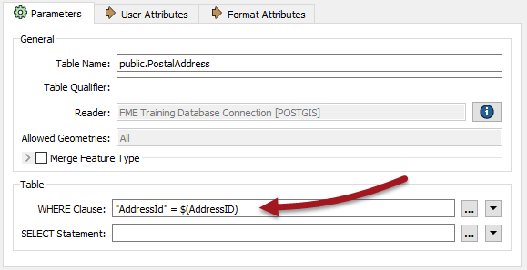

# 练习：垃圾收集日项目

 练习4

 垃圾收集日项目

数据

地址（PostGIS或Esri地理数据库）  
垃圾区（Esri地理数据库）

总体的目标

分析并改善工作空间性能

演示

数据库优化

启动工作空间

C：\ FMEData2018 \ Workspaces \ DesktopAdvanced \ WorkspaceDesign-Ex4-PostGIS-Begin.fmw  
C：\ FMEData2018 \ Workspaces \ DesktopAdvanced \ WorkspaceDesign-Ex4-Geodatabase-Begin.fmw

结束工作空间

C：\ FMEData2018 \ Workspaces \ DesktopAdvanced \ WorkspaceDesign-Ex4-PostGIS-Complete.fmw  
C：\ FMEData2018 \ Workspaces \ DesktopAdvanced \ WorkspaceDesign-Ex4-Geodatabase-Complete.fmw

公众经常打电话给这个城市，询问他们的垃圾收集在哪一天。帮助城市在FME Server上托管内部系统。规划部门的成员可以查找地址ID，将其输入到已发布的参数中，然后系统将检索垃圾回收信息。

该系统运行正常，但速度可能比应该的要慢。让我们进行这个简短的练习来发现原因。

 Vector小姐说......

本练习使用托管在Amazon RDS上的PostGIS数据库或ESRI地理数据库。&lt;/font&gt;您可以使用其中任何一个（不需要额外的许可证）。务必打开正确的工作空间并按照所选格式的正确说明操作。

&lt;/font&gt;&lt;/font&gt;&lt;/td&gt; &lt;/tr&gt; &lt;/tbody&gt;&lt;/table&gt;

  
**1）创建数据库连接（仅限PostGIS）**  
要将PostGIS数据库用作源，需要连接到它。

在Web浏览器中访问[http://fme.ly/database](http://fme.ly/database) - 这将显示在Amazon RDS上运行的PostGIS数据库的参数。

启动Workbench并从菜单栏中选择工具&gt; FME选项

单击“数据库连接”类别的图标，然后单击\[+\]按钮以创建新连接。在“添加数据库连接”对话框中，输入通过Web浏览器获取的连接参数。

为连接命名（如果将其命名为_FME Training Database Connection_，它将与起始工作空间匹配），然后单击“保存”。

_**注意：**_ _是的，密码也是fmedata！_

然后单击“确定”关闭“FME选项”对话框。

  
**2）打开并运行工作空间**  
打开工作空间C：\ FMEData2018 \ Workspaces \ DesktopAdvanced \ WorkspaceDesign-Ex4-PostGIS-Begin.fmw或WorkspaceDesign-Ex4-Geodatabase-Begin.fmw。

工作空间看起来像这样：

基本上，已发布的参数接受地址ID。根据此ID读取和过滤邮政地址数据库。所选地址用于对垃圾区域的空间叠加。结果以HTML格式化，并使用文本文件编写器写出。

要进行比较，请运行工作空间。使用提示模式提示输入地址ID。要使用的合适地址ID是127209（PostGIS）或6135（地理数据库）。

在Web浏览器中，结果如下：

性能将如下所示：

**PostGIS的**

```
INFORM | FME会话持续时间：10.8秒。（CPU：3.9s用户，0.5s系统） INFORM | END - ProcessID：7144，峰值进程内存使用情况：123656 kB，当前进程内存使用情况：123520 kB 
```

**地理数据库**

```
INFORM | FME会话持续时间：2.8秒。（CPU：2.5s用户，0.3s系统） INFORM | END - ProcessID：8228，峰值进程内存使用情况：133556 kB，当前进程内存使用情况：117920 kB 
```

地理数据库更快，因为它是从您自己的文件系统读取的，而不是远程数据库。

  
**3）设置WHERE子句**  
 PostGIS或Geodatabase都没有读模块本身的WHERE子句，但它们的要素类型有。因此，请检查PostalAddress读模块要素类型的属性，并在WHERE Clause参数中输入：

**PostGIS的**

```
“AddressId”= $（AddressID） 
```

**地理数据库**

```
OBJECTID = $（AddressID） 
```

  
[](https://github.com/safesoftware/FMETraining/blob/Desktop-Advanced-2018/DesktopAdvanced2WorkspaceDesign/Images/Img2.237.Ex4.WhereClause.png)

对于PostGIS，请务必注意字段名称“Id”部分中的小写“d”！另外，请注意两种格式之间使用引号的区别。

  
**4）删除测试程序**  
现在我们有了WHERE子句，不再需要Tester转换器，所以删除它。

 技巧

如果您折叠书签然后删除书签，它会一步删除书签和转换器： &lt;/font&gt;&lt;/font&gt;  
  
   


&lt;/td&gt; &lt;/tr&gt; &lt;/tbody&gt;&lt;/table&gt;

  
**5）重新运行工作空间**  
重新运行工作空间。这次只从数据库中读取一个要素。性能相应提高：

**PostGIS的**

```
INFORM | FME会话持续时间：7.7秒。（CPU：2.3s用户，0.3s系统） INFORM | END - ProcessID：1756，峰值进程内存使用情况：122344 kB，当前进程内存使用情况：122344 kB 
```

**地理数据库**

```
INFORM | FME会话持续时间：1.1秒。（CPU：0.8s用户，0.3s系统） INFORM | END - ProcessID：7260，峰值进程内存使用情况：124604 kB，当前进程内存使用情况：117016 kB 
```

内存使用率没有提高，但转换速度更快。

 恭喜

通过完成本练习，您已学会如何： &lt;/font&gt;&lt;/font&gt;

使用SQL WHERE子句可以避免读取所有数据

&lt;/td&gt; &lt;/tr&gt; &lt;/tbody&gt;&lt;/table&gt; &lt;/article&gt; &lt;/div&gt; &lt;/body&gt;&lt;/html&gt;

