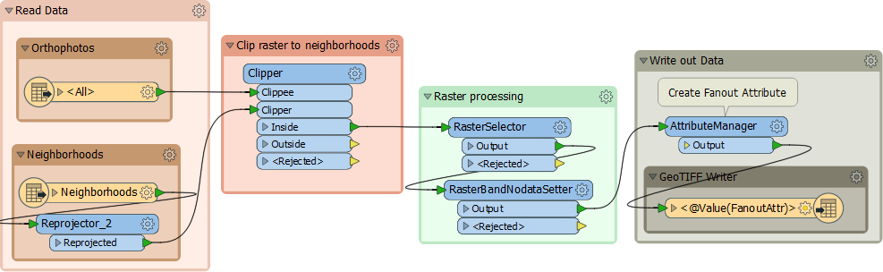

# 批量处理

批处理是在FME中执行一系列工作空间或一次处理多个文件。

---

## 使用WorkspaceRunner进行批处理

WorkspaceRunner是一个转换器，用于在转换中运行另一个FME工作空间。与目录和文件路径名读模块结合使用，它可用于批处理。

例如，我们有一个工作空间，可以读取正射影像瓦片并将它们剪辑到邻域边界，使用tile和neighborhood的组合作为输出文件名来编写它们：

想象一下，我们每周都会获得新的正射影像。我们不是每次都更改先前工作空间中的数据，而是创建一个工作空间来批处理所有新文件。这允许FME同时启动多个进程，以便更快地处理数据：

要设置WorkspaceRunner，FME Workspace参数指向要批处理的工作空间。Source File参数设置为_path\_windows_，这是由目录和文件路径名读模块创建的属性：

“等待作业完成”选项可确保在启动另一个作业之前完成一项作业。设置此选项可防止多个并发FME进程。

如果作业顺序不重要，则可以设置参数最大并发FME进程数。这会导致启动多个FME进程（最多七个），这些可以在Windows任务管理器的“详细信息”选项卡中看到：

---

## 使用批量部署向导进行批处理

批量部署可在FME Workbench的“Run”菜单下找到。它支持即时批处理执行和批处理文件的创建。这允许您在当前工作空间中处理大量源数据集，并为每个源数据集生成单独的输出：

 

批量部署以向导的形式运行。用户指定输入和输出数据集以及任何其他相关设置，例如输出文件名的后缀。

如果未立即执行该进程，则会创建包含批处理进程设置的批处理.tcl文件，以及用于在以后启动该进程的.bat文件。

使用与创建批量转换向导中相同的工作空间，将源类型设置为GeoTiff Reader：

 

然后选择您的源数据。您可以选择手动批量处理的所有数据，也可以使用\*通配符，它​​将找到以.tif结尾的所有文件：

 

您可以选择其他文件目标，也可以根据需要更改数据集基本名称：

 

最后，您可以选择立即运行此批量部署或保存脚本，以便可以在Workbench外部运行工作空间：

 

如果选择立即运行工作空间，则在向导中单击“完成”将立即运行工作空间。如果保存了脚本，则可以随时浏览它们并运行工作空间。

---

| 技巧 |
|:---|
 | 也可以使用命令行或FME命令文件来完成批处理。这些技术更加先进，因此我们想继续学习本课程。但如果您有兴趣了解更多信息，可以查看知识库文章[FME批处理方法](https://knowledge.safe.com/articles/1384/fme-batch-processing-methods-1.html)  |
