# 练习：公园中的公共艺术品 - 要素缓存

|  练习1 |  公园内的公共艺术品 - 要素缓存 |
| :--- | :--- |
| 数据 | 城市社区（谷歌KML） 公共艺术品（Microsoft Excel）  公园（MapInfo Tab）  城市正射影像（GeoTIFF） |
| 总体的目标 | 规划工作空间并确定哪些公园不包含公共艺术品 |
| 演示 | 工作空间布局和运行带有要素缓存的转换 |
| 启动工作空间 | C:\FMEData2018\Workspaces\DesktopAdvanced\WorkspaceDesign-Ex1-Begin.fmw |
| 结束工作空间 | C:\FMEData2018\Workspaces\DesktopAdvanced\WorkspaceDesign-Ex1-Complete.fmw |

省政府已向该市提供赠款，以资助公园内的新公共艺术品。为了最大限度地利用资金，该市希望在没有现有艺术品的情况下为公园添加艺术品。

您的任务是创建工作空间以确定哪些公园应该获得新的艺术作品。在任何艺术作品投入使用之前，该提案需要公开输入，因此您的输出数据需要分解为街区级别。

此工作空间也将传递给多个不同的部门，因此您需要确保其有效运行并且设计良好。

  
**1）启动Workbench**  
打开一个空白工作空间（或打开启动工作空间并跳到第二步）。

在开始创建工作空间之前需要考虑很多事情，因此您决定使用书签创建快速线框设计，以布置您需要执行的操作。

首先，我们需要读取以下数据集：

* Parks.tab
* NeighbourhoodBoundaries.kml
* PublicArt.xlsx
* GeoTiff正射影像的整个文件夹

现在，只需用书签在工作空间中标记它们的位置即可。我们不知道每个部分的大小，所以现在让它们大小相同。

接下来，我们需要创建点并重新投影公共艺术品，然后将公共艺术品叠加在公园上，以找出公园边界中包含哪些公共艺术品; 所以为此部分添加书签。

然后我们将需要测试没有艺术品的公园并为我们的地图创建标签。

接下来，我们将处理正射影像数据，并将其剪切到社区边界。我们剪切后可能需要进行一些栅格后期处理，因此请为此添加一个相应部分。

最后，我们将在栅格图像上叠加没有艺术品的公园，并将其全部写入GeoTiff：

[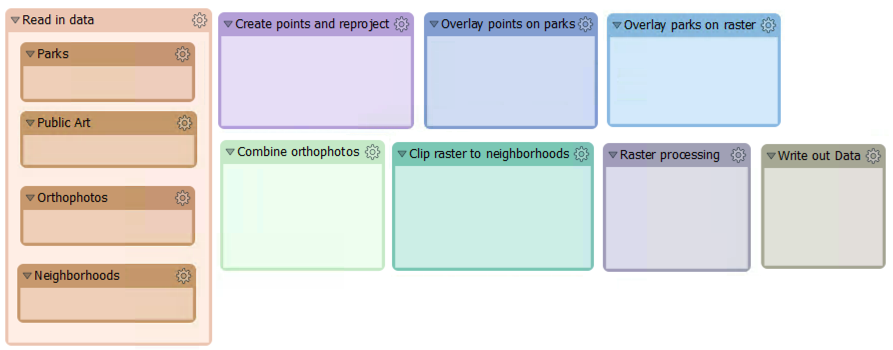](https://github.com/safesoftware/FMETraining/blob/Desktop-Advanced-2018/DesktopAdvanced2WorkspaceDesign/Images/Img2.200.Ex1.WorkspaceWireframe.png)

  
**2）读入数据**  
现在我们可以开始向工作空间添加内容了。让我们读入所有数据，每个数据都有一个单独的读模块：

| 读模块格式 | MapInfo标签（MITAB） |
| :--- | :--- |
| 读模块数据集 | C:\FMEData2018\Data\Parks\Parks.tab |
|  |  |
|  |  |
| 读模块格式 | Microsoft Excel |
| 读模块数据集 | C:\FMEData2018\Data\Culture\PublicArt.xlsx |
| 读模块工作流选项 | 单一合并要素类 |
|  |  |
| 读模块格式 | 谷歌KML |
| 读模块数据集 | C:\FMEData2018\Data\Boundaries\VancouverNeighborhoods.kml |
| 读模块工作流选项 | 单独要素类 |
|  |  |
| 读模块格式 | GeoTIFF（地理参考标记图像文件格式） |
| 读模块数据集 | C:\FMEData2018\Data\Orthophotos\02-03-HI.tif to 14-15-RS.tif |
| 读模块工作流选项 | 单一合并要素类 |

[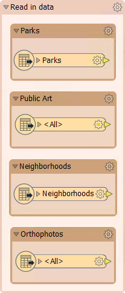](https://github.com/safesoftware/FMETraining/blob/Desktop-Advanced-2018/DesktopAdvanced2WorkspaceDesign/Images/Img2.201.Ex1.ReadInAllData.png)

当您读取VancouverNeighborhoods.kml时，您可以读取所有要素类，只需将它们移到一边即可。我们只对街区要素类感兴趣，因此将其移动到您的书签中。

  
**3）创建点和重新投影**  
对于第一个练习，我们将只关注公园和公共艺术品。我们需要从Excel数据中创建点。将VertexCreator转换器添加到画布并连接到公共艺术品要素类。在参数中，分别将X值和Y值设置为经度和纬度：

[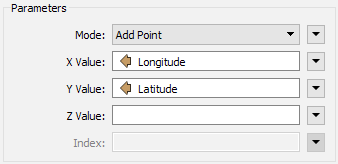](https://github.com/safesoftware/FMETraining/blob/Desktop-Advanced-2018/DesktopAdvanced2WorkspaceDesign/Images/Img2.202.Ex1.VertexCreatorParameters.png)

添加连接到VertexCreator：Output端口的Reprojector转换器。在参数中设置目标坐标系UTM83-10：

[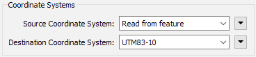](https://github.com/safesoftware/FMETraining/blob/Desktop-Advanced-2018/DesktopAdvanced2WorkspaceDesign/Images/Img2.203.Ex1.ReprojectorParameters.png)

  
**4）使用要素缓存运行工作空间**  
让我们测试点要素是否正确。在菜单栏上选择“运行”&gt;“使用要素缓存运行”，然后选择“运行工作空间”。这将运行工作空间，沿途缓存所有要素。

工作空间完成后，数据缓存由绿色放大镜图标表示。这些可以单独检查，但我们希望一起检查两个缓存。

因此，单击Reprojector转换器。按住键盘上的_Shift_键，现在单击Parks Feature Type以突出显示它。右键单击Parks或Reprojector并选择_Inspect cached features ..._（Ctrl + I是快捷方式）。这将打开FME Data Inspector中的选定缓存：

[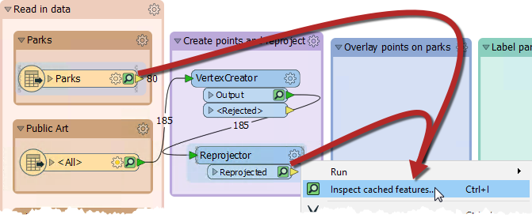](https://github.com/safesoftware/FMETraining/blob/Desktop-Advanced-2018/DesktopAdvanced2WorkspaceDesign/Images/Img2.204.Ex1.SelectBothInspectFeatureCaches.png)

  
**5）添加坐标系并从Reprojector运行**  
 如果（可能就是这种情况）两个数据集不**对齐**，这是因为Microsoft Excel读模块上没有设置坐标系。让我们回到FME Workbench并解决这个问题。

在导航器窗口中的PublicArt \[XLSXR\] Reader下，将坐标系设置为LL84：

[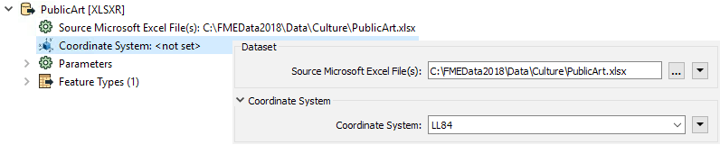](https://github.com/safesoftware/FMETraining/blob/Desktop-Advanced-2018/DesktopAdvanced2WorkspaceDesign/Images/Img2.205.Ex1.SetCoordSystemPublicArt.png)

现在，公共艺术品要素类，VertexCreator和Reprojector 的要素缓存都变为黄色。这意味着缓存是陈旧的，因为有些东西发生了变化。我们需要重新运行转换，但要素缓存的一个好处是我们只需要运行已更改的部分。

单击Reprojector，在弹出菜单上单击_Run To This_ ; 这将仅运行突出显示的工作空间部分，在本例中为PublicArt Feature Table，VertexCreator和Reprojector：

[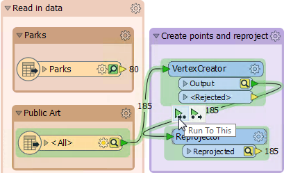](https://github.com/safesoftware/FMETraining/blob/Desktop-Advanced-2018/DesktopAdvanced2WorkspaceDesign/Images/Img2.206.Ex1.RunToThisReprojector.png)

再次检查缓存，这次数据排列正确：

[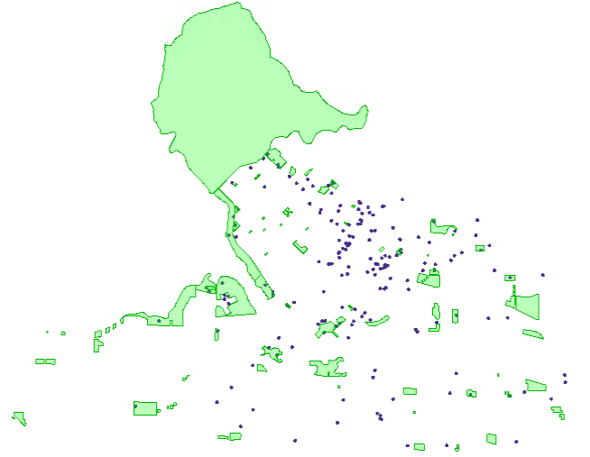](https://github.com/safesoftware/FMETraining/blob/Desktop-Advanced-2018/DesktopAdvanced2WorkspaceDesign/Images/Img2.207.Ex1.InspectCorrectData.png)

  
**6）将公共艺术品叠加到公园**  
现在让我们使用PointOnAreaOverlayer转换器将公共艺术品点叠加到公园多边形上。这将为我们提供一个名为\_overlaps的属性，然后我们可以测试它。

将PointOnAreaOverlayer转换器添加到画布。将Parks连接到PointOnAreaOverlayer：面输入端口和重新投影的PublicArt到PointOnAreaOverlayer：Points输入端口。在PointOnAreaOverlayer参数中的“属性累积”下，启用“合并属性”。此设置可确保两个要素的属性都在输出要素上：

[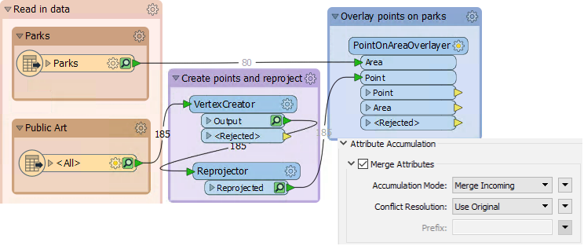](https://github.com/safesoftware/FMETraining/blob/Desktop-Advanced-2018/DesktopAdvanced2WorkspaceDesign/Images/Img2.208.Ex1.PointOnAreaOverlayerParameter.png)

  
**7）测试重叠**  
将Tester转换器添加到画布，连接到PointOnAreaOverlayer：面输出端口。在Tester参数对话框中，为\_overlaps = 0创建测试：

[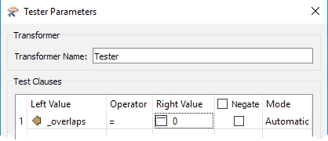](https://github.com/safesoftware/FMETraining/blob/Desktop-Advanced-2018/DesktopAdvanced2WorkspaceDesign/Images/Img2.209.Ex1.TesterOverlaps.png)

这个测试将公园与艺术品区分开来，而不是没有艺术品的公园。

创建测试后，单击Tester并使用“从此运行”（快捷键F6）。

还需要运行PointOnAreaOverlayer转换器。如果您在菜单上选择_Run From This_，那么您将看到一条警告，告诉您以前的转换器也需要运行：

[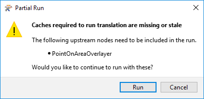](https://github.com/safesoftware/FMETraining/blob/Desktop-Advanced-2018/DesktopAdvanced2WorkspaceDesign/Images/Img2.210.Ex1.StaleCacheWarningDialog.png)

如果使用F6键，您会发现这不仅是“从此运行”选项的快捷方式，而且还绕过警告对话框并运行工作空间，包括任何先前的要求。

完成后，检查Tester：Passed输出端口，以确保测试正常工作。应该有68个没有公共艺术品的公园。

不要忘记确保您使用书签线框，并根据需要调整它们的大小。工作空间将在即将到来的练习中继续。

<table>
  <thead>
    <tr>
      <th style="text-align:left">恭喜</th>
    </tr>
  </thead>
  <tbody>
    <tr>
      <td style="text-align:left">
        
通过完成本练习，您已学会如何：

        <ul>
          <li>使用书签计划工作空间</li>
          <li>使用要素缓存检查工作空间</li>
        </ul>
      </td>
    </tr>
  </tbody>
</table>
