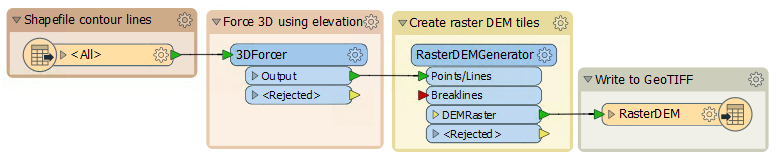
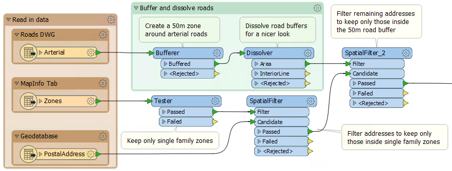

# 练习：性能评估项目

 练习5

 性能评估项目

数据

不同的

总体的目标

分析并改善工作空间性能

演示

并行处理

启动工作空间

C：\ FMEData2018 \ Workspaces \ DesktopAdvanced \ WorkspaceDesign-Ex5a-Begin.fmw  
C：\ FMEData2018 \ Workspaces \ DesktopAdvanced \ WorkspaceDesign-Ex5b-Begin.fmw  
C：\ FMEData2018 \ Workspaces \ DesktopAdvanced \ WorkspaceDesign-Ex5c-Begin.fmw

结束工作空间

C：\ FMEData2018 \ Workspaces \ DesktopAdvanced \ WorkspaceDesign-Ex5a-Complete.fmw  
C：\ FMEData2018 \ Workspaces \ DesktopAdvanced \ WorkspaceDesign-Ex5b-Complete.fmw  
C：\ FMEData2018 \ Workspaces \ DesktopAdvanced \ WorkspaceDesign-Ex5c-Complete.fmw

这里包括您的同事生成的许多工作空间。作为常驻FME专家，您被要求评估每个工作空间的性能。

  
**1）工作空间A**  
 启动Workbench并打开工作空间C：\ FMEData2018 \ Workspaces \ DesktopAdvanced \ WorkspaceDesign-Ex5a-Begin.fmw

此工作空间执行空间叠加和最近街区查找。它确定每个邮政地址和消防站所在的街区，并找到每个地址最近的消防站。最近的消防站必须在同一个街区。

检查工作空间并评估其使用并行处理的能力。您应该回答以下问题：

任何转换器都允许并行处理吗？

是否存在可以用于并行处理的现有组？

我可以创建一个人工组来并行处理吗？

并行处理会加快工作空间的性能，还是会让情况变得更糟？

这些问题的答案可以在完成的工作空间中找到：C：\ FMEData2018 \ Workspaces \ DesktopAdvanced \ WorkspaceDesign-Ex5a-Complete.fmw

  
**2）工作空间B**  
启动Workbench并打开工作空间C：\ FMEData2018 \ Workspaces \ DesktopAdvanced \ WorkspaceDesign-Ex5b-Begin.fmw

此工作空间从Esri Shapefile数据集中读取轮廓数据，并将它们转换为栅格DEM瓦片 - 每个shapefile一个瓦片。

再次，检查工作空间并评估其使用并行处理的能力。您应该回答以下问题：

* 任何转换器都允许并行处理吗？
* 是否存在可以用于并行处理的现有组？
* 我可以创建一个人工组来并行处理吗？
* 并行处理会加快工作空间的性能，还是会让情况变得更糟？

这些问题的答案可以在完成的工作空间中找到：C：\ FMEData2018 \ Workspaces \ DesktopAdvanced \ WorkspaceDesign-Ex5b-Complete.fmw

  
**3）工作空间C**  
启动Workbench并打开工作空间C：\ FMEData2018 \ Workspaces \ DesktopAdvanced \ WorkspaceDesign-Ex5c-Begin.fmw

您可能很熟悉此工作空间。它来自Desktop Basic课程，是一个在主要道路50米范围内查找所有单户地址的项目。

再一次，检查工作空间并评估它是否有能力采用并行处理。您应该再次回答以下问题：

* 任何转换器都允许并行处理吗？
* 是否存在可以用于并行处理的现有组？
* 我可以创建一个人工组来并行处理吗？
* 并行处理会加快工作空间的性能，还是会让情况变得更糟？

这些问题的答案可以在完成的工作空间中找到：C：\ FMEData2018 \ Workspaces \ DesktopAdvanced \ WorkspaceDesign-Ex5c-Complete.fmw

<table>
  <thead>
    <tr>
      <th style="text-align:left">恭喜</th>
    </tr>
  </thead>
  <tbody>
    <tr>
      <td style="text-align:left">
        
通过完成本练习，您已学会如何：

        
评估何时使用并行处理

        
设置转换器以使用并行处理

        
创建一个用于并行处理的人工组

      </td>
    </tr>
  </tbody>
</table>&lt;/td&gt; &lt;/tr&gt; &lt;/tbody&gt;&lt;/table&gt; &lt;/article&gt; &lt;/div&gt; &lt;/body&gt;&lt;/html&gt;

