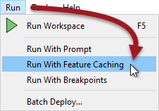
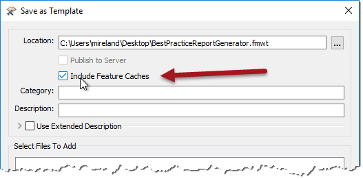

# 缓存要素

在以前版本的FME中，可以使用“运行全面检查（ Run with Full Inspection）”运行工作空间。

全面检查意味着数据已在工作空间的每个步骤中保存，因此可立即检查。

在FME 2018中，此工具的功能已更改，因此名称也已更改为使用要素缓存运行（Run with Feature Caching）：  

启用此选项后，FME会在运行工作空间时在转换的每个步骤生成缓存：

缓存由每个对象上的小图标表示。

## 检查缓存数据

有时，能够在转换的任何步骤检查数据都很重要。在每一步添加一个Inspector转换器都很烦人，因此可以使用数据缓存选项。

只需单击特定对象上的图标即可检查缓存数据。

## 保存缓存数据

由于工作空间可以在多个会话中处理，并且您可能希望将带有缓存的工作空间传输到另一个用户，因此将工作空间另存为模板也可以选择保存数据缓存：

这样，从模板创建的任何工作空间都可以自动访问上一次运行的缓存。

|  技巧 |
| :--- |
|  设置“使用数据缓存运行”比手动添加Inspectorz转换器更快。但是，请注意缓存数据显然会导致转换速度变慢，并使用磁盘空间等系统资源。  数据缓存在开发工作空间时非常有用，但在将工作空间投入生产之前应该关闭。 |

