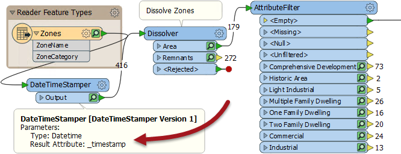
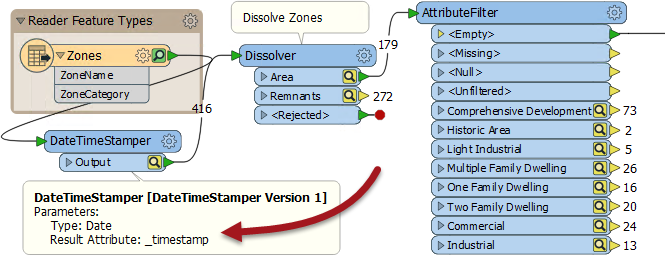
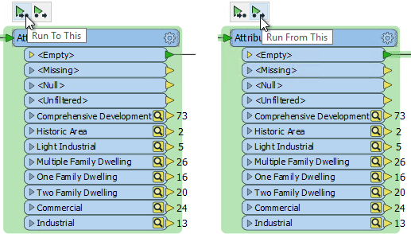
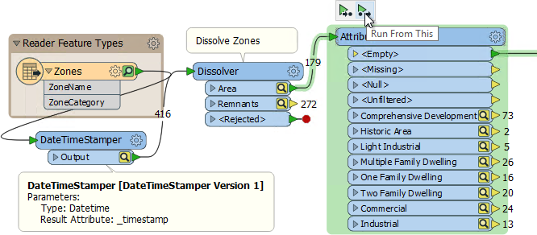
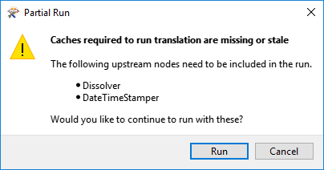
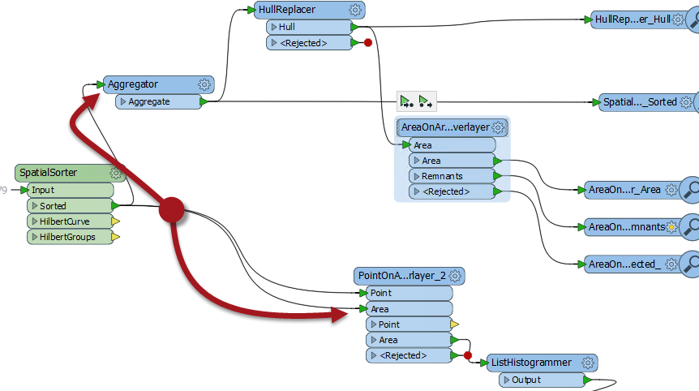

# 部分运行

## 缓存数据状态

当转换器或要素类型的缓存为绿色时，表示缓存是最新的; 即缓存表示将在该点运行的工作空间生成的数据。

这里工作空间创建一个datetime属性，并运行工作空间来填充缓存：

但是，在编辑工作空间时，缓存可以将颜色更改为黄色。这意味着缓存不再是最新的; 即缓存不再代表要运行的工作空间将产生的数据。

这里DateTimeStamper已更改为仅创建日期属性：

DateTimeStamper之后（下游）的所有缓存都变为黄色，表示它们不再代表工作空间。但DateTimeStamper之前（上游）的缓存仍为绿色，因为它们不再受影响。

## 重用缓存要素

要素从完全检查更改为要素缓存的主要原因是缓存数据现在可用于检查以外的目的。

当需要运行工作空间时，可以从绿色缓存中自动检索数据并在该点的下游使用。例如，在上述工作空间中，不需要从源数据集中读取数据，因为它已在最新的缓存中可用。

这可以通过单击要运行的转换器并使用以下两个弹出操作之一来实现：

这两个选项是**Run to This**和**Run from This**。

**运行到此\(Run to This\)**运行工作空间直到并包括所选转换器。它非常适合编辑转换器，并且您想看看转换器本身的结果。

**从此运行\(Run From This\)**（快捷键F6）从选定的转换器开始运行工作空间。它非常适合编辑转换器，并且您希望查看最终工作空间的结果。

将鼠标悬停在其中一个选项上会导致工作空间部分以绿色突出显示：

这里运行AttributeFilter转换器，数据从先前的缓存中获取。但是，由于先前的缓存是黄色的，并且已过时，因此FME将通知用户必须进一步返回以获取有效的缓存并在其间运行额外的转换器：

如果作者希望重新运行整个工作空间，他们可以使用通常的运行按钮（或F5）来执行此操作，该按钮将重新运行工作空间并（假设启用了要素缓存选项）重新填充所有缓存。

|  技巧 |
| :--- |
|  一个Junction转换器可以在部分运行中发挥有用的作用。例如，这里工作空间被分成两个流。如果我希望同时运行两个流，那么唯一的命令是SpatialSorter上的Run From This。 但这意味着SpatialSorter也将运行。如果我想运行两个流而不是SpatialSorter，那么适当位置的Junction转换器将允许我这样做。我可以在Junction转换器本身上运行它，它的开销很小。     |

### 为什么要重用缓存数据？

使用缓存数据的明显原因是性能之一。如果工作空间可以使用先前转换器中缓存的数据，则不需要再次进行该转换。当一次构建一个转换器的工作空间时，可以在每个步骤测试工作空间，并且仅需要执行当前转换器。

同样，这可以防止过多的数据读取。例如，如果正在从网络上的数据库读取数据，则数据缓存会阻止FME对该数据库进行后续调用。它节省了网络流量和查询时间。

此外，这是一个很好的工具，用于缓存Web服务的结果。例如，发将记录发送到web服务进行地理编码可能会导致该服务的实际货币成本。但是现在FME能够缓存该数据并重复使用它，从而避免重复使用该Web服务。

|  分析师女士说...... |
| :--- |
|  显然，数据缓存不会考虑源数据集中可能发生的变化。它只知道工作空间中已更改的内容。工作空间作者可以了解源数据集是否已更改，因此需要使用新运行进行刷新。 |

