# 练习：应急响应项目

|  练习 |  缓存和部分运行 |
| :--- | :--- |
| 数据 | 道路（AutoCAD DWG） 消防站和分区（GML） |
| 总体目标 | 使用NetworkCostCalculator创建时间和距离等值线 |
| 演示 | 数据缓存和部分运行 |
| 启动工作空间 | 无 |
| 结束工作空间 | C:\FMEData2018\Workspaces\UpgradingTo2018\Caching-Ex1-Complete.fmwt |

为协助规划城市的紧急服务，您的任务是评估紧急响应时间，通过创建等时线数据集 - 表示每个消防站的行程时间的轮廓线 - 用于医疗紧急情况。

  
**1）添加消防站读模块**  
启动FME Workbench。从菜单栏中选择“读模块”&gt;“添加读模块”。设置参数如下：

| 读模块格式 | GML（地理标记语言） |
| :--- | :--- |
| 读模块数据集 | C:\FMEData2018\Data\Emergency\FireHallsWithZones.gml |

出现提示时，选择要添加到工作空间的FireHalls和MedicZones要素类：

[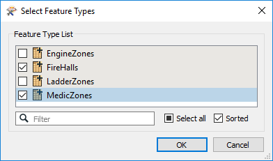](https://github.com/domix2000/FMETraining-1/blob/Desktop-Upgrade-To-2018/2018Upgrade2PartialRun/Images/Img2.200.FireHallFTs.png)

  
**2）添加Roads 读模块**  
再次从菜单栏中选择读模块&gt; 添加读模块。这次设置参数如下：

| 读模块格式 | Autodesk AutoCAD DWG / DXF |
| :--- | :--- |
| 读模块数据集 | C:\FMEData2018\Data\Transportation\CompleteRoads.dwg |

出现提示时，选择要添加到工作空间的所有要素类（即我们希望所有道路类型）仅留下层“0”。

  
**3）运行工作空间**  
确保打开要素缓存（运行&gt;使用要素缓存运行）并运行工作空间。将读取和缓存数据。意即：

* 我们的转换前检查可以在这里完成
  * 我们不必在Data Inspector中单独读取它
* 现在，数据已准备好供工作空间的后续阶段使用
  * 当我们运行整个工作空间时，FME将不必重新读取数据

选择工作空间中的所有要素类，右键单击其中一个要素类型，然后选择“检查缓存的要素”（快捷键Ctrl + I）：

[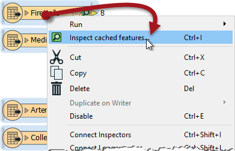](https://github.com/domix2000/FMETraining-1/blob/Desktop-Upgrade-To-2018/2018Upgrade2PartialRun/Images/Img2.201.InspectOriginalReaders.png)

现在我们可以检查数据以查看我们正在处理的内容。

  
**4）添加Tester**  
在本练习中，我们将在单个消防站，消防站4号上工作。因此，添加一个连接到FireHalls要素类型的Tester转换器。设置它以过滤掉其他消防站。最简单的方法是检查（并保留）_Name_属性以数字4结尾的要素：

[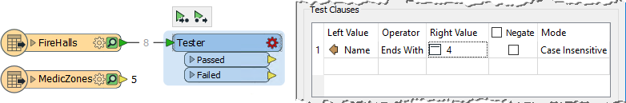](https://github.com/domix2000/FMETraining-1/blob/Desktop-Upgrade-To-2018/2018Upgrade2PartialRun/Images/Img2.202.Tester.png)

单击Tester，然后按Run From This按钮（快捷键F6）。Tester转换器将使用与其连接的要素类型的数据缓存运行。

单击Passed输出端口的绿色缓存图标。Data Inspector将打开并显示单个消防站要素。它应该是4号站。

  
**5）添加NetworkCostCalculator**  
现在我们将添加一个NetworkCostCalculator转换器。执行此操作的最佳方法是选择所有道路要素类，然后通过键入NCC并选择该转换器来使用“快速添加”。这样，将添加转换器并自动连接所有道路要素类。

然后连接Tester：传递到Source输入端口：

[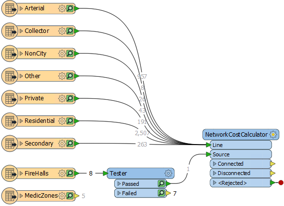](https://github.com/domix2000/FMETraining-1/blob/Desktop-Upgrade-To-2018/2018Upgrade2PartialRun/Images/Img2.203.NCCCanvas.png)

根据需要重新排列对象，以避免重叠连接（或者向上/向下移动输入端口）。

|  技巧 |
| :--- |
|  请注意，即使我们尚未运行NetworkCostCalculator，我们也会对其连接进行要素计数。它们是灰色的，以表明这并没有发生，但这就是计数的意义所在。 |

  
**6）设置NetworkCostCalculator参数**  
检查NetworkCostCalculator参数。将输出最优成本设置为“Z-Values”。将“捕捉源点”设置为“是”并将捕捉容差设置为100：

[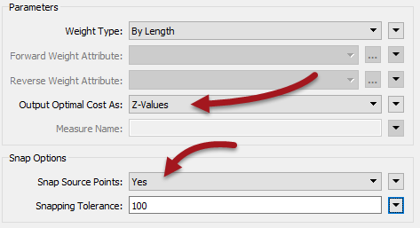](https://github.com/domix2000/FMETraining-1/blob/Desktop-Upgrade-To-2018/2018Upgrade2PartialRun/Images/Img2.204.NCCParams.png)

这些参数将在每个网络线路上输出成本作为Z值，并且如果它不准确地位于网络上，则将源消防站捕捉到网络。

单击它并选择Run To This运行NetworkCostCalculator。

|  技巧 |
| :--- |
|  因为我们目前已经缓存了所有数据，并且此后没有转换器，所以如果我们选择Run From This或Run To This，则无关紧要。两者都以相同的性能实现相同的结果。 |

检查已连接的输出缓存。如果查询道路要素，您将看到它在每个顶点上都有Z值。Z值表示通往消防站的道路距离。

  
**7）添加ContourGenerator**  
要显示这些结果，请添加连接到NetworkCostCalculator：连接输出端口的ContourGenerator转换器。要连接的ContourGenerator端口是Points / Lines：

[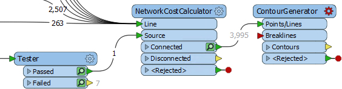](https://github.com/domix2000/FMETraining-1/blob/Desktop-Upgrade-To-2018/2018Upgrade2PartialRun/Images/Img2.205.ContourGenerator.png)

打开ContourGenerator参数对话框。将Surface Tolerance设置为10，将Output Contour Interval设置为50.运行ContourGenerator转换器并检查Contours输出缓存：

[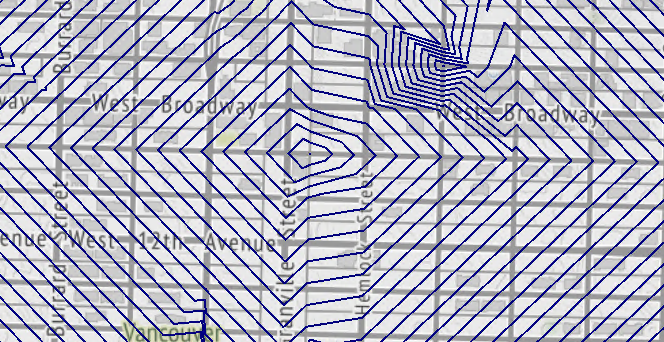](https://github.com/domix2000/FMETraining-1/blob/Desktop-Upgrade-To-2018/2018Upgrade2PartialRun/Images/Img2.206.ContourGeneratorOutput.png)

输出是一组等距线，显示距所选消防站的距离（通过道路）。

  
**8）添加ExpressionEvaluator**  
要创建等时线 Isochrones（行程时间相等的线），我们需要指定车辆行驶的速度。显然，这取决于道路类型，地形，天气和十字路口的交叉点; 但快速搜索显示，一个城市的消防车平均速度为55公里/小时（35英里/小时）。

因此，将ExpressionEvaluator转换器添加到AutoCAD Roads要素类和NetworkCostCalculator转换器Line端口之间的工作空间。最快的方法是单击绿线箭头并键入ExpressionEvaluator的名称。这样转换器将同时插入所有连接中：

[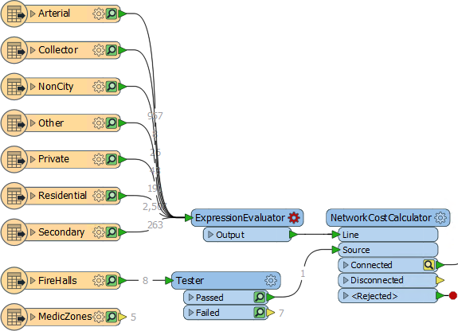](https://github.com/domix2000/FMETraining-1/blob/Desktop-Upgrade-To-2018/2018Upgrade2PartialRun/Images/Img2.207.EEOnCanvas.png)

注意新转换器“下游”的缓存如何变为黄色。它们是陈旧的，因为它们不再代表工作空间将生成的结果。

  
**9）设置ExpressionEvaluator**  
检查**ExpressionEvaluator**的参数。设置表达式以计算名为TravelTime的属性。表达式应该是：

```text
@Length（）/ 916.666666
```

* @Length（）是一个FME函数，用于测量每条道路链接的长度。
* 916.66666来自（速度\*（米-每公里/秒-每分钟）），即（55 \*（1000/60））

  
**10）调整NetworkCostCalculator**  
现在再次检查**NetworkCostCalculator**的参数。

将“权重类型”参数从“按长度”更改为“按两个属性”。选择TravelTime作为前进和后退权重的属性：

[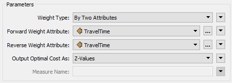](https://github.com/domix2000/FMETraining-1/blob/Desktop-Upgrade-To-2018/2018Upgrade2PartialRun/Images/Img2.208.NCCParams2.png)

  
**11）调整ContourGenerator**  
现在再次检查**ContourGenerator**的参数。

将Surface Tolerance更改为1并将Output Contour Interval更改为1（即每条轮廓线将表示1分钟的行程时间）。

现在我们必须重新运行工作空间。您可以选择：

* 在ExpressionEvaluator上“从此运行”
* 在ContourGenerator上“运行到此”
* 在ContourGenerator上“从此运行”

当您将鼠标悬停在前两个选项上时，相同的工作空间部分将突出显示。第三个选项只会突出显示ContourGenerator本身，并且在选择时会警告需要包含先前的转换器，因为它们还没有有效的缓存。

检查新的ContourGenerator输出缓存：

[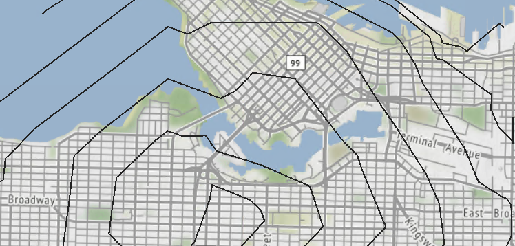](https://github.com/domix2000/FMETraining-1/blob/Desktop-Upgrade-To-2018/2018Upgrade2PartialRun/Images/Img2.209.IsochroneOutput.png)

结果将是一系列代表4号消防站紧急车辆行程时间的等时线。

  
**12）另存为模板**  
我们将在下一章结束时继续这个练习。如果您在此期间关闭并重新打开工作空间，我们会将其另存为模板。这样我们就可以保留缓存。

因此，从菜单栏中选择保存&gt;另存为模板。出现提示时输入模板名称。请务必选中“包含要素缓存”选项：

[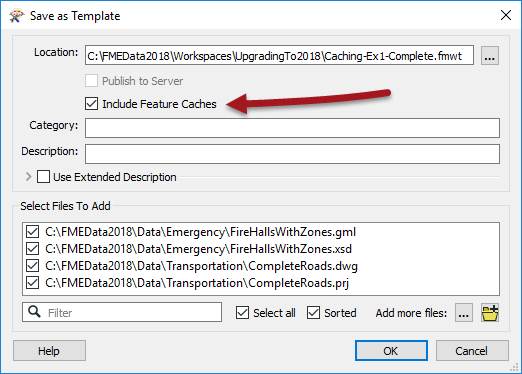](https://github.com/domix2000/FMETraining-1/blob/Desktop-Upgrade-To-2018/2018Upgrade2PartialRun/Images/Img2.210.SaveAsTemplate.png)

现在，当我们使用此模板重新打开工作空间时，数据将已缓存并可供使用。

<table>
  <thead>
    <tr>
      <th style="text-align:left">恭喜</th>
    </tr>
  </thead>
  <tbody>
    <tr>
      <td style="text-align:left">
        <p>通过完成本练习，您已学会如何：
          <br />
        </p>
        <ul>
          <li>启用要素缓存</li>
          <li>检查工作空间中的所有缓存数据</li>
          <li>使用“从此运行”和“运行到此”执行部分运行</li>
          <li>决定何时“运行到此”或“从此运行”最合适</li>
          <li>保存包含要素缓存的模板文件</li>
        </ul>
      </td>
    </tr>
  </tbody>
</table>
