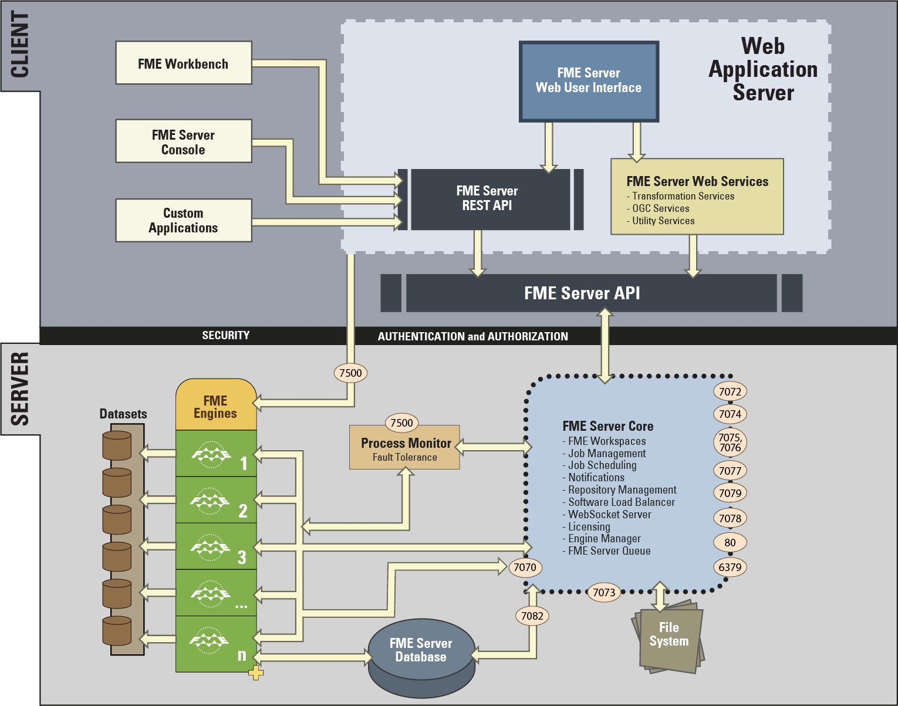

# 防火墙和端口

## 配置防火墙设置

FME Server Web服务和其他客户端使用FME Server API通过TCP / IP与FME Server Core通信。请求通过端口7071发送到FME Server Core。结果消息通过FME Server Core创建的随机分配的端口返回给客户端。因此，请务必使用规则在上配置任何防火墙设置，以允许与计算机进行完全通信。

当需要特定端口时，端口应该可用并且不会被防火墙设置阻止。

**注意：安装FME Server时，将在Windows计算机上为 &lt;FMEServerInstall&gt;\Server\fme\fme.exe创建一个入站规则 “全部允许”。**

## 端口

**Ports 25, 7125, and 465** 用于SMTP发布服务器。

**Ports 6379** 用于FME服务器队列。

**Ports 7069 and 7082** 用于FME服务器数据库通信。

**Ports 7070 and 7501** 管理FME引擎进程。

**Port 7071** 使用REST API将请求发送到FME服务器核心。

**Ports 7072 - 7076** 管理通知服务。

**Ports 7077 and 7081** 用于配置，备份和还原请求以及系统清理任务。

**Port 7078** 处理WebSocket服务器请求。

**Port 7079** 处理FME服务器资源请求。

**Port 7500** 管理FME服务器核心进程。

|  Vector小姐说... |
| :--- |
|  有关FME Server使用的最新和完整端口列表以及更详细的说明，请参阅[FME Server 端口文档](http://docs.safe.com/fme/2018.0/html/FME_Server_Documentation/Content/ReferenceManual/FME-Server-Ports.htm)。 |

