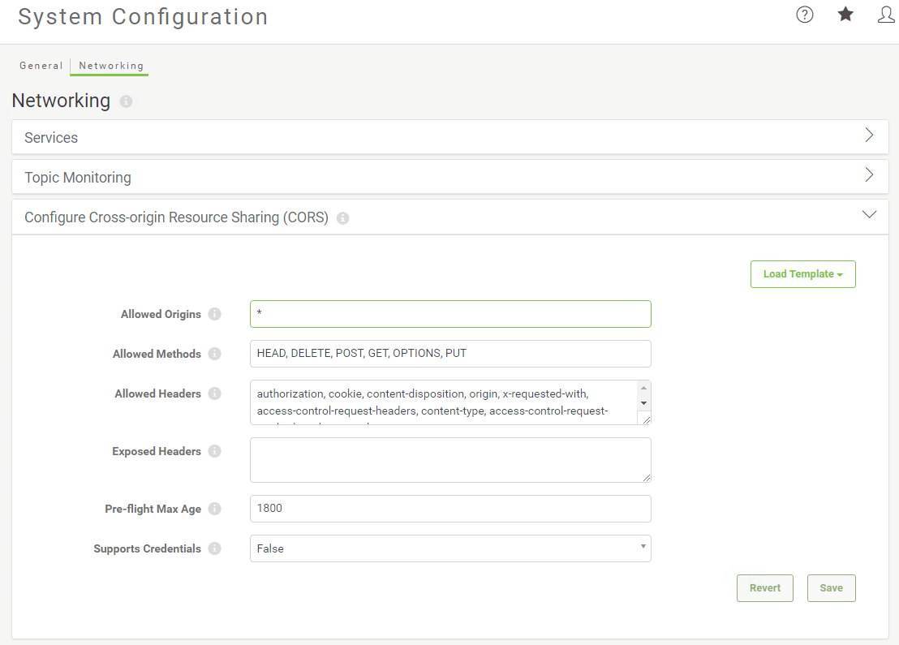

# CORS

\(Cross-Origin Resource Sharing\)跨源资源共享（CORS）允许您指定托管在其他域上的网站，这些网站可以通过Ajax请求从FME Server访问资源。

默认情况下启用CORS以允许任何主机访问FME Server资源。

**要禁用CORS:**

1. 单击_加载模板_, 然后选择 _禁用CORS_。
2. 单击 _保存更改_。\(或者要取消，请单击 _还原更改_\)。

**要重新启用CORS:**

1. 单击_加载模板_, 然后选择 _允许所有主机_ 或 _允许特定主机_。
2. 根据需要配置其余设置。
3. 单击 _保存更改_。\(或者要取消，请单击 _还原更改_\)。

## CORS设置选项

允许的来源: 允许访问FME服务器的以逗号分隔的主机列表。星号（\*\)允许从任何主机进行访问。如果任何来源正在传递凭据，则无法指定星号。有关如何指定主机列表的示例，请单击“ 加载模板”，然后选择“ 允许特定主机”。

允许的方法：可以在来自允许的来源的请求中使用的以逗号分隔的HTTP方法列表。

允许的标头：来自允许的来源的允许请求标头的逗号分隔列表。请求标头是浏览器JavaScript应用程序通过方法XMLHttpRequest.setRequestHeader（）设置的任何自定义标头。

暴露的标头：以逗号分隔的非标准响应标头列表，可以安全地向请求者公开（通过XMLHttpRequest.getResponseHeader（）方法启动）。此信息在Access-Control-Expose-Head的响应标头中返回。

预检最大寿命：指定请求者可以缓存预检请求的结果的时间长度（以秒为单位）。此信息在Access-Control-Max-Age响应标头中返回。

支持凭据：如果为TRUE，则允许请求者包含用于使用FME Server进行授权的凭据，包括Cookie，HTTP身份验证（令牌）或客户端证书。此值在Access-Control-Allow-Credentials响应标头中返回。

|  分析师小姐说... |
| :--- |
|  FME Server 2017及以上版本现在具有“允许所有主机”作为CORS的默认设置。 |

