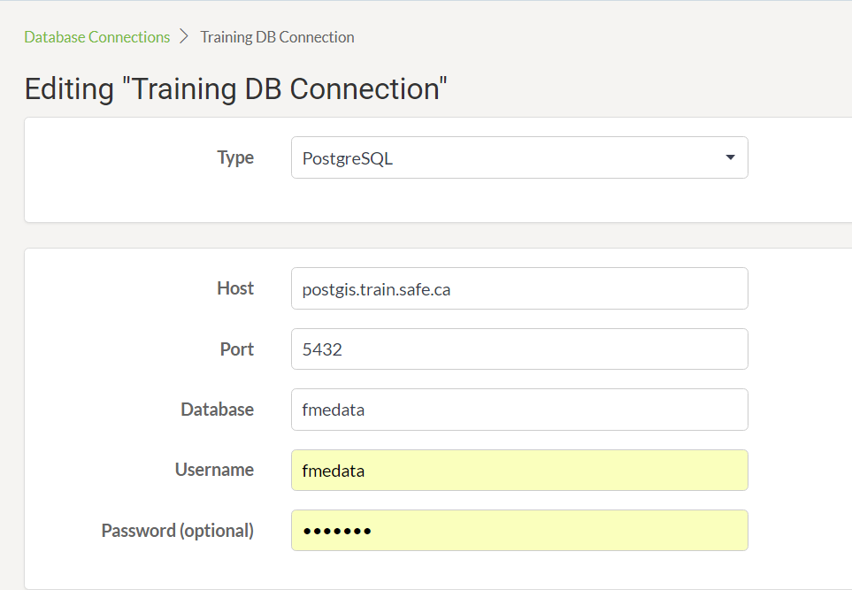
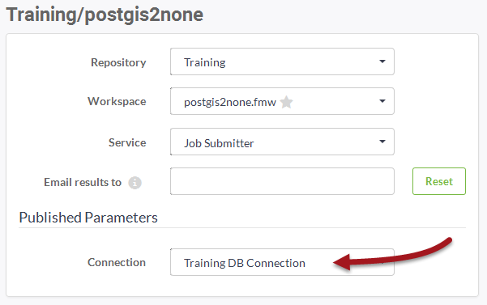

# 数据库连接

当数据集的源数据是数据库时，FME能够将连接参数存储在安全容器中。该容器可以发布到FME Server或在其上重新创建。

## 什么是数据库连接？

数据库连接是一组数据库连接参数的容器。这些参数包括数据库服务器，端口号，用户名，密码以及根据数据库类型而变化的其他参数。

数据库连接的两个主要优点是：

* 连接参数不再嵌入工作空间，这意味着更少的安全风险
  * 例如，您的参数不会向下载工作空间的任何人公开
* 连接参数可以在多个工作空间之间重用
  * 例如，使用同一数据库的两个工作空间可以使用相同的连接

数据库连接可以使用FME Desktop中的工作空间发布，也可以直接在FME Server中添加。

## 创建数据库连接

创建数据库连接通常在FME Desktop中启动。可以使用FME Workbench菜单栏中的工具&gt; FME选项&gt;数据库连接创建连接。然后，可以在读模块，写模块或转换器中使用已定义的连接。

例如，此工作空间具有PostGIS数据库的连接，如读模块参数和数据库连接列表中所示：

当工作空间发布到FME Server时，新对话框会询问作者是否还要发布数据库连接：

然后将连接添加到FME Server上的连接容器中。

---

|  警察局长Webb-Mapp说...... |
| :--- |
|  请注意，您不必上传与工作空间的连接。如果FME Server上已存在该数据库的连接，则可以使用该连接。   如果您没有上传连接，并且您还没有在FME Server上使用该连接，那么您将需要使用“数据库连接”页面来创建连接。 |

## 管理数据库连接

FME Server有一个用于管理通过主菜单访问的数据库连接的页面：

此页面允许工作空间作者（通常是管理员）创建新连接，复制现有连接，删除现有连接或编辑现有连接：

## 使用数据库连接

运行工作空间时，如果它具有数据库读模块（例如），则会提示最终用户使用已发布的参数，并可以选择要使用的数据库连接：

然后工作空间正常运行完成。

---

|  警察局长Webb-Mapp说...... |
| :--- |
|  连接与FME Server上的其他对象一样，具有安全权限。只有与连接共享的所有者或\(默认情况下\)管理员才能使用它。并不是任何随机用户都可以通过发布的参数访问所有数据库连接。    这也意味着可以使用作者的连接参数在FME桌面测试工作空间，但是需要最终用户的连接发布到服务器;所有这一切都以一种既简单又安全的方式进行。 |

|  Vector小姐说... |
| :--- |
|  如果我创建一个具有超级用户权限的数据库连接，那么它将绕过数据库为创建和删除表所做的任何权限检查。那么，您认为我如何才能防止用户滥用该功能呢?    [1.删除该用户在FME Server上运行该工作空间的权限](http://52.73.3.37/fmedatastreaming/Manual/QAResponse2017.fmw?chapter=21&question=5&answer=1&DestDataset_TEXTLINE=C%3A%5CFMEOutput%5CQAResponse.html)  [2.删除该用户访问工作空间所在的整个存储库的权限](http://52.73.3.37/fmedatastreaming/Manual/QAResponse2017.fmw?chapter=21&question=5&answer=2&DestDataset_TEXTLINE=C%3A%5CFMEOutput%5CQAResponse.html)  [3.删除该用户角色访问该特定数据库连接的权限](http://52.73.3.37/fmedatastreaming/Manual/QAResponse2017.fmw?chapter=21&question=5&answer=3&DestDataset_TEXTLINE=C%3A%5CFMEOutput%5CQAResponse.html)  [4.从其角色权限中删除管理数据库连接](http://52.73.3.37/fmedatastreaming/Manual/QAResponse2017.fmw?chapter=21&question=5&answer=4&DestDataset_TEXTLINE=C%3A%5CFMEOutput%5CQAResponse.html) |

